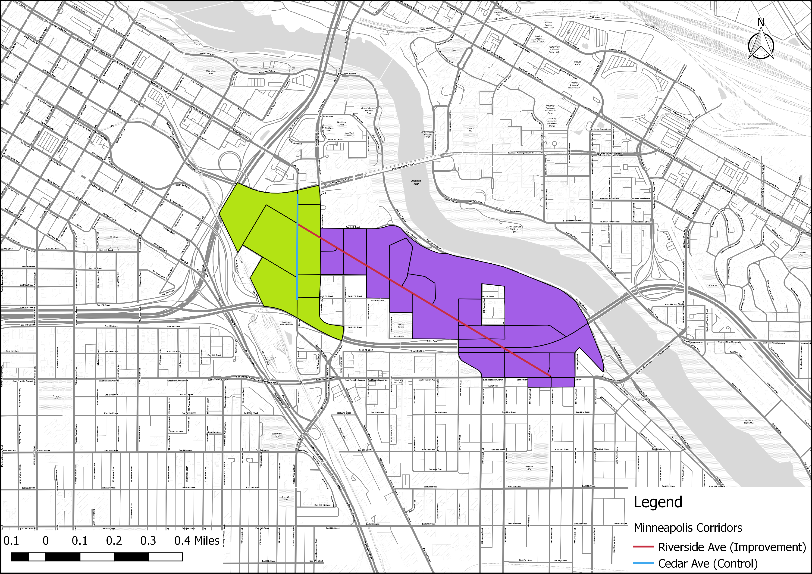
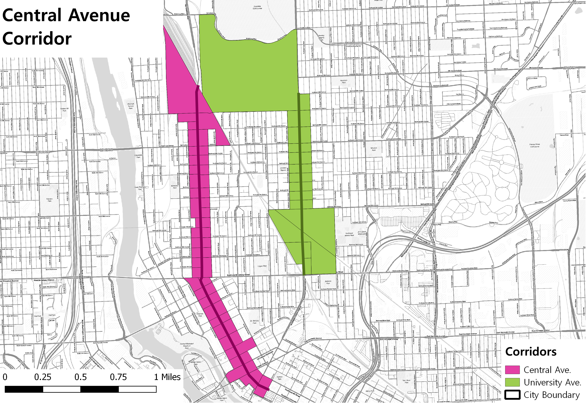

```{r setup,include=FALSE}

knitr::opts_chunk$set(cache = TRUE)


```


# 1. Introduction

In order to make their cities more livable, policymakers and planning departments are improving streets and upgrading transportation infrastructure  in order to improve access and mobility for pedestrians and bicyclists through the reduction of on-street parking or traffic lanes. While studies have shown how such upgrades improve safety the question remains whether such infrastructure improvements also improve the economic outcomes of improved corridors. This study will attempt to answer to what extent these types of corridor-level street improvements impact economic activity and business vitality.

# 2. Data Sources/Methodology

## 2.1.  Data Sources

For this study we used multiple data sources to estimate the effect of new bike lane infrastructure investment. First, we used the Longitudinal Origin-Destination Employment Statistics (LODES) data set from the **Longitudinal Employer-Household Dynamics Dataset** (LEHD).  It integrates existing data from state-supplied administrative records on workers and employers with existing census, surveys, and other administrative records to create a longitudinal data system on U.S employment. This data set tracks Workplace Area Characteristics (WAC), census blocks where people work as opposed to where workers live, for all the census blocks between 2002 and 2015 for most of the states in the US.  As such, LEHD provides geographically granular detail about American’s jobs, workers and local economies, allowing us to examine employment by broad industry sector, wage and educational attainment. Some disadvantages of the LODES data set are that in order to guarantee confidentiality block level data is "fuzzed" so the numbers are not exactly the number of jobs, but they are accurate estimates. Additionally, though we get industrial data, it is only provided at the most general level (the equivalent of two digit NAICS codes) so we are unable to isolate specific retail or service employment such as restaurant workers. That being said, the LODES data set is comprehensive, offers unprecedented geographic detail, and longitudinal allowing for consistent comparisons over time.

This report also takes advantage of establishment level **Quarterly Census of Employment and Wages** (QCEW) data. Also referred to as ES-202 data, the QCEW is quarterly data submitted by firms to their respective state governments as part of the unemployment insurance system. Employers report their industry code, their number of employees at the site, and gross pay. The individual QCEW data is confidential and requires special permission from the state in order to use it and has additional data use restrictions. The QCEW gives us address level data on individual establishments as well as detailed employment information. Unfortunately, getting access to such data is difficult and differs for each state and has to be presented in a way to preserve confidentiality. As such, we cannot present ultra-detailed industrial information and have further presentation restrictions depending on the state.

Due to data suppression issues, we were unable to get disaggregated individual three-digit NAICS employment figures for the Minneapolis corridors. As a compromise, Minnesota's Department of Employment and Economic Development (DEED) aggregated all of the three-digit NAICS retail codes (NAICS 442-453). These aggregated numbers correspond closely to the LEHD codes used in the report, but with the advantage that the numbers are not "fuzzed" for confidentiality concerns, the data include total wages paid and average employment. And all of this data is available quarterly and goes back to the year 2000 dramatically increasing our sample size.

Finally, we also collected **sales tax data**. Sales tax data allows us to estimate a more sensitive measure of economic activity than employment (as the decision to hire or fire for a firm is often an expensive one we expect employment to be a delayed response). Some drawbacks of sales tax data is that some states do not have a sales tax or, in states or cities that do have one, the sales tax data is not broken down by specific industry and it is difficult to accurately parse out accurate figures. But the benefits of sales tax data largely outweigh these issues and do offer a more sensitive metric than employment. 

In terms of specific rates, Minneapolis sales tax is, at minimum, 8.025% (for example, buying a meal at a restaurant outside of downtown Minneapolis) up to 14.025% (for ordering a meal in a restaurant with live entertainment within the downtown taxing district). The minimal 8.025% rate includes the 6.875% state sales tax, a 0.5% transit tax for Hennepin County, an additional .15% Hennepin County tax and, finally, a 0.5% city sales/use tax. Additional entertainment and accommodations taxes may also be included.

## 2.2  Methodology

We have applied three methods in order to isolate the impact of street improvements while controlling for other economic and regional factors. The methods are an integrated trend analysis (following the NY DOT study), a difference-in-difference approach, and an interrupted time series analysis. 

### 2.2.1  Corridor Comparison Selection

In order to properly isolate the effect of the street improvements we must identify treatment corridors (corridors that actually were improved) and control corridors (corridors that are similar to the treatment corridors except they remain unimproved). Treatment corridors are corridors where new bike or pedestrian related improvements were installed. Ideally, these corridors are made up of a minimum of 10 adjacent, or intersecting, census blocks with a minimal number of retail and accommodations related jobs. Additionally, we will only use corridors where street improvements were installed between 2008 and 2013 in order to guarantee with have sufficient data to track pre and post-treatment employment trends. 

Once corridors are selected based on these criteria we require further testing in order to discern how similar the proposed treatment and control corridors. Finding corridors that are as similar as possible to each other except for the construction of new bicycle/pedestrian infrastructure allows us to approximate true experimental conditions. We will use a combination of descriptive statistics- comparing corridor employment figures to city employment quantiles- and statistical tests- t-tests in order to determine if the average employment, by block, for each corridor is similar to the other.

### 2.2.2  Aggregated Trend Comparison

This first method follows the previous NYCDOT study (NYCDOT, 2013), aiming to examine whether the treatment corridors tend to have better business performance than comparison corridors after street improvements. The approach compares the trends of treatment and control corridors in addition to city-wide trends over the full time period we have data for. If treatment corridors show greater increases in employment or sales tax receipts, then that would represent a positive impact of street improvement on business activities. This method is easy to follow and represents the aggregated trend of business activities. However, it lacks the rigor of econometric estimates and statistical tests that explicitly test whether or not the street improvement caused the change in trend.

### 2.2.3  Difference-in-Difference

The second method aims to estimate the difference in business vitality of pre- and post-improvement periods between improved and comparison corridors within the same time period. This is known as a difference-in-difference (DID) approach. It is a designed to answer the "but for" question of what a corridor's economic trajectory would look like had it streets not been improved.  It requires data from pre/post intervention such as panel data (individual level data overtime) or cross-sectional data (individual or group level). The approach looks at the change in the variable of interest in the treatment group before and after it is treated. In this case this means looking at some time period before and after a street improvement. Meanwhile, the control group has not been treated in either time period. The difference in growth trajectories between the two periods will give an unbiased estimate of the effect of the treatment. DID is a useful technique when randomization on the individual level is not possible. This approach removes biases in the second period comparisons between the treatment group and control group that could be result from permanent differences between those groups, as well as biases from comparisons over time in the treatment group that could be the result of trends. A key assumption of DID estimate is that the differences between control group and treatment group would have remained constant in the absence of treatment. 

DID is a linear modeling approach and its basic formula is expressed as:

$$ Y_{it} = \beta_0 + \beta_1T_{it} + \beta_2A_{it} + \beta_3T_{it}A_{it} +\varepsilon_{it} $$

$Y_{it}$ is the observed outcome in groups i and t (in this case change in employment or sales tax revenue)
$T_{it}$ is a dummy variable set to 1 if the observation is from the treatment group
$A_{it}$ is a dummy variable set to 1 if the observation is from the post treatment period i either groups
$\beta_3$ is the DID estimate of the treatment effect

If the DID estimate $\beta_3$  is significant and positive, then that indicates a positive effect of the street improvement. Conversely if the estimate is significant and negative that indicates a negative effect of the improvement. Finally, a non-significant result indicates the improvement had no statistically discernible effect. 

### 2.2.4  Interrupted Time Series

Interrupted time series is an econometric technique that estimates how street improvements impact corridor economic vitality from a longitudinal perspective. This approach tracks the treatment corridor over time and estimates the impact by the treatment by looking at the change of the corridor growth trend after the treatment. If the treatment has a causal impact, the post-intervention series will have a different level or slope than the pre-intervention series. In our research, interrupted-time series will be used to distinguish differences in growth before and after a specific time break point where an intervention, such as installation of new bicycled facility happens.  

One advantage of ITS is that it allows for the statistical investigation of potential biases in the estimate of the effect of the intervention. Given the longitudinal nature of the test ITS requires a significantly larger amount of data in order to accurately estimate a real effect on the growth trend. 

The interrupted time-series analysis equation can be expressed as: 

$$ Y_t = \beta_0 + \beta_1T_1 + \beta_2X_1 + \beta_3T_1X_1 +\varepsilon_{it} $$

$Y_t$ is the observed business outcome in time period t
$T_t$ indicates the number of quarters from start to finish of the series
$X_t$ is the treatment dummy variable taking values of 0 in the pre-intervention period and 1 in the post-intervention period
$\beta_0$ is the model intercept or baseline level at T = 0
$\beta_1$ represents the change in the outcome with a time unit increase (the pre-intervention trend)
$\beta_2$ is the level change following the intervention
$\beta_3$ indicates the slope change following the intervention 


```{r message=FALSE, warning=FALSE, include=FALSE}

if(!require(pacman)){install.packages("pacman"); library(pacman)}
p_load(here, RPostgreSQL, sf, ggplot2, directlabels,ggthemes, lubridate, dplyr, dbplyr, stargazer,cowplot, zoo, tidyr)


user <- "jamgreen"
host <- "pgsql102.rc.pdx.edu"
pw <- scan(here::here("batteries.pgpss"), what = "")
dbname <- "bike_lanes"

con <- dbConnect("PostgreSQL", host = host, user = user, dbname = dbname, 
                 password = pw, port = 5433)


source(here::here("Code/corridor_comparison_functions.R"))

minn_corridor <- st_read(dsn = con, query = "select a.geoid10 as geoid, a.c000 as c000,
a.cns07 as cns07, a.cns08 as cns08, a.cns12 as cns12, a.cns14 as cns14, a.cns15 as cns15, a.cns16 as cns16, a.cns17 as cns17, a.cns18 as cns18, a.cns19 as cns19, b.name as Name, 
b.buildstart as buildstart, b.buildend as buildend, b.group as corridor_group, 
b.type as grouptype,  a.year as year, a.geometry as geom
FROM minneapolis_lehd a, minneapolis_corridors b
WHERE ST_Intersects(ST_Buffer(b.geom, 20), a.geometry);")

minn_corridor <- minn_corridor %>%
  rename(C000 = c000, CNS07 = cns07, CNS08 = cns08,CNS18 = cns18, CNS12 = cns12, CNS14 = cns14, CNS15 = cns15,CNS16 = cns16, CNS17 = cns17, CNS18 = cns18, CNS19 = cns19, Group = corridor_group, BuildStart = buildstart, BuildEnd = buildend, Name = name)
#add new colume of construct year as numeric

minn_lehd <- st_read(dsn = con, "minneapolis_lehd") %>% as.data.frame() %>% 
  select(-geometry)

minn_lehd <- minn_lehd %>%
  rename(C000 = c000, CNS07 = cns07, CNS08 = cns08,CNS18 = cns18, CNS12 = cns12, CNS14 = cns14, CNS15 = cns15,CNS16 = cns16, CNS17 = cns17, CNS18 = cns18, CNS19 = cns19)


minn_emp_ratio <- employ_ratio_test(minn_corridor)

minn_growth <- growth_rate(minn_corridor)

minn_lehd_2007 <- minn_lehd %>% filter(year == "2007", CNS07+CNS18 > 0)

#prep quantile dataframe

p <- seq(0,1, by = .05)

quant_df <- data.frame(q_tot_emp = quantile(minn_lehd_2007$C000, probs = p, na.rm = TRUE),
                       q_retail = quantile(minn_lehd_2007$CNS07, probs = p, na.rm = TRUE),
                       q_food_accom = quantile(minn_lehd_2007$CNS18, probs = p, na.rm = TRUE),
                       probs = p)

```


#3. Corridor Comparisons

Our first test in corridor comparability is comparing the count of the total number, retail, and accommodation jobs within the corridors compared to block figures for the city of Minneapolis as a whole. This is allows us to have a broad understanding of the relative job density of the corridors. This serves two purposes: first, it gives us a quick estimate of the range of jobs the corridors have; and second, it shows how similar the corridors are to each other in terms of the number of jobs in each. Finally, we perform a t-test, a statistical test designed to measure if the means of two different groups are statistically similar. This final test offers us a more rigorous test of the comparability of the corridors. All of these figures use 2007 employment numbers from the LEHD as that is the earliest year before the first improvement project. 

## 3.1 Riverside Ave.




Our first corridor group consists of the Riverside and Cedar Ave corridors. The Cedar Ave comparison corridor is only 2,000 feet and covers three census blocks and is too small for meaningful comparison but we shall continue forward with the analysis.


```{r message=FALSE, warning=FALSE, include=FALSE}

#comparisons-----

riverside <- minn_corridor %>% filter(Name == "Riverside Ave (improvement site)", year == as.numeric(as.character(BuildStart))-1)

cedar <- minn_corridor %>% filter(Name == "Cedar Ave (control)", year == "2008")

riverside <- riverside %>% summarise(TotEmp = sum(C000)/nrow(riverside), RetailEmp = sum(CNS07)/nrow(riverside), AccomEmp = sum(CNS08)/nrow(riverside))
# get employment at block level, divided by nrow()

cedar <- cedar %>% summarise(TotEmp = sum(C000)/nrow(cedar), RetailEmp = sum(CNS07)/nrow(cedar),AccomEmp = sum(CNS08)/nrow(cedar))

#t-tests----

riverside <- minn_corridor %>% filter(Name == "Riverside Ave (improvement site)", year == "2008")
cedar <- minn_corridor %>% filter(Name == "Cedar Ave (control)", year == "2008")

riverside <- riverside %>% mutate(business = CNS07 + CNS18,
                                  service1 = CNS07 + CNS12 + CNS14 + CNS15 + CNS16 + CNS17 + CNS18 + CNS19,
                                  service2 = CNS07 + CNS12 + CNS14 + CNS17 + CNS18 + CNS19,
                                  busi_perc1 = business/service1,
                                  busi_perc2 = business/service2)

cedar <- cedar %>% mutate(business = CNS07 + CNS18,
                                  service1 = CNS07 + CNS12 + CNS14 + CNS15 + CNS16 + CNS17 + CNS18 + CNS19,
                                  service2 = CNS07 + CNS12 + CNS14 + CNS17 + CNS18 + CNS19,
                                  busi_perc1 = business/service1,
                                  busi_perc2 = business/service2)


t.test(riverside$business, cedar$business)
t.test(riverside$busi_perc1, cedar$busi_perc1)
t.test(riverside$busi_perc2, cedar$busi_perc2)

```


### 3.1.1 Corrdior Employment Counts

The following table shows total, retail, and accommodations employment for Riverside and Cedar and the city based percentile rank of the corridors. Riverside ranks consistently higher than cedar when looking at the concentration of employment per block. 


| Corridor       | Tot Emp | Retail Emp | Accom Emp | Tot (%) | Retail (%) | Accom (%) |
|----------------|---------|------------|-----------|---------|------------|-----------|
| Riverside Ave. | 345    | 18        | 6         | 85-90      | 80-85         | 65-70       |
| Cedar Ave.     | 61     | 13          | 1         | 55-60      | 75-80         | 50-55       |

Table 1: Riverside and Cedar Avenue Employment Percentiles

### 3.1.2 Corridor Average Employment Comparisons

We performed t-tests on three metrics at the census block level: "business" employment, the sum of retail and accommodations employment; a "business share" metric that is the share of employment in a census block of business employment over the sum of other services industries such as professional/scientific services, public administration and educational services; finally, a second business share metric on a smaller share of services employment including professional/scientific services, administrative/waste management services and arts/accommodation services (check appendix for variable definitions).

On all three metrics the t-test returned non-significant results meaning that there is not a statistically significant difference in the mean employment levels between the two corridors. This means that the corridors are comparable and are appropriate for continued testing. 

## 3.2 Franklin Ave


### 3.2.1 Corridor Employment Counts

The Franklin Avenue corridors both have total employment percentiles in the top 60th percentile of the city with a large divergence in retail employment percentiles.  The Franklin Avenue control corridor is also in the top 5% of areas of the city in accommodations employment while the improvement corridor has no accommodations employment.


```{r message=FALSE, warning=FALSE, include=FALSE}

#group 2

franklin <- minn_corridor %>% filter(Name == "Franklin Ave (improvement)", year == "2007")
minnehaha <- minn_corridor %>% filter(Name == "Franklin Ave (control)", year == "2007")

franklin <- franklin %>% summarise(tot_emp = sum(C000)/nrow(franklin), retail_emp = sum(CNS07)/nrow(franklin), accom_emp = sum(CNS08)/nrow(franklin))

minnehaha <- minnehaha %>% summarise(tot_emp = sum(C000)/nrow(minnehaha), retail_emp = sum(CNS07)/nrow(minnehaha), 
accom_emp = sum(CNS08)/nrow(minnehaha))

#t-tests

franklin <- minn_corridor %>% filter(Name == "Franklin Ave (improvement)", year == "2007")
minnehaha <- minn_corridor %>% filter(Name == "Franklin Ave (control)", year == "2007")

franklin <- franklin %>% 
  mutate(business = CNS07 + CNS18, service1 = CNS07 + CNS12 + CNS14 + 
           CNS15 + CNS16 + CNS17 + CNS18 + CNS19, service2 = CNS07 + 
           CNS12 + CNS14 + CNS17 + CNS18 + CNS19,
           busi_perc1 = business/service1,
           busi_perc2 = business/service2)

minnehaha <- minnehaha %>% 
  mutate(business = CNS07 + CNS18, service1 = CNS07 + CNS12 + CNS14 + 
           CNS15 + CNS16 + CNS17 + CNS18 + CNS19, service2 = CNS07 + 
           CNS12 + CNS14 + CNS17 + CNS18 + CNS19,
          busi_perc1 = business/service1,
          busi_perc2 = business/service2)


t.test(franklin$business, minnehaha$business)
t.test(franklin$busi_perc1, minnehaha$busi_perc1)
t.test(franklin$busi_perc2, minnehaha$busi_perc2)
```


| Corridor           | Tot Emp | Retail Emp | Accom Emp | Tot (%) | Retail (%) | Accom (%) |
|--------------------|---------|------------|-----------|---------|------------|-----------|
| Franklin (improvement) | 74     | 10         | 0         | 60-65      | 70-75         | N/A       |
| Franklin (control) | 77    | 1         | 8       | 60-65      | 40-45         | 70-75        |

Table 2: Franklin Ave. Corridors Employment Percentiles

### 3.2.2 Corridor Average Employment Comparisons


In terms of the t-tests both corridors have statistically non-significant differences in "business" employment and their business employment share categories. Thus these corridors are appropriate comparators for further study.

## 3.3 Central Avenue



### 3.3.1 Corridor Employment Counts


Both the Central and University Avenue corridors have total and retail employment in the 55-60th and 65-70th percentile of blocks in the city, respectively. Central Avenue also has accommodations employment equal to the 60-65th percentile of the city. 


```{r message=FALSE, warning=FALSE, include=FALSE}

central <- minn_corridor %>% filter(Name == "Central Ave (improvement)", year == "2007")
university <- minn_corridor %>% filter(Name == "University Ave NE (control)", year == "2007")

central <- central %>% summarise(tot_emp = sum(C000)/nrow(central), 
                                 retail_emp = sum(CNS07)/nrow(central),
                                   accom_emp = sum(CNS08)/nrow(central))

university <- university %>% 
  summarise(tot_emp = sum(C000)/nrow(university), 
            retail_emp = sum(CNS07)/nrow(university), 
            accom_emp = sum(CNS08)/nrow(university))

#t-tests

central <- minn_corridor %>% filter(Name == "Central Ave (improvement)", year == "2007")
university <- minn_corridor %>% filter(Name == "University Ave NE (control)", year == "2007")

central <- central %>% mutate(business = CNS07 + CNS18,
                                  service1 = CNS07 + CNS12 + CNS14 + CNS15 + CNS16 + CNS17 + CNS18 + CNS19,
                                  service2 = CNS07 + CNS12 + CNS14 + CNS17 + CNS18 + CNS19,
                                  busi_perc1 = business/service1,
                                  busi_perc2 = business/service2)

university <- university %>% mutate(business = CNS07 + CNS18,
                                  service1 = CNS07 + CNS12 + CNS14 + CNS15 + CNS16 + CNS17 + CNS18 + CNS19,
                                  service2 = CNS07 + CNS12 + CNS14 + CNS17 + CNS18 + CNS19,
                                  busi_perc1 = business/service1,
                                  busi_perc2 = business/service2)


t.test(central$business, university$business)
t.test(central$busi_perc1, university$busi_perc1)
t.test(central$busi_perc2, university$busi_perc2)
```


| Corridor       | Tot Emp | Retail Emp | Accom Emp | Tot (%) | Retail (%) | Accom (%) |
|----------------|---------|------------|-----------|---------|------------|-----------|
| Central Ave    | 60     | 8         | 91        | 55-60      | 65-70         | 60-65        |
| University Ave | 54    | 7        | 0         | 55-60      | 65-70         | N/A       |

Table 3: Central and University Avenue Corridors Employment Percentiles

### 3.3.2 Corridor Average Employment Comparisons

All t-tests came back non-significant at the .05 level meaning that the two corridors are appropriate comparators.

## 3.4 Lyndale Avenue South


Lyndale Avenue South


### 3.4.1 Corridor Employment Counts

Lyndale and Grand Avenue diverge in terms of their percentile numbers across all employment categories with Lyndale in the top 50th percentile of total employment compared to the 25-30th percentile for Grand. This gap carries over into retail employment in terms of percentiles but the because the difference is between 1 an d0 it is not very informative. 

```{r message=FALSE, warning=FALSE, include=FALSE}

lyndale <- minn_corridor %>% filter(Name == "Lyndale Ave S (improvement)", year == "2007")
grand <- minn_corridor %>% filter(Name == "Grand Ave (control)", year == "2007")

lyndale <- lyndale %>% 
  summarise(tot_emp = sum(C000)/nrow(lyndale), 
            retail_emp = sum(CNS07)/nrow(lyndale),
            accom_emp = sum(CNS08)/nrow(lyndale))

grand <- grand %>% 
  summarise(tot_emp = sum(C000)/nrow(grand), 
           retail_emp = sum(CNS07)/nrow(grand),
          accom_emp = sum(CNS08)/nrow(grand))

#t-tests

lyndale <- minn_corridor %>% filter(Name == "Lyndale Ave S (improvement)", year == "2007")
grand <- minn_corridor %>% filter(Name == "Grand Ave (control)", year == "2007")

lyndale <- lyndale %>% 
  mutate(business = CNS07 + CNS18, service1 = CNS07 + CNS12 + CNS14 + 
           CNS15 + CNS16 + CNS17 + CNS18 + CNS19, service2 = CNS07 + 
           CNS12 + CNS14 + CNS17 + CNS18 + CNS19,
           busi_perc1 = business/service1,
          busi_perc2 = business/service2)

grand <- grand %>% 
  mutate(business = CNS07 + CNS18, service1 = CNS07 + CNS12 + CNS14 + 
           CNS15 + CNS16 + CNS17 + CNS18 + CNS19, service2 = CNS07 + 
           CNS12 + CNS14 + CNS17 + CNS18 + CNS19,
           busi_perc1 = business/service1,
           busi_perc2 = business/service2)


t.test(lyndale$business, grand$business)
t.test(lyndale$busi_perc1, grand$busi_perc1)
t.test(lyndale$busi_perc2, grand$busi_perc2)


```

| Corridor | Tot Emp | Retail Emp | Accom Emp | Tot (%) | Retail (%) | Accom (%) |
|----------|---------|------------|-----------|---------|------------|-----------|
| Lyndale  | 41     | 7        | 1         | 50-55      | 65-70         | 50-55       |
| Grand    | 12      | 1         | 0         | 25-30      | 40-45         | N/A       |

Table 4: Lyndale and Grand Avenue Corridors Employment Percentiles

### 3.4.2 Corridor Average Employment Comparisons

All t-tests came back non-significant meaning that the corridors are acceptable comparators. 


## 3.5 North 2nd Street


### 3.5.1 Corridor Employment Counts

North 2nd Street and Broadway Avenue both had total and retail employment in the 70-75th and 40-45th percentile ranges. The gap narrows a bit when looking at accommodations employment, though both corridors had very low accommodations employment in 2007.


```{r message=FALSE, warning=FALSE, include=FALSE}
second <- minn_corridor %>% filter(Name == "North 2nd Street (improvement)", year == "2007")
  
broadway <- minn_corridor %>% filter(Name == "Broadway Ave (control)", year == "2007")

second <- second %>% summarise(tot_emp = sum(C000)/nrow(second), 
                               retail_emp = sum(CNS07)/nrow(second),
                               accom_emp = sum(CNS08)/nrow(second))

broadway <- broadway %>% 
  summarise(tot_emp = sum(C000)/nrow(broadway), 
            retail_emp = sum(CNS07)/nrow(broadway),
            accom_emp = sum(CNS08)/nrow(broadway))

#t-tests

second <- minn_corridor %>% 
  filter(Name == "North 2nd Street (improvement)", year == "2007")

broadway <- minn_corridor %>% 
  filter(Name == "Broadway Ave (control)", year == "2007")

second <- second %>% 
  mutate(business = CNS07 + CNS18, service1 = CNS07 + CNS12 + CNS14 + 
          CNS15 + CNS16 + CNS17 + CNS18 + CNS19, service2 = CNS07 + 
           CNS12 + CNS14 + CNS17 + CNS18 + CNS19, 
          busi_perc1 = business/service1, busi_perc2 = business/service2)

broadway <- broadway %>% 
  mutate(business = CNS07 + CNS18, service1 = CNS07 + CNS12 + CNS14 + 
           CNS15 + CNS16 + CNS17 + CNS18 + CNS19,
          service2 = CNS07 + CNS12 + CNS14 + CNS17 + CNS18 + CNS19,
          busi_perc1 = business/service1,
          busi_perc2 = business/service2)


t.test(second$business, broadway$business)
t.test(second$busi_perc1, broadway$busi_perc1)
t.test(second$busi_perc2, broadway$busi_perc2)
```


| Corridor   | Tot Emp | Retail Emp | Accom Emp | Tot (%) | Retail (%) | Accom (%) |
|------------|---------|------------|-----------|---------|------------|-----------|
| Second St. | 132    | 4.5         | 1         | 70-75      | 55-60         | 50-55       |
| Broadway   | 36     | 7         | 0         | 45-50      | 65-70         | N/A        |

Table 5: North 2nd Street and Broadway Corridors Employment Profile

# 4. Data Analysis


## 4.1 Riverside Avenue

### 4.1.1 Trend Analysis

#### LEHD Data

Riverside retail employment trends seem to suggest a possible positive effect of the bike infrastructure installation with a major jump in employment in the two years immediately after construction and positively trending employment growth since the initial jumps. The comparison corridor's (Cedar Avenue) employment remains basically unchanged except for a minor bump between 2010 and 2011 where employment returns to 2009 levels. 

```{r, echo=FALSE, message=FALSE, warning=FALSE, fig.width = 9, fig.asp=.75}


source(here::here("Code/corridor_comparison_functions.R"))

minn_corridor <- minn_corridor %>% rename(geometry = geom, Type = grouptype)

#riverside index table and plot
riverside_agg_idx <- agg_index_trend_table(minn_corridor, group = 1, construct_year = 2009)

#city agg plots

minn_agg <- city_agg_index_trend_table(minn_lehd, construct_year = 2009)

riverside_agg_idx <- bind_rows(riverside_agg_idx, minn_agg)
riverside_agg_idx <- riverside_agg_idx %>% filter(!is.na(year))


riverside_agg_retail <- city_agg_index_trend_one_control_plot(riverside_agg_idx, industry = "Retail", corridor_name = "Riverside Ave.", control_corridor = "Cedar Ave.", industry_code = "CNS07_sd", construct_year = 2009, end_year = 2010)

riverside_agg_accom <- city_agg_index_trend_one_control_plot(riverside_agg_idx, industry = "Accommodations", corridor_name = "Riverside Ave.", control_corridor = "Cedar Ave.", industry_code = "CNS07_sd", construct_year = 2009, end_year = 2010)


plot_grid(riverside_agg_retail, riverside_agg_accom, align = "h")

```


The Riverside accommodations patterns are more mixed. Employment growth for the improvement corridor is more robust and consistent after construction compared to the control corridor. The trend analysis here implies a potential positive effect of the infrastructure construction but given the control corridor's positive trends it is not clear that the infrastructure development itself has an independent effect.


#### Sales Tax 

In order to have a fuller understanding of the impact of new cycle infrastructure we also collected sales tax data for the corridors from the state of Minnesota. As mentioned in the introduction, sales taxes are a more sensitive measure of economic activity than employment and is measured more frequently.

In terms of retail sales, Riverside remains consistently lower than Cedar Avenue in absolute terms and in terms of growth over time. While Cedar Ave shows consistent growth over time with a spike in sales immediately pre-construction, Riverside see a drop in sales, minor recovery, and declining sales growth post-construction that is only now recovering. 

While Cedar Avenue is the dominant corridor in terms of retail sales, both corridors track each other much more closely when examining restaurant sales tax receipts. Both Cedar and Riverside have consistent positive growth basically over the whole study period. Both corridors also have significant jumps in the rate of growth immediately post-construction though Cedar's rate is greater. 

```{r riverside_sales, echo=FALSE, message=FALSE, warning=FALSE, fig.width = 9, fig.asp=.75}

con <- dbConnect("PostgreSQL", host = host, user = user, dbname = dbname, 
                 password = pw, port = 5433)

#prep corridor sales tax df from Wei---------------
minn_sale <- tbl(con, "minn_sales_tax")
minn_sale <- collect(minn_sale)


#riverside graphs-------------

riverside_agg <- agg_trend_table(minn_sale, group = 1)
riverside_agg <- riverside_agg %>% 
  mutate(Type = case_when(Type == " Improvement" ~ "Treatment",
                          Type == "Control" ~ "Control: Cedar Ave.")) 

riverside_agg$Type <- factor(riverside_agg$Type, levels = c("Treatment", "Control: Cedar Ave."))

riverside_agg_retail_plot <- ggplot(riverside_agg,aes(x=year, y=CNS07,group=Type,colour=Type,shape=Type))+
  geom_rect(aes(xmin = 2009, xmax = 2010, ymin = -Inf, ymax = Inf),fill = "darkolivegreen1",linetype=0,alpha = 0.03) +
  geom_line() + 
  geom_point(size=3, fill="white") +
  scale_shape_manual(values=c(22,21))+
  scale_x_continuous(breaks=c(2004,2006,2008,2010,2012,2014,2016)) +
  theme_minimal() +
  labs(title = "Retail Sales Comparison: Riverside Ave", x="Year",y="Sales Tax") +
  scale_y_continuous(labels = scales::dollar)

riverside_agg_accom_plot <- ggplot(riverside_agg,aes(x=year, y=CNS18,group=Type,colour=Type,shape=Type))+
  geom_rect(aes(xmin = 2009, xmax = 2010, ymin = -Inf, ymax = Inf),fill = "darkolivegreen1",linetype=0,alpha = 0.03) +
  geom_line() + 
  geom_point(size=3, fill="white") +
  scale_shape_manual(values=c(22,21))+
  scale_x_continuous(breaks=c(2004,2006,2008,2010,2012,2014,2016)) +
  theme_minimal() +
  labs(title = "Restaurant Sales Comparison: Riverside Ave", x="Year",y="Sales Tax") +
  scale_y_continuous(labels = scales::dollar)

plot_grid(riverside_agg_retail_plot, riverside_agg_accom_plot, ncol = 1)


```

Comparing the trends for the Riverside corridor it is not immediately apparent that the construction had an impact on retail or restaurant sales. In both cases, the treatment and control corridors largely follow each other in terms of growth, except for a dramatic drop and recovery in retail sales between 2013 and 2014. Given the sensitivity of sales tax as a measure it is unlikely that drop, and subsequent recovery, are a reaction to construction completed years before. In the case of restaurant sales, both corridors experienced dramatic growth, though the improved corridor's rate of growth is more modest, both corridors have significantly more restaurant sales post construction. 

```{r riverside_sales_idx, echo=FALSE, message=FALSE, warning=FALSE, fig.width = 9, fig.asp=.75}


#riverside graphs-------------

riverside_agg_idx <- agg_index_trend_table (minn_sale, group = 1,2009)

riverside_agg_idx <- riverside_agg_idx %>% 
  mutate(Type = case_when(Type == " Improvement" ~ "Treatment",
                          Type == "Control" ~ "Control: Cedar Ave.")) 

riverside_agg_idx$Type <- factor(riverside_agg_idx$Type, levels = c("Treatment", "Control: Cedar Ave."))

riverside_agg_retail_idx_plot <- ggplot(riverside_agg_idx,aes(x=year, y=CNS07_sd,group=Type,colour=Type,shape=Type))+
  geom_rect(aes(xmin = 2009, xmax = 2010, ymin = -Inf, ymax = Inf),fill = "darkolivegreen1",linetype=0,alpha = 0.03) +
  geom_line() + 
  geom_point(size=3, fill="white") +
  scale_shape_manual(values=c(22,21))+
  scale_x_continuous(breaks=c(2004,2006,2008,2010,2012,2014,2016)) +
  theme_minimal() +
  labs(title = "Retail Sales Comparison: Riverside Ave", x="Year",y="Sale Index",
       caption = "Sales tax is indexed to 2009 \n Shaded Area is Construction Period")

riverside_agg_idx_accom_plot <- ggplot(riverside_agg_idx,aes(x=year, y=CNS18_sd,group=Type,colour=Type,shape=Type))+
  geom_rect(aes(xmin = 2009, xmax = 2010, ymin = -Inf, ymax = Inf),fill = "darkolivegreen1",linetype=0,alpha = 0.03) +
  geom_line() + 
  geom_point(size=3, fill="white") +
  scale_shape_manual(values=c(22,21))+
  scale_x_continuous(breaks=c(2004,2006,2008,2010,2012,2014,2016)) +
  theme_minimal() +
  labs(title = "Restaurant Sales Comparison: Riverside Ave", x="Year",y="Sale Index",
       caption = "Sales tax is indexed to 2009 \n Shaded Area is Construction Period")

plot_grid(riverside_agg_retail_idx_plot, riverside_agg_idx_accom_plot, ncol = 1)


```

The indexed plots give us an alternative view of the corridors that reinforce what the non-indexed plots have shown us. Retail sales values, indexed to 2009, hihglight the consistent growth of retail on Cedar and the relatively weak growth of Riverside in clearer terms. Looking at this plot it becomes clear that Riverside, in terms of retail sides, has yet to recover to its 2009 levels. The restaurant sales index plot tracks closely to the non-indexed plot because both corridors have grown consistently over time.

#### QCEW

As mentioned earlier the QCEW data provided by the state will give us much more detail of changes over time as well as establishment counts and total wage data. While we do not have fully disaggregated data the increased sample size and detail on establishments and wages is still valuable and expands our understanding of the economic and business dynamics of our corridors.

The Riverside Avenue trend analysis shows that there was a large jump in business activity on Riverside the first qurter of 2005 with consistent overall growth in employment and wages. This large jump in growth was related to the addition of a new, large establishment on the corridor as the total number of retail establishments grew from 4 to 5 in 2005. This large establishment is a clear driver in the growth of employment and wages. Also, note that there does not seem to be any immediately apparent relationship in employment or wage growth and the infrastructure construction period.  

```{r, echo=FALSE, message=FALSE, warning=FALSE, fig.width=9, fig.asp=.75}

con <- dbConnect("PostgreSQL", host = host, user = user, dbname = dbname, 
                 password = pw, port = 5433)

minn_qcew <- tbl(con, "minneapolis_qcew_modified")

riverside_qcew <- minn_qcew %>% filter(corridors == "Riverside Ave" | corridors == "Cedar Ave")

riverside_qcew <- collect(riverside_qcew) %>% 
  mutate(year_quarter = paste0(year,"-",quarter), 
          year_quarter = as.yearqtr(year_quarter))

riverside_qcew <- riverside_qcew %>% 
  mutate(street_type = case_when(street_type == "improvement" ~ "Treatment",
                                 street_type == "control" ~ "Control: Cedar Ave"))

riverside_qcew$street_type <- factor(riverside_qcew$street_type, 
                                     levels = c("Treatment", "Control: Cedar Ave"))

river_agg <- riverside_qcew %>% 
 filter(year_quarter == "2009 Q1") %>% 
  select(corridors, street_type, estab_base = establishments, base_wage = total_wages, base_avg_emp = avg_emp)

riverside_qcew <- riverside_qcew %>% 
  left_join(river_agg, by = c("corridors" = "corridors", "street_type" = "street_type"))

riverside_qcew <- riverside_qcew %>% 
  mutate(estab_idx = establishments/estab_base,
         wage_idx = total_wages/base_wage,
         avg_emp_idx = avg_emp/base_avg_emp)

qc_1 <- ggplot(riverside_qcew, 
              aes(x = year_quarter, y = avg_emp, group = street_type, 
                           colour = street_type, shape = street_type)) +
  geom_rect(aes(xmin = 2009, 
                  xmax = 2010, 
                  ymin = -Inf, ymax = Inf),
                  fill = "#adff2f",linetype=0,alpha = 0.03) +
  geom_line() + 
  scale_x_yearqtr() +
    scale_color_manual(values = c("#00BFC4", "#F8766D")) +
  theme_minimal() +
    geom_point(size = 3, fill = "white") +
  labs(x = "Quarter", y = "", title = "Riverside Ave Retail\n Employment Change",
              subtitle = "QCEW NAICS 442-453",
       caption = "Data Source: QCEW data provided by Minnesota's and Dept. of Employment\n and Economic Development") +
  guides(shape = guide_legend("Corridor"), colour = guide_legend("Corridor")) +
  scale_y_continuous(labels = scales::comma) +
    theme(axis.text.x = element_text(angle=45, vjust = 0.5))

qc_2 <- ggplot(riverside_qcew, 
              aes(x = year_quarter, y = total_wages, group = street_type, 
                           colour = street_type, shape = street_type)) +
  geom_rect(aes(xmin = 2009, 
                  xmax = 2010, 
                  ymin = -Inf, ymax = Inf),
                  fill = "#adff2f",linetype=0,alpha = 0.03) +
  geom_line() + 
  scale_x_yearqtr() +
  scale_color_manual(values = c("#00BFC4", "#F8766D")) +
  theme_minimal() +
    geom_point(size = 3, fill = "white") +
  labs(x = "Quarter", y = "", title = "Riverside Ave Retail\n Total Wages",
              subtitle = "QCEW NAICS 442-453",
       caption = "Data Source: QCEW data provided by Minnesota's and Dept. of Employment\n and Economic Development") +
  guides(shape = guide_legend("Corridor"), colour = guide_legend("Corridor")) +
  scale_y_continuous(labels = scales::dollar) +
    theme(axis.text.x = element_text(angle=45, vjust = 0.5))

plot_grid(qc_1, qc_2, ncol = 1)

```

The indexed employment and wage figures offer a clearer picture of the dramatic growth of Riverside Ave, even accounting for the large jump in employment in 2005. Principally, note that employment growth for Riverside and Cedar has recovered to 2009 levels with Riverside showing robust growth post-recession and a flattening in the past three years. Cedar, on the other hand, has stadily lost employment post recession after a large bump and is also now hovering around its 2009 employment levels.

Wage growth, though, for both corridors has been on a largely positive trajectory from even before the construction period, though Riverside has seen higher wage growth, relative to its 2009 base year, than Cedar has. Again, note that there does not seem to be any immediately evident connection between wage growth and the corridor construction.


```{r, echo=FALSE, message=FALSE, warning=FALSE, fig.width=9, fig.asp=.75}

qc_idx1 <- ggplot(riverside_qcew, 
              aes(x = year_quarter, y = avg_emp_idx, group = street_type, 
                           colour = street_type, shape = street_type)) +
  geom_rect(aes(xmin = 2009, 
                  xmax = 2010, 
                  ymin = -Inf, ymax = Inf),
                  fill = "#adff2f",linetype=0,alpha = 0.03) +
  geom_line() + 
  geom_point(size = 3, fill = "white") +
  scale_x_yearqtr() +
    scale_color_manual(values = c("#00BFC4", "#F8766D")) +
  theme_minimal() +
  labs(x = "Quarter", y = "", title = "Riverside Ave Retail\n Employment Growth",
              subtitle = "QCEW NAICS 442-453",
       caption = "Data Source: QCEW data provided by Minnesota's and Dept. of Employment\n and Economic Development, data are indexed to the first quarter of 2009") +
  guides(shape = guide_legend("Corridor"), colour = guide_legend("Corridor")) +
  scale_y_continuous(labels = scales::percent) +
    theme(axis.text.x = element_text(angle=45, vjust = 0.5))

qc_idx2 <- ggplot(riverside_qcew, 
              aes(x = year_quarter, y = wage_idx, group = street_type, 
                           colour = street_type, shape = street_type)) +
  geom_rect(aes(xmin = 2009, 
                  xmax = 2010, 
                  ymin = -Inf, ymax = Inf),
                  fill = "#adff2f",linetype=0,alpha = 0.03) +
  geom_line() + 
  geom_point(size = 3) +
  scale_x_yearqtr() +
  scale_color_manual(values = c("#00BFC4", "#F8766D")) +
  theme_minimal() +
  labs(x = "Quarter", y = "", title = "Riverside Ave Retail\n Total Wage Change",
              subtitle = "QCEW NAICS 442-453",
       caption = "Data Source: QCEW data provided by Minnesota's and Dept. of Employment\n and Economic Development, data are indexed to the first quarter of 2009") +
  guides(shape = guide_legend("Corridor"), colour = guide_legend("Corridor")) +
  scale_y_continuous(labels = scales::percent) +
    theme(axis.text.x = element_text(angle=45, vjust = 0.5))

plot_grid(qc_idx1, qc_idx2,  ncol = 1)


```

### 4.1.2 Difference-in-Difference

The Riverside/Cedar Avenue treatment corridor exhibits a statistically significant and positive effect of infrastructure construction on the number of retail jobs and a positive, but non-significant, effect on accommodations employment. According to our model, Riverside Avenue grew by more than 285 jobs compared to the control corridor. 

[insert riverside d-i-d table]

In terms of sales tax, the corridor shows some mixed results. The *pre_post* construction term is positive and significant for both restaurant and retail showing positive sales tax receipt growth post-construction, but the difference term is negative and significant for retail sales signaling a negative impact of the new construction on retail sales tax receipts. This result largely mirrors what we saw in the visual trend analysis with that dramatic drop in sales in 2013/2014. Given that drop is well after construction there are likely additional reasons for the drop than just the placement of new infrastructure.

The QCEW difference-in-difference results largely parallels the LEHD results. According to our specification, there is a negative and significant effect of infrastrucuture construction on average employment and total wages. Because the reference level for the treatment dummy variable is Riverside, the treated corridor, the negative value represents what would occur had Riverside not received treatment. So, in this case, the negative value signals the positive effect of construction.   

### 4.1.3 ITS

The Riverside Ave corridor does not exhibit a level or slope change from the pre-treatment trend patterns in our current specification of the model. While the ts_year coefficient for retail is positive and significant this only tells us that the growth trend of retail employment for the corridor is itself positive. The non-significant **prepost** and **ts_year:pre_post** indicate that there was neither a level or slope change attributable to the treatment.

[insert riverside its table]

The non-significant results from the *ts_year:pre_post* term gives some supportive evidence that the construction was not directly responsible for the drop in sales tax receipts for the corridor that the DiD highlighted. Overall, it seems unlikely there is a clear causal relationship between the corridor construction and employment or sales tax effects.

The QCEW ITS estimates are mixed. For employment, the ITS estimates show a positive and significant change in the level of employment but a negative slope. This follows from the visual inspection of employment that shows a clear jump in 2005 but relatively flat to slightly negative growth after the construction period. For wages, both the level and slope change variables are non-significant. 

## 4.2 Franklin Avenue

### 4.2.1 Trend Analysis

#### LEHD Data

Retail employment does show consistent, though moderate, growth for the improvement corridor though the control corridor has a dramatic spike in employment between 2014 and 2015. In terms of overall trends, the control corridor has consistently higher year over year growth compared to the treatment corridor. 


```{r echo=FALSE, message=FALSE, warning=FALSE, fig.width=9, fig.asp=.75}

franklin_agg <- agg_index_trend_table(minn_corridor, group = 2, construct_year  = 2011)
minn_agg <- city_agg_index_trend_table(minn_lehd, construct_year = 2011)


franklin_agg <- bind_rows(franklin_agg, minn_agg)

franklin_idx_retail <- city_agg_index_trend_one_control_plot(df_plot = franklin_agg, industry = "Retail",
                                                            corridor_name = "Franklin Ave.", control_corridor = "Franklin Ave.", industry_code = "CNS07_sd", construct_year = 2011, end_year = 2012)

franklin_idx_accom <- city_agg_index_trend_one_control_plot(df_plot = franklin_agg, industry = "Accommodations", corridor_name = "Franklin Ave.", control_corridor = "Franklin Ave.", industry_code = "CNS18_sd", construct_year = 2011, end_year = 2012)


plot_grid(franklin_idx_retail, franklin_idx_accom, align = "h")

```


In terms of accommodations employment the trend analysis is relatively ambiguous. In the post-construction period both the improvement and control corridor employment remained flat to slightly negative while the improvement corridor sees dramatic growth in the last year to year period. Given the timing and dramatic change in growth it is unlikely the construction itself is responsible for the spike. 

#### Sales Tax 

It was not imposisble to parse out the sales tax differences between the two sections of Franklin Avenue due to their proximity so these figures are excluded from the study.

```{r franklin_sales, eval=FALSE, message=FALSE, warning=FALSE, include=FALSE}

franklin_agg <- agg_trend_table(minn_sale, group = 2)

franklin_agg <- franklin_agg %>% 
  mutate(Type = case_when(Type == " Improvement" ~ "Treatment",
                          Type == "Control" ~ "Control: Franklin Ave."))

franklin_agg$Type <- factor(franklin_agg$Type, levels = )

franklin_agg_retail_plot <- ggplot(franklin_agg,aes(x=year, y=CNS07,group=Type,colour=Type,shape=Type))+
  geom_rect(aes(xmin = 2011, xmax = 2012, ymin = -Inf, ymax = Inf),fill = "darkolivegreen1",linetype=0,alpha = 0.03) +
  geom_line() + 
  geom_point(size=3, fill="white") +
  scale_shape_manual(values=c(22,21))+
  scale_x_continuous(breaks=c(2004,2006,2008,2010,2012,2014,2016)) +
  theme_minimal() +
  labs(title = "Retail Sales Comparison: Franklin Ave", x="Year",y="Sales Tax") +
  scale_y_continuous(labels = scales::dollar)

franklin_agg_accom_plot <- ggplot(franklin_agg,aes(x=year, y=CNS18_,group=Type,colour=Type,shape=Type))+
  geom_rect(aes(xmin = 2011, xmax = 2012, ymin = -Inf, ymax = Inf),fill = "darkolivegreen1",linetype=0,alpha = 0.03) +
  geom_line() + 
  geom_point(size=3, fill="white") +
  scale_shape_manual(values=c(22,21))+
  scale_x_continuous(breaks=c(2004,2006,2008,2010,2012,2014,2016)) +
  theme_minimal() +
  labs(title = "Restaurant Sales Comparison: Franklin Ave", x="Year",y="Sales Tax") +
  scale_y_continuous(labels = scales::dollar)

plot_grid(franklin_agg_retail_plot, franklin_agg_accom_plot, ncol = 1)
```


```{r franklin_sales_idx, eval=FALSE, message=FALSE, warning=FALSE, include=FALSE}

franklin_agg <- agg_index_trend_table(minn_sale, group = 2,2011)

franklin_agg_retail_plot <- ggplot(franklin_agg,aes(x=year, y=CNS07_sd,group=Type,colour=Type,shape=Type))+
  geom_rect(aes(xmin = 2011, xmax = 2012, ymin = -Inf, ymax = Inf),fill = "darkolivegreen1",linetype=0,alpha = 0.03) +
  geom_line() + 
  geom_point(size=3, fill="white") +
  scale_shape_manual(values=c(22,21))+
  scale_x_continuous(breaks=c(2004,2006,2008,2010,2012,2014,2016)) +
  theme_minimal() +
  labs(title = "Retail Sales Comparison: Franklin Ave", x="Year",y="Sale Index",
       caption = "Sales tax is indexed to 2009 \n Shaded Area is Construction Period")

franklin_agg_accom_plot <- ggplot(franklin_agg,aes(x=year, y=CNS18_sd,group=Type,colour=Type,shape=Type))+
  geom_rect(aes(xmin = 2011, xmax = 2012, ymin = -Inf, ymax = Inf),fill = "darkolivegreen1",linetype=0,alpha = 0.03) +
  geom_line() + 
  geom_point(size=3, fill="white") +
  scale_shape_manual(values=c(22,21))+
  scale_x_continuous(breaks=c(2004,2006,2008,2010,2012,2014,2016)) +
  theme_minimal() +
  labs(title = "Restaurant Sales Comparison: Franklin Ave", x="Year",y="Sale Index",
       caption = "Sales tax is indexed to 2009 \n Shaded Area is Construction Period")

plot_grid(franklin_agg_retail_plot, franklin_agg_accom_plot, ncol = 1)
```

#### QCEW

The treated section of the Franklin Ave corridor has significantly more employment than the control area, but note the accelerated change in slope for the treated section a little before 2010 that carries through the construction period and finally moderates and drops in the past few quarters. This is in comparison to the relatively flat overall growth of the control section. 


```{r echo=FALSE, message=FALSE, warning=FALSE, fig.width=9, fig.asp=.75}

franklin_qcew <- minn_qcew %>% filter(corridors == "Franklin Ave") %>% 
  collect()

franklin_qcew <- franklin_qcew %>% 
  mutate(year_quarter = paste0(year,"-",quarter), 
          year_quarter = as.yearqtr(year_quarter))

franklin_qcew <- franklin_qcew %>% 
  mutate(street_type = case_when(street_type == "improvement" ~ "Treatment",
                                 street_type == "control" ~ "Control: Franklin Ave"))

franklin_qcew$street_type <- factor(franklin_qcew$street_type, 
                                     levels = c("Treatment", "Control: Franklin Ave"))

franklin_agg <- franklin_qcew %>% 
 filter(year_quarter == "2011 Q1") %>% 
  select(corridors, street_type, estab_base = establishments, base_wage = total_wages, base_avg_emp = avg_emp)

franklin_qcew <- franklin_qcew %>% 
  left_join(franklin_agg, by = c("corridors" = "corridors", "street_type" = "street_type"))

franklin_qcew <- franklin_qcew %>% 
  mutate(estab_idx = establishments/estab_base,
         wage_idx = total_wages/base_wage,
         avg_emp_idx = avg_emp/base_avg_emp)

qc_franklin1 <- ggplot(franklin_qcew, 
              aes(x = year_quarter, y = avg_emp, group = street_type, 
                           colour = street_type, shape = street_type)) +
  geom_rect(aes(xmin = 2011, 
                  xmax = 2012, 
                  ymin = -Inf, ymax = Inf),
                  fill = "#adff2f",linetype=0,alpha = 0.03) +
  geom_line() + 
  scale_x_yearqtr() +
    scale_color_manual(values = c("#00BFC4", "#F8766D")) +
  theme_minimal() +
    geom_point(size = 3, fill = "white") +
  labs(x = "Quarter", y = "", title = "Franklin Ave Retail\n Employment Change",
              subtitle = "QCEW NAICS 442-453",
       caption = "Data Source: QCEW data provided by Minnesota's and Dept. of Employment\n and Economic Development") +
  guides(shape = guide_legend("Corridor"), colour = guide_legend("Corridor")) +
  scale_y_continuous(labels = scales::comma) +
    theme(axis.text.x = element_text(angle=45, vjust = 0.5))

qc_franklin2 <- ggplot(franklin_qcew, 
              aes(x = year_quarter, y = total_wages, group = street_type, 
                           colour = street_type, shape = street_type)) +
  geom_rect(aes(xmin = 2011, 
                  xmax = 2012, 
                  ymin = -Inf, ymax = Inf),
                  fill = "#adff2f",linetype=0,alpha = 0.03) +
  geom_line() + 
  scale_x_yearqtr() +
  scale_color_manual(values = c("#00BFC4", "#F8766D")) +
  theme_minimal() +
    geom_point(size = 3, fill = "white") +
  labs(x = "Quarter", y = "", title = "Franklin Ave Retail\n Total Wages",
              subtitle = "QCEW NAICS 442-453",
       caption = "Data Source: QCEW data provided by Minnesota's and Dept. of Employment\n and Economic Development") +
  guides(shape = guide_legend("Corridor"), colour = guide_legend("Corridor")) +
  scale_y_continuous(labels = scales::dollar) +
    theme(axis.text.x = element_text(angle=45, vjust = 0.5))

plot_grid(qc_franklin1, qc_franklin2, ncol = 1)


```

The indexed figures for both total wages and average employment growth show the two corridors tracking each other closely with a slight divergence in later quarters for the treated section of the corridor. This follows logically given the fact that these are two sections of the same stretch of street. That being said, the corridor has seen robust, consistent growth over time, though it is not immediately apparent if the infrastructure construction had a clear effect from the trend analysis alone. 

```{r echo=FALSE, message=FALSE, warning=FALSE, fig.width=9, fig.asp=.75}

qc_idx_emp_franklin <- ggplot(franklin_qcew, 
              aes(x = year_quarter, y = avg_emp_idx, group = street_type, 
                           colour = street_type, shape = street_type)) +
  geom_rect(aes(xmin = 2011, 
                  xmax = 2012, 
                  ymin = -Inf, ymax = Inf),
                  fill = "#adff2f",linetype=0,alpha = 0.03) +
  geom_line() + 
  geom_point(size = 3, fill = "white") +
  scale_x_yearqtr() +
    scale_color_manual(values = c("#00BFC4", "#F8766D")) +
  theme_minimal() +
  labs(x = "Quarter", y = "", title = "Franklin Ave Retail\n Employment Growth",
              subtitle = "QCEW NAICS 442-453",
       caption = "Data Source: QCEW data provided by Minnesota's and Dept. of Employment\n and Economic Development, data are indexed to the first quarter of 2011") +
  guides(shape = guide_legend("Corridor"), colour = guide_legend("Corridor")) +
  scale_y_continuous(labels = scales::percent) +
    theme(axis.text.x = element_text(angle=45, vjust = 0.5))

qc_idx_franklin_wages <- ggplot(franklin_qcew, 
              aes(x = year_quarter, y = wage_idx, group = street_type, 
                           colour = street_type, shape = street_type)) +
  geom_rect(aes(xmin = 2011, 
                  xmax = 2012, 
                  ymin = -Inf, ymax = Inf),
                  fill = "#adff2f",linetype=0,alpha = 0.03) +
  geom_line() + 
  geom_point(size = 3) +
  scale_x_yearqtr() +
  scale_color_manual(values = c("#00BFC4", "#F8766D")) +
  theme_minimal() +
  labs(x = "Quarter", y = "", title = "Franklin Ave Retail\n Total Wage Change",
              subtitle = "QCEW NAICS 442-453",
       caption = "Data Source: QCEW data provided by Minnesota's and Dept. of Employment\n and Economic Development, data are indexed to the first quarter of 2011") +
  guides(shape = guide_legend("Corridor"), colour = guide_legend("Corridor")) +
  scale_y_continuous(labels = scales::percent) +
    theme(axis.text.x = element_text(angle=45, vjust = 0.5))

plot_grid(qc_idx1, qc_idx2,  ncol = 1)


```


### 4.2.2 Difference-in-Difference

We did not perform a difference-in-difference estimate for Franklin as it violated too many assumptions of the model, principally, the independence assumption between groups. In short, because Franklin covers the same stretch of road we cannot easily parse out the changes between the two groups neatly.


### 4.2.3 ITS

Franklin Avenue exhibits mixed results. For accommodations employment the corridor lost a significant number of jobs, thus the large, negative and statistically significant change in level seen in the **prepost** term, but also there is a positive shift in the *slope*. This is seen visually in the aggregate employment chart for accommodations employment for the corridor where there is a clear drop in employment after construction and then a massive jump in employment between 2014 and 2015. Due to a lack of data it is unclear whether this rise will taper off creating a new, higher level of employment, but it does seem like the corridor potentially has a positive shift in accommodations employment.

[insert ITS table]

ITS models were not run for Franklin using the sales tax data due to data consolidation issue. 

The QCEW ITS models largely do not find an effect of construction except for the slope change term for total wages. In the case of total wages, the ITS estimate finds a positive significant value. But considering that the empployment model is non-significant across all terms and the lvel change term is negative and non-significant for wages this does not support a causal relationship between new cycling infrastructure and retail employment or wages. 

## 4.3 Central Avenue

### 4.3.1 Trend Analysis

####  LEHD Data

Central Avenue shows a clear positive retail employment trend post-construction for the treatment corridor that eventually overtakes the control corridor in the latest period. Note that both corridors have positive employment trends post-construction though the control corridor has its most dramatic year to year growth during the construction period. 


```{r echo=FALSE, message=FALSE, warning=FALSE, fig.width=9, fig.asp=.75}


central_agg <- agg_index_trend_table(minn_corridor, group = 3, construct_year = 2012)
minn_agg <- city_agg_index_trend_table(minn_lehd, construct_year = 2012)

central_agg <- bind_rows(central_agg, minn_agg)

central_agg_idx_retail <- city_agg_index_trend_one_control_plot(df_plot = central_agg, industry = "Retail", corridor_name = "Central Ave.", control_corridor = "Cedar Ave,", industry_code = "CNS07_sd", construct_year = 2012, end_year = 2013)

central_agg_idx_accom <- city_agg_index_trend_one_control_plot(df_plot = central_agg, industry = "Accommodations", corridor_name = "Central Ave.", control_corridor = "Cedar Ave,", industry_code = "CNS18_sd", construct_year = 2012, end_year = 2013)


plot_grid(central_agg_idx_retail, central_agg_idx_accom, align = "h")

```

The accommodations employment trend is more ambiguous. The treatment corridor saw a huge jump in employment immediately post construction but given the largely pre-construction negative trend, the shorter post-construction period, and the extreme growth this is probably due to the entry of some large employer as opposed to a response to new infrastructure.


#### Sales Tax 

Sales tax receipts for Central Ave do not necessarily signal an effect of lane installation in one way or the other. While Central's receipts, overall, have grown for bothe retail and restaurant sales, the posiive growth trends for both industries start either before or at the beginning of the construction period.  The rate of change in growth, though, in restaurant receipts for both Central accelarates post-construction. While not definitive, the restaurant receipts hint at a potential relationship with the new infrastructure that our econometric models will be better able to explore.   

```{r central_sales_tax, echo=FALSE, message=FALSE, warning=FALSE, fig.width = 9, fig.asp=.75}
central_agg <- agg_trend_table (minn_sale, group = 3)

central_agg <- central_agg %>% 
  mutate(Type = case_when(Type == " Improvement" ~ "Treatment",
                          Type == "Control" ~ "Control: University Ave."))

central_agg$Type <- factor(central_agg$Type, levels = c("Treatment", "Control: University Ave."))

central_agg_retail_plot <- ggplot(central_agg,aes(x=year, y=CNS07,group=Type,colour=Type,shape=Type))+
  geom_rect(aes(xmin = 2012, xmax = 2013, ymin = -Inf, ymax = Inf),fill = "darkolivegreen1",linetype=0,alpha = 0.03) +
  geom_line() + 
  geom_point(size=3, fill="white") +
  scale_shape_manual(values=c(22,21))+
  scale_x_continuous(breaks=c(2004,2006,2008,2010,2012,2014,2016)) +
  theme_minimal() +
  labs(title = "Retail Sales Comparison: Central Ave", x="Year",y="Sales Tax") +
  scale_y_continuous(labels = scales::dollar)

central_agg_accom_plot <- ggplot(central_agg,aes(x=year, y=CNS18,group=Type,colour=Type,shape=Type))+
  geom_rect(aes(xmin = 2012, xmax = 2013, ymin = -Inf, ymax = Inf),fill = "darkolivegreen1",linetype=0,alpha = 0.03) +
  geom_line() + 
  geom_point(size=3, fill="white") +
  scale_shape_manual(values=c(22,21))+
  scale_x_continuous(breaks=c(2004,2006,2008,2010,2012,2014,2016)) +
  theme_minimal() +
  labs(title = "Restaurant Sales Comparison: Central Ave", x="Year",y="Sales Tax") +
  scale_y_continuous(labels = scales::dollar)

plot_grid(central_agg_retail_plot, central_agg_accom_plot, ncol = 1)

```

The index value plots bring the difference in growth rates between the two corridors into stark relief. Central has fared much better over thecourse of the study period exhibiting robust growth in retail and restaurant sales. The post-construction growth bump is especially apparent in the restaurant sales indexed plot. University Ave's flattened growth in both restaurant and retail sales is especially striking in comparison to niversity's consistent growth. 

```{r central_sales_tax_idx, echo=FALSE, message=FALSE, warning=FALSE, fig.width = 9, fig.asp=.75}
central_agg_idx <- agg_index_trend_table (minn_sale, group = 3,2012)
central_agg_idx <- central_agg_idx %>% 
  mutate(Type = case_when(Type == " Improvement" ~ "Treatment",
                          Type == "Control" ~ "Control: University Ave."))

central_agg_idx$Type <- factor(central_agg_idx$Type, levels = c("Treatment", "Control: University Ave."))


central_agg_idx_retail_plot <- ggplot(central_agg_idx,aes(x=year, y=CNS07_sd,group=Type,colour=Type,shape=Type))+
  geom_rect(aes(xmin = 2012, xmax = 2013, ymin = -Inf, ymax = Inf),fill = "darkolivegreen1",linetype=0,alpha = 0.03) +
  geom_line() + 
  geom_point(size=3, fill="white") +
  scale_shape_manual(values=c(22,21))+
  scale_x_continuous(breaks=c(2004,2006,2008,2010,2012,2014,2016)) +
  theme_minimal() +
  labs(title = "Retail Sales Comparison: Central Ave", x="Year",y="Sale Index",
       caption = "Sales tax is indexed to 2012 \n Shaded Area is Construction Period")

central_agg_idx_accom_plot <- ggplot(central_agg_idx,aes(x=year, y=CNS18_sd,group=Type,colour=Type,shape=Type))+
  geom_rect(aes(xmin = 2012, xmax = 2013, ymin = -Inf, ymax = Inf),fill = "darkolivegreen1",linetype=0,alpha = 0.03) +
  geom_line() + 
  geom_point(size=3, fill="white") +
  scale_shape_manual(values=c(22,21))+
  scale_x_continuous(breaks=c(2004,2006,2008,2010,2012,2014,2016)) +
  theme_minimal() +
  labs(title = "Restaurant Sales Comparison: Central Ave", x="Year",y="Sale Index",
       caption = "Sales tax is indexed to 2012 \n Shaded Area is Construction Period")

plot_grid(central_agg_idx_retail_plot, central_agg_idx_accom_plot, ncol = 1)

```

#### QCEW

Central Ave retail employment change was highly volatile in the early part of the 2000s, maintained a level around 200 jobs immediately before and through the recession and has seen fairly dramatic growth in the past few years. University Ave, on the other hand, has largely been down with respect to employment growth but saw a spike in employment starting during 2012, peaking in 2014, and has largely trended negatively since. Both corridors' total wages paid over time largely mirror their employment directly. For both, there is not an immediately apparent connection between the construction of new cycling infrastructure and employment or wage change. 

```{r central_qcew_absolute, echo=FALSE, message=FALSE, warning=FALSE, fig.width=9, fig.asp=.75}

central_qcew <- minn_qcew %>% 
  filter(corridors == "Central Ave" | corridors == "University Ave")

central_qcew <- collect(central_qcew) %>% 
  mutate(year_quarter = paste0(year,"-",quarter), 
          year_quarter = as.yearqtr(year_quarter))

central_qcew <- central_qcew %>% 
  mutate(street_type = case_when(street_type == "improvement" ~ "Treatment",
                                 street_type == "control" ~ "Control: University Ave"))

central_qcew$street_type <- factor(central_qcew$street_type, 
                                     levels = c("Treatment", "Control: University Ave"))

central_agg <- central_qcew %>% 
 filter(year_quarter == "2012 Q1") %>% 
  select(corridors, street_type, estab_base = establishments, base_wage = total_wages, base_avg_emp = avg_emp)

central_qcew <- central_qcew %>% 
  left_join(central_agg, by = c("corridors" = "corridors", "street_type" = "street_type"))

central_qcew <- central_qcew %>% 
  mutate(estab_idx = establishments/estab_base,
         wage_idx = total_wages/base_wage,
         avg_emp_idx = avg_emp/base_avg_emp)

#qcew absolute plots

qc_central_emp <- ggplot(central_qcew, 
              aes(x = year_quarter, y = avg_emp, group = street_type, 
                           colour = street_type, shape = street_type)) +
  geom_rect(aes(xmin = 2012, 
                  xmax = 2013, 
                  ymin = -Inf, ymax = Inf),
                  fill = "#adff2f",linetype=0,alpha = 0.03) +
  geom_line() + 
  scale_x_yearqtr() +
    scale_color_manual(values = c("#00BFC4", "#F8766D")) +
  theme_minimal() +
    geom_point(size = 3, fill = "white") +
  labs(x = "Quarter", y = "", title = "Central Ave Retail Employment\n Change",
       subtitle = "QCEW NAICS 442-453",
       caption = "Data Source: QCEW data provided by Minnesota's and Dept. of Employment\n and Economic Development") +
  guides(shape = guide_legend("Corridor"), colour = guide_legend("Corridor")) +
  scale_y_continuous(labels = scales::comma) +
    theme(axis.text.x = element_text(angle=45, vjust = 0.5))

qc_central_wages <- ggplot(central_qcew, 
              aes(x = year_quarter, y = total_wages, group = street_type, 
                           colour = street_type, shape = street_type)) +
  geom_rect(aes(xmin = 2012, 
                  xmax = 2013, 
                  ymin = -Inf, ymax = Inf),
                  fill = "#adff2f",linetype=0,alpha = 0.03) +
  geom_line() + 
  scale_x_yearqtr() +
  scale_color_manual(values = c("#00BFC4", "#F8766D")) +
  theme_minimal() +
    geom_point(size = 3, fill = "white") +
  labs(x = "Quarter", y = "", title = "Central Ave Retail\n Total Wages",
       subtitle = "QCEW NAICS 442-453",
       caption = "Data Source: QCEW data provided by Minnesota's and Dept. of Employment\n and Economic Development") +
  guides(shape = guide_legend("Corridor"), colour = guide_legend("Corridor")) +
  scale_y_continuous(labels = scales::dollar) +
    theme(axis.text.x = element_text(angle=45, vjust = 0.5))

plot_grid(qc_central_emp, qc_central_wages, ncol = 1)


```

The index plots show the dramatic growth of both Central and University Avenues over the past decade and a half with repsect to both retail employment and wages. One detail to note is that Central continues on a positive trajectory for both wages and employment in the last few years ultimately surpassing the much more volatile University in terms of growth. 

```{r central_qcew_idx, echo=FALSE, message=FALSE, warning=FALSE, fig.width=9, fig.asp=.75}

#qcew index plots

qc_idx_emp_central <- ggplot(central_qcew, 
              aes(x = year_quarter, y = avg_emp_idx, group = street_type, 
                           colour = street_type, shape = street_type)) +
  geom_rect(aes(xmin = 2012, 
                  xmax = 2013, 
                  ymin = -Inf, ymax = Inf),
                  fill = "#adff2f",linetype=0,alpha = 0.03) +
  geom_line() + 
  geom_point(size = 3, fill = "white") +
  scale_x_yearqtr() +
    scale_color_manual(values = c("#00BFC4", "#F8766D")) +
  theme_minimal() +
  labs(x = "Quarter", y = "", title = "Central Ave Retail\n Employment Growth",
              subtitle = "QCEW NAICS 442-453",
       caption = "Data Source: QCEW data provided by Minnesota's and Dept. of Employment\n and Economic Development, data are indexed to the first quarter of 2012") +
  guides(shape = guide_legend("Corridor"), colour = guide_legend("Corridor")) +
  scale_y_continuous(labels = scales::percent) +
    theme(axis.text.x = element_text(angle=45, vjust = 0.5))

qc_idx_central_wages <- ggplot(central_qcew, 
              aes(x = year_quarter, y = wage_idx, group = street_type, 
                           colour = street_type, shape = street_type)) +
  geom_rect(aes(xmin = 2012, 
                  xmax = 2013, 
                  ymin = -Inf, ymax = Inf),
                  fill = "#adff2f",linetype=0,alpha = 0.03) +
  geom_line() + 
  geom_point(size = 3) +
  scale_x_yearqtr() +
  scale_color_manual(values = c("#00BFC4", "#F8766D")) +
  theme_minimal() +
  labs(x = "Quarter", y = "", title = "Central Ave Retail\n Total Wage Change",
              subtitle = "QCEW NAICS 442-453",
       caption = "Data Source: QCEW data provided by Minnesota's and Dept. of Employment\n and Economic Development, data are indexed to the first quarter of 2012") +
  guides(shape = guide_legend("Corridor"), colour = guide_legend("Corridor")) +
  scale_y_continuous(labels = scales::percent) +
    theme(axis.text.x = element_text(angle=45, vjust = 0.5))


plot_grid(qc_idx_emp_central, qc_idx_central_wages,  ncol = 1)


```
### 4.3.2 Difference-in-Difference

Central Avenue's difference term is significant and negative for accommodations employment, though non-significant for retail. For Central Avenue, therefore, the installation of the new infrastructure is responsible for the loss of approximately 203 accommodations jobs compared to the control corridor. This result can be intuited if you revisit the aggregate employment graph for the Central Avenue corridors and you can see there is a large gap in the overall number of accommodations jobs between the treatment and control corridor. Additionally, the control corridor has more robust growth over time compared to the treatment.

[inset did table]

In terms of sales tax, Central Avenue shows mixed results of the construction. The difference term for restaurant sales is negative and significant while retail sales tax returns are positive and significant. Overall, this model specification implies that new infrastructure construction is repsonible for an additional 7 million dollars in retail sales tax receipts and a loss of 5.7 million dollars in restaurant receipts.It is not immediately apparent why the corridor should have such divergent results potentially signaling the influence of some uncontrolled factor affecting restaurant sales, in particular. 

The QCEW DiD estimates for wages and employment both returned non-significant results. This makes intuitive sense when examining the employment and wage figures where there does not seem to be any visual signals that the construction period has any effect on either employment or wages. 

### 4.3.3 ITS

Central Avenue also has mixed results, but due to limited number of data points after construction these results may not be very informative. According to this model specification, Central Avenue retail employment saw a negative, statistically significant drop in employment level after treatment, but there is a positive slope singaling an overall positive growth trend. Again, viewing the aggregate the employment graphs can help the reader to understand these coefficients, particularly the change in slope. It is clear that retail employment seems to be on a positive trajectory, but the lack of additional points make it difficult to come to a solid conclusion on the overall trend. Also note the significant change in slope for the accommodations employment term.

[insert its table]

The sales tax ITS analysis only reinforces the ambiguous results of the corridor with the *ts_year:pre_post* term being significant and positive for restaurant sales but non-significant for retail. Also note the large, negative and significant *pre-post* term for restaurant, signaling some kind of massive shock to the corridor, but with stronger growth post construction. The overall ambiguity here makes it difficult to definitively give a clear causal influence of the construction on employment or sales tax receipts in the corridor.

The QCEW ITS models for Central Ave offer a mixed set of conclusions. For employment, the ITS has a negative and significant result for the level change but a non-significant result for a slope change. The wage model, on the other hand, shows a negative and significant result for the *pre_post* term and a positive and significant result for the *ts_year:pre_post* term showing a negative change in level but positive change in slope post construction.  

## 4.4 Lyndale Avenue South

### 4.4.1 Trend Analysis

#### LEHD Data

Retail employment on the Lyndale Avenue corridor looks to only have just recovered its employment since the recession though its growth pattern has been much more consistent than its comparison corridor. Interestingly, both the improved and control corridors saw a spike in retail employment in 2015. This is generally good news for the corridors though we the trend analysis does not show any real impact of the street improvement itself on retail employment. 

```{r echo=FALSE, message=FALSE, warning=FALSE, fig.width=9, fig.asp=.75}

lyndale_trend <- agg_index_trend_table(minn_corridor, group = 4, construct_year = 2008)
minn_agg <- city_agg_index_trend_table(minn_lehd, construct_year = 2008)

lyndale_trend <- bind_rows(lyndale_trend, minn_agg)

lyndale_idx_retail <- city_agg_index_trend_one_control_plot(df_plot = lyndale_trend,industry = "Retail",corridor_name = "Lyndale Ave. S.", control_corridor = "Grand Ave.",industry_code = "CNS07_sd",construct_year = 2008, end_year = 2009)

lyndale_idx_accom <- city_agg_index_trend_one_control_plot(df_plot = lyndale_trend,industry = "Accommodations",corridor_name = "Lyndale Ave. S.", control_corridor = "Grand Ave.",industry_code = "CNS18_sd",construct_year = 2008, end_year = 2009)

# lyndale_retail_trend <- agg_index_trend_plot(lyndale_trend, industry = "Retail", industry_code = "CNS07_sd", construct_year = 2008, end_year = 2009, corridor_name = "Lyndale Ave. S")
# 
# lyndale_accom_trend <- agg_index_trend_plot(lyndale_trend, industry = "Accommodations", industry_code = "CNS18_sd", construct_year = 2008, end_year = 2009, corridor_name = "Lyndale Ave. S")

# lyndale_idx_retail <- city_agg_index_trend_plot(lyndale_trend, industry = "Retail", industry_code = "CNS07_sd", construct_year = 2008, end_year = 2009, corridor_name = "Lyndale Ave. S")
# 
# lyndale_idx_accom <- city_agg_index_trend_plot(lyndale_trend, industry = "Accommodations", industry_code = "CNS18_sd", construct_year = 2008, end_year = 2009, corridor_name = "Lyndale Ave. S")

plot_grid(lyndale_idx_retail, lyndale_idx_accom, align = "h")

```

In terms of accommodations employment, the treatment corridor shows no real effect due to construction showing only modest overall employment growth since 2008. 

####  Sales Tax 

The Lyndale Ave corridor also displays ambiguous impacts of new cycling infrastructure on retail and restaurant demand. There is a  minor bump post construction for retail that results in increased growth over time signaling a possible effect of construction. Restaurant sales tax growth, though, is clearly tied to some major increase in demand nearly a decade after construction. Additionally, the growth in restaurant sales tax receipts was less than that of its control corridor both in absolute and relative terms. 

```{r echo=FALSE, message=FALSE, warning=FALSE, fig.width = 9, fig.asp=.75}

lyndale_agg <- agg_trend_table(minn_sale, group = 4)

lyndale_agg <- lyndale_agg %>% 
  mutate(Type = stringr::str_trim(Type, "both"),
         Type = case_when(Type == "Improvement" ~ "Treatment",
                          Type == "Control" ~ "Control: Grand Ave."))

lyndale_agg$Type <- factor(lyndale_agg$Type, levels = c("Treatment", "Control: Grand Ave."))


lyndale_agg_retail_plot <- ggplot(lyndale_agg,aes(x=year, y=CNS07,group=Type,colour=Type,shape=Type))+
  geom_rect(aes(xmin = 2008, xmax = 2009, ymin = -Inf, ymax = Inf),fill = "darkolivegreen1",linetype=0,alpha = 0.03) +
  geom_line() + 
  geom_point(size=3, fill="white") +
  scale_shape_manual(values=c(22,21))+
  scale_x_continuous(breaks=c(2004,2006,2008,2010,2012,2014,2016)) +
  theme_minimal() +
  labs(title = "Retail Sales Comparison: Lyndale Ave S.", x="Year",y="Sales Tax") +
  scale_y_continuous(labels = scales::dollar)

lyndale_agg_accom_plot <- ggplot(lyndale_agg,aes(x=year, y=CNS18,group=Type,colour=Type,shape=Type))+
  geom_rect(aes(xmin = 2008, xmax = 2009, ymin = -Inf, ymax = Inf),fill = "darkolivegreen1",linetype=0,alpha = 0.03) +
  geom_line() + 
  geom_point(size=3, fill="white") +
  scale_shape_manual(values=c(22,21))+
  scale_x_continuous(breaks=c(2004,2006,2008,2010,2012,2014,2016)) +
  theme_minimal() +
  labs(title = "Restaurant Sales Comparison: Lyndale Ave S.", x="Year",y="Sales Tax") +
  scale_y_continuous(labels = scales::dollar)

plot_grid(lyndale_agg_retail_plot, lyndale_agg_accom_plot, ncol = 1)


```

The index plots echo the conclusions seen in the absolute value plots. In particular, notice the dramatic decline of retail sales for Grand Ave compared to the modest, but steady, growth in receipts on Lyndale. Grand performs better when examining restaurant sales growing at a faster rate than Lyndale until the final year where Lyndale experiences a monster jump in growth. But as mentioned earlier, these graphs do not provide compelling visual clues as to the effect of new infrastructure on sales tax receipts. 

```{r echo=FALSE, message=FALSE, warning=FALSE, fig.width = 9, fig.asp=.75}

lyndale_agg_idx <- agg_index_trend_table (minn_sale, group = 4,2008)

lyndale_agg_idx <- lyndale_agg_idx %>% 
  mutate(Type = stringr::str_trim(Type, "both"),
         Type = case_when(Type == "Improvement" ~ "Treatment",
                          Type == "Control" ~ "Control: Grand Ave."))

lyndale_agg_idx$Type <- factor(lyndale_agg_idx$Type, levels = c("Treatment", "Control: Grand Ave."))

lyndale_agg_idx_retail_plot <- ggplot(lyndale_agg_idx,aes(x=year, y=CNS07_sd,group=Type,colour=Type,shape=Type))+
  geom_rect(aes(xmin = 2008, xmax = 2009, ymin = -Inf, ymax = Inf),fill = "darkolivegreen1",linetype=0,alpha = 0.03) +
  geom_line() + 
  geom_point(size=3, fill="white") +
  scale_shape_manual(values=c(22,21))+
  scale_x_continuous(breaks=c(2004,2006,2008,2010,2012,2014,2016)) +
  theme_minimal() +
  labs(title = "Retail Sales Comparison: Lyndale Ave", x="Year",y="Sale Index",
       caption = "Sales tax is indexed to 2008 \n Shaded Area is Construction Period")

lyndale_agg_idx_accom_plot <- ggplot(lyndale_agg_idx,aes(x=year, y=CNS18_sd,group=Type,colour=Type,shape=Type))+
  geom_rect(aes(xmin = 2008, xmax = 2009, ymin = -Inf, ymax = Inf),fill = "darkolivegreen1",linetype=0,alpha = 0.03) +
  geom_line() + 
  geom_point(size=3, fill="white") +
  scale_shape_manual(values=c(22,21))+
  scale_x_continuous(breaks=c(2004,2006,2008,2010,2012,2014,2016)) +
  theme_minimal() +
  labs(title = "Restaurant Sales Comparison: Lyndale Ave", x="Year",y="Sale Index",
       caption = "Sales tax is indexed to 2008 \n Shaded Area is Construction Period")

plot_grid(lyndale_agg_idx_retail_plot, lyndale_agg_idx_accom_plot, ncol = 1)


```


#### QCEW

Thought the baseline numbers differ drastically the absolute employment and wage values for Lyndale Ave still offer some enlightenment as to overall patterns of growth and the difference between Lyndale and Grand. First, while Lyndale starts from a much higher base employment both corridors see some growth immediately pre-recession, consistent employment loss during the recession and recovery after. Though note that Lyndale's recovery is more consistent post recession than Grand's which has a slight, though consistent fall in employment until nearly 2015.

```{r lyndale_qcew_absolute, echo=FALSE, message=FALSE, warning=FALSE, fig.width=9, fig.asp=.75}

lyndale_qcew <- minn_qcew %>% 
  filter(corridors == "Lyndale Ave S" | corridors == "Grand Ave")

lyndale_qcew <- collect(lyndale_qcew) %>% 
  mutate(year_quarter = paste0(year,"-",quarter), 
          year_quarter = as.yearqtr(year_quarter))

lyndale_qcew <- lyndale_qcew %>% 
  mutate(street_type = case_when(street_type == "improvement" ~ "Treatment",
                                 street_type == "control" ~ "Control: Grand Ave"))

lyndale_qcew$street_type <- factor(lyndale_qcew$street_type, 
                                     levels = c("Treatment", "Control: Grand Ave"))

lyndale_agg <- lyndale_qcew %>% 
 filter(year_quarter == "2008 Q1") %>% 
  select(corridors, street_type, estab_base = establishments, base_wage = total_wages, base_avg_emp = avg_emp)

lyndale_qcew <- lyndale_qcew %>% 
  left_join(lyndale_agg, by = c("corridors" = "corridors", "street_type" = "street_type"))

lyndale_qcew <- lyndale_qcew %>% 
  mutate(estab_idx = establishments/estab_base,
         wage_idx = total_wages/base_wage,
         avg_emp_idx = avg_emp/base_avg_emp)

#qcew absolute plots

qc_lyndale_emp <- ggplot(lyndale_qcew, 
              aes(x = year_quarter, y = avg_emp, group = street_type, 
                           colour = street_type, shape = street_type)) +
  geom_rect(aes(xmin = 2008, 
                  xmax = 2009, 
                  ymin = -Inf, ymax = Inf),
                  fill = "#adff2f",linetype=0,alpha = 0.03) +
  geom_line() + 
  scale_x_yearqtr() +
    scale_color_manual(values = c("#00BFC4", "#F8766D")) +
  theme_minimal() +
    geom_point(size = 3, fill = "white") +
  labs(x = "Quarter", y = "", title = "Lyndale Ave S Retail Employment\n Change",
       subtitle = "QCEW NAICS 442-453",
       caption = "Data Source: QCEW data provided by Minnesota's and Dept. of Employment\n and Economic Development") +
  guides(shape = guide_legend("Corridor"), colour = guide_legend("Corridor")) +
  scale_y_continuous(labels = scales::comma) +
    theme(axis.text.x = element_text(angle=45, vjust = 0.5))

qc_lyndale_wages <- ggplot(lyndale_qcew, 
              aes(x = year_quarter, y = total_wages, group = street_type, 
                           colour = street_type, shape = street_type)) +
  geom_rect(aes(xmin = 2008, 
                  xmax = 2009, 
                  ymin = -Inf, ymax = Inf),
                  fill = "#adff2f",linetype=0,alpha = 0.03) +
  geom_line() + 
  scale_x_yearqtr() +
  scale_color_manual(values = c("#00BFC4", "#F8766D")) +
  theme_minimal() +
    geom_point(size = 3, fill = "white") +
  labs(x = "Quarter", y = "", title = "Lyndale Ave S Retail\n Total Wages",
       subtitle = "QCEW NAICS 442-453",
       caption = "Data Source: QCEW data provided by Minnesota's and Dept. of Employment\n and Economic Development") +
  guides(shape = guide_legend("Corridor"), colour = guide_legend("Corridor")) +
  scale_y_continuous(labels = scales::dollar) +
    theme(axis.text.x = element_text(angle=45, vjust = 0.5))

plot_grid(qc_lyndale_emp, qc_lyndale_wages, ncol = 1)


```


The indexed figures give us a better idea of the patterns of growth between the two corridors.  In particular, both for wages and employment the corridors have similar growth trajectories while Lyndale Ave is consistently less volatile and has a higher rate of growth, at least for employment, starting around 2012 and carrying through 2015 when Cedar Ave takes over. Again, note that there does not seem to be an immediately apparent relationship between the construction period and wage or employment growth. 


```{r lyndale_qcew_idx, echo=FALSE, message=FALSE, warning=FALSE, fig.width=9, fig.asp=.75}

#qcew index plots

qc_idx_emp_lyndale <- ggplot(lyndale_qcew, 
              aes(x = year_quarter, y = avg_emp_idx, group = street_type, 
                           colour = street_type, shape = street_type)) +
  geom_rect(aes(xmin = 2008, 
                  xmax = 2009, 
                  ymin = -Inf, ymax = Inf),
                  fill = "#adff2f",linetype=0,alpha = 0.03) +
  geom_line() + 
  geom_point(size = 3, fill = "white") +
  scale_x_yearqtr() +
    scale_color_manual(values = c("#00BFC4", "#F8766D")) +
  theme_minimal() +
  labs(x = "Quarter", y = "", title = "Lyndale Ave S Retail\n Employment Growth",
              subtitle = "QCEW NAICS 442-453",
       caption = "Data Source: QCEW data provided by Minnesota's and Dept. of Employment\n and Economic Development, data are indexed to the first quarter of 2008") +
  guides(shape = guide_legend("Corridor"), colour = guide_legend("Corridor")) +
  scale_y_continuous(labels = scales::percent) +
    theme(axis.text.x = element_text(angle=45, vjust = 0.5))

qc_idx_lyndale_wages <- ggplot(lyndale_qcew, 
              aes(x = year_quarter, y = wage_idx, group = street_type, 
                           colour = street_type, shape = street_type)) +
  geom_rect(aes(xmin = 2008, 
                  xmax = 2009, 
                  ymin = -Inf, ymax = Inf),
                  fill = "#adff2f",linetype=0,alpha = 0.03) +
  geom_line() + 
  geom_point(size = 3) +
  scale_x_yearqtr() +
  scale_color_manual(values = c("#00BFC4", "#F8766D")) +
  theme_minimal() +
  labs(x = "Quarter", y = "", title = "Lyndale Ave S Retail\n Total Wage Change",
              subtitle = "QCEW NAICS 442-453",
       caption = "Data Source: QCEW data provided by Minnesota's and Dept. of Employment\n and Economic Development, data are indexed to the first quarter of 2008") +
  guides(shape = guide_legend("Corridor"), colour = guide_legend("Corridor")) +
  scale_y_continuous(labels = scales::percent) +
    theme(axis.text.x = element_text(angle=45, vjust = 0.5))


plot_grid(qc_idx_emp_lyndale, qc_idx_lyndale_wages,  ncol = 1)


```


### 4.4.2 Difference-in-Difference

For Lyndale Avenue we find a statistically significant and negative effect of infrastructure installation for accommodations employment and a non-significant result for retail employment. Again, the interpretation of the difference term is that "but for" the installation of the infrastructure Lyndale Avenue would have nearly 109 additional accommodations jobs. 

[insert d-i-d]

The DiD specification for sales tax for Lyndale shows a non-significant effect of construction on restaurant sales tax receipts but a positive and significant effect on retail sales tax receipts. In this case, the model implies that the corridor construction was responsible for an additional 4 million dollars in receipts compared to the control corridor.  

### 4.4.3 ITS


Lyndale exhibits a similar pattern to Central but with the construction completed in 2009 we have enough data post-treatment to have more valid results. In this case, there is a negative, statistically significant drop in the level of accommodations employment for the corridor but a positive, significant slope. Again, when examining the aggregate employment trend graphs we see a clear drop in employment in 2009 and 2010 and a seeming return to the pre-treatment level with a positive slope. The positive growth trend continues through 2015 but it is unclear if we will see a leveling off of new employment at a higher level or if employment will collapse again.


In terms of sales tax returns, Lyndale is similar to the other corridors in that there are statistically significant and negative effects on the *level* of receipts when comparing pre and post-construction periods but also positive and significant changes in the *slope*, or rate of growth, of receipts. While the initial level drop is worrisome, robust growth across both restaurant and retail sales signals a potential positive effect of the infrastructure placement.


## 4.5 North 2nd Street

###4.5.1 Corridor Employment Comparisons


All t-tests came back non-significant meaning that the corridors are acceptable comparators. 

### 4.5.2 Trend Analysis

#### LEHD Data


North 2nd Street's employment trends point towards a probable impact of street improvement as the overall trend was negative before construction, with a minor rebound immediately pre-construction, a dip during construction, and then rebound in all periods post-construction.

```{r echo=FALSE, message=FALSE, warning=FALSE, fig.width=9, fig.asp=.75}

north_agg <- agg_index_trend_table(minn_corridor, group = 5, construct_year = 2011)
minn_agg <- city_agg_index_trend_table(minn_lehd, construct_year = 2011)

north_agg <- bind_rows(north_agg, minn_agg)

north_retail_idx <- city_agg_index_trend_one_control_plot(df_plot = north_agg, industry = "Retail", corridor_name = "North 2nd St.", control_corridor = "Broadway Ave.", industry_code = "CNS07_sd", construct_year = 2011, end_year = 2012)

north_accom_idx <- city_agg_index_trend_one_control_plot(df_plot = north_agg, industry = "Accommodations", corridor_name = "North 2nd St.", control_corridor = "Broadway Ave.", industry_code = "CNS18_sd", construct_year = 2011, end_year = 2012)

# north_retail_trend <- agg_index_trend_plot(north_agg, industry = "Retail", corridor_name = "North 2nd St.", industry_code = "CNS07_sd", construct_year = 2011, end_year = 2012)
# 
# north_accom_trend <- agg_index_trend_plot(north_agg, industry = "Accommodation", corridor_name = "North 2nd St.", industry_code = "CNS18_sd", construct_year = 2011, end_year = 2012)

# north_retail_idx <- city_agg_index_trend_plot(north_agg, industry = "Retail", corridor_name = "North 2nd St.", industry_code = "CNS07_sd", construct_year = 2011, end_year = 2012)
# 
# north_accom_idx <- city_agg_index_trend_plot(north_agg, industry = "Accommodation", corridor_name = "North 2nd St.", industry_code = "CNS18_sd", construct_year = 2011, end_year = 2012)

plot_grid(north_retail_idx, north_accom_idx, align = "h")

```

Accommodations employment growth is quite robust for the treatment corridor but its growth trend starts at the beginning of the construction period and continues afterwards. 

#### Sales Tax 

At first glance, North 2nd potential offers dramatic evidence of a positive effect of new infrastructure construction, but the extreme jump in sales tax receipts signals some greater change probably affected the corridor, such as the opening of multiple new establishments or one especially large establishment. Initial jump aside, the consintued growth after the large spike in growth is a positive sign of the overall health of retail on the corridor. 

We do not include the restaurant sales tax values because no restaurant sales tax was collected on North 2nd until 2014.


```{r north_sales, echo=FALSE, fig.asp=.75, fig.width=9, message=FALSE, warning=FALSE}

second_agg <- agg_trend_table(minn_sale, group = 5)

second_agg <- second_agg %>% 
  mutate(Type = stringr::str_trim(Type, "both"),
         Type = case_when(Type == "Improvement" ~ "Treatment",
                          Type == "Control" ~ "Control: West Broadway"))

second_agg$Type <- factor(second_agg$Type, levels = c("Treatment", "Control: West Broadway"))

second_agg_retail_plot <- ggplot(second_agg,aes(x=year, y=CNS07,group=Type,colour=Type,shape=Type))+
  geom_rect(aes(xmin = 2011, xmax = 2012, ymin = -Inf, ymax = Inf),fill = "darkolivegreen1",linetype=0,alpha = 0.03) +
  geom_line() + 
  geom_point(size=3, fill="white") +
  scale_shape_manual(values=c(22,21))+
  scale_x_continuous(breaks=c(2004,2006,2008,2010,2012,2014,2016)) +
  theme_minimal() +
  labs(title = "Retail Sales Comparison: North Second Ave", x="Year",y="Sales Tax") +
  scale_y_continuous(labels = scales::dollar)


plot(second_agg_retail_plot)


```

The index plot highlights the immense rate of growth North 2nd has seen in retail sales since 2012 and the relatively static nature of retail activity on West Broadway. Again, it is unlikely that the new infrastructure is the principle cause of such a dramatic jump in sales, but consistent growth over time after the initial jump may be, in some part, connected to the new infrastructure.  

```{r eval=FALSE, echo=FALSE, fig.asp=.75, fig.width=9, message=FALSE, warning=FALSE}

second_agg_idx <- agg_index_trend_table(minn_sale, group = 5,2012)

second_agg_idx <- second_agg_idx %>% 
  mutate(Type = stringr::str_trim(Type, "both"),
         Type = case_when(Type == "Improvement" ~ "Treatment",
                          Type == "Control" ~ "Control: West Broadway"))

second_agg_idx$Type <- factor(second_agg_idx$Type, levels = c("Treatment", "Control: West Broadway"))

second_agg_idx_retail_plot <- ggplot(second_agg_idx,aes(x=year, y=CNS07_sd,group=Type,colour=Type,shape=Type))+
  geom_rect(aes(xmin = 2011, xmax = 2012, ymin = -Inf, ymax = Inf),fill = "darkolivegreen1",linetype=0,alpha = 0.03) +
  geom_line() + 
  geom_point(size=3, fill="white") +
  scale_shape_manual(values=c(22,21))+
  scale_x_continuous(breaks=c(2004,2006,2008,2010,2012,2014,2016)) +
  theme_minimal() +
  labs(title = "Retail Sales Comparison: North Second Ave", x="Year",y="Sales Tax",
       caption = "Sales Tax values are indexed to 2012 due to missing data in 2011") 


plot(second_agg_idx_retail_plot)


```

#### QCEW

The absolute graphs show the general decline of North 2nd compared to Boradway over th elast two decades. After a high in the early part of the 2000s, North 2nd has largely been in decline with a slight uptick starting 2012/2013, but it is still far below its peak. Broadway, on the other hand, is defined by some pretty dramatic drops in employment and quick recoveries, though its last major fall during the recession has met with only a mild recovery. Note that for North 2nd there is not an immediately apparent relationship between the construction period and employment or wages.

```{r north_2nd_qcew, echo=FALSE, message=FALSE, warning=FALSE, fig.width=9, fig.asp=.75}

north_qcew <- minn_qcew %>% 
  filter(corridors == "North 2nd Street" | corridors == "Broadway Ave")

north_qcew <- collect(north_qcew) %>% 
  mutate(year_quarter = paste0(year,"-",quarter), 
          year_quarter = as.yearqtr(year_quarter))

north_qcew <- north_qcew %>% 
  mutate(street_type = case_when(street_type == "improvement" ~ "Treatment",
                                 street_type == "control" ~ "Control: Broadway Ave"))

north_qcew$street_type <- factor(north_qcew$street_type, 
                                     levels = c("Treatment", "Control: Broadway Ave"))

north_agg <- north_qcew %>% 
 filter(year_quarter == "2011 Q1") %>% 
  select(corridors, street_type, estab_base = establishments, base_wage = total_wages, base_avg_emp = avg_emp)

north_qcew <- north_qcew %>% 
  left_join(north_agg, by = c("corridors" = "corridors", "street_type" = "street_type"))

north_qcew <- north_qcew %>% 
  mutate(estab_idx = establishments/estab_base,
         wage_idx = total_wages/base_wage,
         avg_emp_idx = avg_emp/base_avg_emp)

#qcew absolute plots

qc_north_emp <- ggplot(north_qcew, 
              aes(x = year_quarter, y = avg_emp, group = street_type, 
                           colour = street_type, shape = street_type)) +
  geom_rect(aes(xmin = 2011, 
                  xmax = 2012, 
                  ymin = -Inf, ymax = Inf),
                  fill = "#adff2f",linetype=0,alpha = 0.03) +
  geom_line() + 
  scale_x_yearqtr() +
    scale_color_manual(values = c("#00BFC4", "#F8766D")) +
  theme_minimal() +
    geom_point(size = 3, fill = "white") +
  labs(x = "Quarter", y = "", title = "North 2nd St. Retail Employment\n Change",
       subtitle = "QCEW NAICS 442-453",
       caption = "Data Source: QCEW data provided by Minnesota's and Dept. of Employment\n and Economic Development") +
  guides(shape = guide_legend("Corridor"), colour = guide_legend("Corridor")) +
  scale_y_continuous(labels = scales::comma) +
    theme(axis.text.x = element_text(angle=45, vjust = 0.5))

qc_north_wages <- ggplot(north_qcew, 
              aes(x = year_quarter, y = total_wages, group = street_type, 
                           colour = street_type, shape = street_type)) +
  geom_rect(aes(xmin = 2012, 
                  xmax = 2013, 
                  ymin = -Inf, ymax = Inf),
                  fill = "#adff2f",linetype=0,alpha = 0.03) +
  geom_line() + 
  scale_x_yearqtr() +
  scale_color_manual(values = c("#00BFC4", "#F8766D")) +
  theme_minimal() +
    geom_point(size = 3, fill = "white") +
  labs(x = "Quarter", y = "", title = "North Second St. Retail\n Total Wages",
       subtitle = "QCEW NAICS 442-453",
       caption = "Data Source: QCEW data provided by Minnesota's and Dept. of Employment\n and Economic Development") +
  guides(shape = guide_legend("Corridor"), colour = guide_legend("Corridor")) +
  scale_y_continuous(labels = scales::dollar) +
    theme(axis.text.x = element_text(angle=45, vjust = 0.5))

plot_grid(qc_north_emp, qc_north_wages, ncol = 1)

```

The indexed figures reinforce what the above figures demonstrate but they do offer a clearer example of the mirrored growth trends between the corridors starting around 2006/2007. Both corridors are only just now starting to grow beyond their 2011 baseline values with North 2nd showing a greater growth rate than Broadway post-2015. Note that these figures also do not 

```{r north_qcew_idx, echo=FALSE, message=FALSE, warning=FALSE, fig.width=9, fig.asp=.75}

#qcew index plots

qc_idx_emp_north <- ggplot(north_qcew, 
              aes(x = year_quarter, y = avg_emp_idx, group = street_type, 
                           colour = street_type, shape = street_type)) +
  geom_rect(aes(xmin = 2011, 
                  xmax = 2012, 
                  ymin = -Inf, ymax = Inf),
                  fill = "#adff2f",linetype=0,alpha = 0.03) +
  geom_line() + 
  geom_point(size = 3, fill = "white") +
  scale_x_yearqtr() +
    scale_color_manual(values = c("#00BFC4", "#F8766D")) +
  theme_minimal() +
  labs(x = "Quarter", y = "", title = "North 2nd St. Retail\n Employment Growth",
              subtitle = "QCEW NAICS 442-453",
       caption = "Data Source: QCEW data provided by Minnesota's and Dept. of Employment\n and Economic Development, data are indexed to the first quarter of 2011") +
  guides(shape = guide_legend("Corridor"), colour = guide_legend("Corridor")) +
  scale_y_continuous(labels = scales::percent) +
    theme(axis.text.x = element_text(angle=45, vjust = 0.5))

qc_idx_north_wages <- ggplot(north_qcew, 
              aes(x = year_quarter, y = wage_idx, group = street_type, 
                           colour = street_type, shape = street_type)) +
  geom_rect(aes(xmin = 2011, 
                  xmax = 2012, 
                  ymin = -Inf, ymax = Inf),
                  fill = "#adff2f",linetype=0,alpha = 0.03) +
  geom_line() + 
  geom_point(size = 3) +
  scale_x_yearqtr() +
  scale_color_manual(values = c("#00BFC4", "#F8766D")) +
  theme_minimal() +
  labs(x = "Quarter", y = "", title = "North 2nd St. Retail\n Total Wage Change",
              subtitle = "QCEW NAICS 442-453",
       caption = "Data Source: QCEW data provided by Minnesota's and Dept. of Employment\n and Economic Development, data are indexed to the first quarter of 2011") +
  guides(shape = guide_legend("Corridor"), colour = guide_legend("Corridor")) +
  scale_y_continuous(labels = scales::percent) +
    theme(axis.text.x = element_text(angle=45, vjust = 0.5))


plot_grid(qc_idx_emp_north, qc_idx_north_wages,  ncol = 1)

```


### 4.5.3 Difference-in-Difference

Our difference-in-difference estimation shows a positive and significant effect of treatment responsible for approximately 247 accommodations jobs while retail has a negative but non-significant effect. 

[insert d-i-d table]

Due to missing data we only ran a difference-in-difference model for the retail sales tax receipts. As the table shows, the difference term for North Second Ave is negative but non-significant indicating there is not a causal relationship between the change in retail sales tax receipts and new infrastructure placement compared to the control. 

### 4.5.4 ITS

North 2nd Avenue also has mixed ITS results. The corridor has a large, negative and significant drop in retail employment level, as well as a borderline significant drop in accommodations employment. But the corridor also has a significant and positive slope showing the vigorous rate of job growth post-construction. Assuming this job growth remains consistent North 2nd Avenue should ideally have sustained job growth. 

The mixed results are also reflected when looking at the corridor's sales tax receipts. There is a large, negative and significant drop in the level of receipts but a positive, and significant, change in the rate of growth of receipts post-construction. Assuming this rate of growth continues, the corridor should ultimately see more sales post-construction, but, again, it is hard to make a definitive statement on the causal nature of the relationship between the construction and the receipts.


# 5.  Conclusion

Overall, there are mixed effects of infrastructure improvement on retail and accommodations jobs. Three corridors- North Second, Franklin, and Riverside- show positive effects of new infrastructure placement but only for retail or accommodations employment. The negative results are also significant for only one of the industries. The mixed nature of the results in terms of significance and affected industries offer some preliminary evidence that the infrastructure does indeed have an effect, but it is unclear exactly what that effect is. 

More importantly, while these results are interesting they should be taken with a heavy grain of salt. Difference-in-difference requires a certain set of assumptions in order for its results to be valid, and, unfortunately, many of the corridors tested do not fit. Two of the main assumptions, the parallel trend assumption, and the independence assumption, are violated in most of these models. The parallel trends assumption dictates that in order for a DiD estimate to be valid the trend in your variable of interest must be similar between your two groups before treatment. In plain terms, the growth trajectory of the two groups should be similar before a policy is enacted. This is not the case for a few of the corridors where it is clear that either the treatment or the control corridor had a dramatically different growth trajectory before treatment even began. The independence assumption basically states that the two groups should not be able to affect each other. A clear violation of this assumption is seen for the Franklin Avenue corridor where the control and treatment corridors are the same stretch road. It is unlikely that a change from one corridor will not affect the other as they are touching. As such, while interesting, these DiD estimates are not appropriate. 

## 5.1 Key Take Aways

* The impact of new cycling infrastructure on *employment* is mixed but is generally positive and significant
* The impact of new cycling ifnrastructure on retail *sales tax* is negative
* The LEHD and sales tax data contradict each other here requiring further research into why they diverge

```{r, include=FALSE}

 dbDisconnect(con)

```


