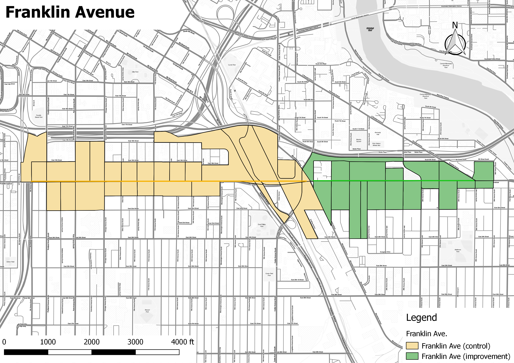
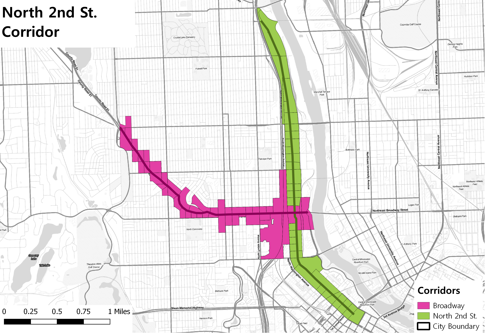

```{r setup,include=FALSE}

knitr::opts_chunk$set(cache = TRUE)


```


#Introduction

In order to make their cities more livable, policymakers and planning departments are improving streets and upgrading transportation infrastructure  in order to improve access and mobility for pedestrians and bicyclists through the reduction of on-street parking or traffic lanes. While studies have shows how such upgrades improve safety the question remains whether such infrastructure improvements also improve the economic outcomes of improved corridors. This study will attempt to answer to what extent these types of corridor-level street improvements impact economic activity and business vitality.

#Data Sources/Methodology

For this study we used the Longitudinal Employment Household Dynamics Dataset (LEHD). It integrates existing data from state-supplied administrative records on workers and employers with existing census, surveys, and other administrative records to create a longitudinal data system on U.S employment. This dataset tracks Workplace Area Characteristics (WAC), census blocks where people work as opposed to where workers live, for all the census blocks between 2002 and 2015 for most of the states in the US.  As such, LEHD provides geographically granular detail about American’s jobs, workers and local economies, allowing us to examine employment by broad industry sector, wage and educational attainment. 

##Methdology

We have applied three methods in order to isolate the impact of street improvements while controlling for other economic and regional factors. The methods are an integrated trend analysis (following the NY DOT study), a difference-in-difference approach, and an interrupted time series analysis. 

###Corridor Comparison Selection

In order to properly isolate the effect of the street improvements we must identify treatment corridors (corridors that actually were improved) and control corridors (corridors that are similar to the treatment corridors except they remain unimproved). Treatment corridors are corridors where new bike or pedestrian related improvements were installed. Ideally, these corridors are made up of a minimum of 10 adjacent, or intersecting, census blocks with a minimal number of retail and accommodations related jobs. Additionally, we will only use corridors where street improvements were installed between 2008 and 2013 in order to guarantee with have sufficient data to track pre and post-treatment employment trends. 

Once corridors are selected based on these criteria we require further testing in order to discern how similar the proposed treatment and control corridors. Finding corridors that are as similar as possible to each other except for the construction of new bicycle/pedestrian infrastructure allows us to approximate true experimental conditions. We will use a combination of descriptive statistics- comparing corridor employment figures to city employment quantiles- and statistical tests- t-tests in order to determine if the average employment, by block, for each corridor is similar to the other.

###Aggregated Trend Comparison

This first method follows the previous NYCDOT study (NYCDOT, 2013), aiming to examine whether the treatment corridors tend to have better business performance than comparison corridors after street improvements. The approach compares the trends of treatment and control corridors in addition to city-wide trends over the full time period we have data for. If treatment corridors show greater increases in employment or sales tax receipts that would represent a positive impact of street improvement on business activities. This method is easy to follow and represents the aggregated trend of business activities. However, it lacks the rigor of econometric estimates and statistical tests that explicitly test whether or not the street improvement caused the change in trend.

###Difference-in-Difference

The second method aims to estimate the difference in business vitality of pre- and post-improvement periods between improved and comparison corridors within the same time period. This is known as a difference-in-difference (DID) approach. It is a designed to answer the "but for" question of what a corridor's economic trajectory would look like had it streets not been improved.  It requires data from pre/post intervention such as panel data (individual level data overtime) or cross-sectional data (individual or group level). The approach looks at the change in the variable of interest in the treatment group before and after it is treated. In this case this means looking at some time period before and after a street improvement. Meanwhile, the control group has not been treated in either time period. The difference in growth trajectories between the two periods will give an unbiased estimate of the effect of the treatment. DID is a useful technique when randomization on the individual level is not possible. This approach removes biases in the second period comparisons between the treatment group and control group that could be result from permanent differences between those groups, as well as biases from comparisons over time in the treatment group that could be the result of trends. A key assumption of DID estimate is that the differences between control group and treatment group would have remained constant in the absence of treatment. 

DID is a linear modeling approach and its basic formula is expressed as:

$$ Y_{it} = \beta_0 + \beta_1T_{it} + \beta_2A_{it} + \beta_3T_{it}A_{it} +\varepsilon_{it} $$

$Y_{it}$ is the observed outcome in groups i and t (in this case change in employment or sales tax revenue)
$T_{it}$ is a dummy variable set to 1 if the observation is from the treatment group
$A_{it}$ is a dummy variable set to 1 if the observation is from the post treatment period i either groups
$\beta_3$ is the DID estimate of the treatment effect

If the DID estimate $\beta_3$  is significant and positive, then that indicates a positive effect of the street improvement. Conversely if the estimate is significant and negative that indicates a negative effect of the improvement. Finally, a non-significant result indicates the improvement had no statistically discernible effect. 

###Interrupted Time Series

Interrupted time series is an econometric technique that estimates how street improvements impact corridor economic vitality from a longitudinal perspective. This approach tracks the treatment corridor over time and estimates the impact by the treatment by looking at the change of the corridor growth trend after the treatment. If the treatment has a causal impact, the post-intervention series will have a different level or slope than the pre-intervention series. In our research, interrupted-time series will be used to distinguish differences in growth before and after a specific time break point where an intervention, such as installation of new bicycled facility happens.  

One advantage of ITS is that it allows for the statistical investigation of potential biases in the estimate of the effect of the intervention. Given the longitudinal nature of the test ITS requires a significantly larger amount of data in order to accurately estimate a real effect on the growth trend. 

The interrupted time-series analysis equation can be expressed as: 

$$ Y_t = \beta_0 + \beta_1T_1 + \beta_2X_1 + \beta_3T_1X_1 +\varepsilon_{it} $$

$Y_t$ is the observed business outcome in time period t
$T_t$ indicates the number of quarters from start to finish of the series
$X_t$ is the treatment dummy variable taking values of 0 in the pre-intervention period and 1 in the post-intervention period
$\beta_0$ is the model intercept or baseline level at T = 0
$\beta_1$ represents the change in the outcome with a time unit increase (the pre-intervention trend)
$\beta_2$ is the level change following the intervention
$\beta_3$ indicates the slope change following the intervention 


```{r message=FALSE, warning=FALSE, include=FALSE}

if(!require(pacman)){install.packages("pacman"); library(pacman)}
p_load(here, stargazer, sf, ggplot2, ggthemes, dplyr)

source(here::here("Code/corridor_comparison_functions.R"))

minn_corridor <- st_read(here::here("Data/minneapolis/minn_corridor_lehd_wgs84.geojson"))
#add new colume of construct year as numeric

minn_lehd <- st_read(here::here("Data/Minneapolis/minn_lehd.geojson")) %>% as.data.frame()

minn_emp_ratio <- employ_ratio_test(minn_corridor)

minn_growth <- growth_rate(minn_corridor)

minn_lehd_2007 <- minn_lehd %>% filter(year == "2007", CNS07+CNS18 > 0)

#prep quantile dataframe

p <- seq(0,1, by = .05)

quant_df <- data.frame(q_tot_emp = quantile(minn_lehd_2007$C000, probs = p, na.rm = TRUE),
                       q_retail = quantile(minn_lehd_2007$CNS07, probs = p, na.rm = TRUE),
                       q_food_accom = quantile(minn_lehd_2007$CNS18, probs = p, na.rm = TRUE),
                       probs = p)

```

#Corridor Comparisons

Our first test in corridor comparability is comparing the count of the total number, retail, and accommodation jobs within the corridors compared to block figures for the city of Minneapolis as a whole. This is allows us to have a broad understanding of the relative job density of the corridors. This serves two purposes: first, it gives us a quick estimate of the range of jobs the corridors have; and second, it shows how similar the corridors are to each other in terms of the number of jobs in each. Finally, we perform a t-test, a statistical test designed to measure if the means of two different groups are statistically similar. This final test offers us a more rigorous test of the comparability of the corridors. All of these figures use 2007 employment numbers from the LEHD as that is the earliest year before the first improvement project. 

##Riverside Ave.


Our first corridor group consists of the Riverside and Cedar Ave corridors. The Cedar Ave comparison corridor is only 2,000 feet and covers three census blocks and is too small for meaningful comparison but we shall continue forward with the analysis.


```{r message=FALSE, warning=FALSE, include=FALSE}

#comparisons-----

riverside <- minn_corridor %>% filter(Name == "Riverside Ave (improvement site)", 
                                      year == as.numeric(as.character(BuildStart))-1)
cedar <- minn_corridor %>% filter(Name == "Cedar Ave (control)", year == "2008")

riverside <- riverside %>% summarise(TotEmp = sum(C000)/nrow(riverside), RetailEmp = sum(CNS07)/nrow(riverside),
                                     AccomEmp = sum(CNS08)/nrow(riverside))
# get employment at block level, divided by nrow()

cedar <- cedar %>% summarise(TotEmp = sum(C000), RetailEmp = sum(CNS07),
                             AccomEmp = sum(CNS08))

#t-tests----

riverside <- minn_corridor %>% filter(Name == "Riverside Ave (improvement site)", year == "2008")
cedar <- minn_corridor %>% filter(Name == "Cedar Ave (control)", year == "2008")

riverside <- riverside %>% mutate(business = CNS07 + CNS18,
                                  service1 = CNS07 + CNS12 + CNS14 + CNS15 + CNS16 + CNS17 + CNS18 + CNS19,
                                  service2 = CNS07 + CNS12 + CNS14 + CNS17 + CNS18 + CNS19,
                                  busi_perc1 = business/service1,
                                  busi_perc2 = business/service2)

cedar <- cedar %>% mutate(business = CNS07 + CNS18,
                                  service1 = CNS07 + CNS12 + CNS14 + CNS15 + CNS16 + CNS17 + CNS18 + CNS19,
                                  service2 = CNS07 + CNS12 + CNS14 + CNS17 + CNS18 + CNS19,
                                  busi_perc1 = business/service1,
                                  busi_perc2 = business/service2)


t.test(riverside$business, cedar$business)
t.test(riverside$busi_perc1, cedar$busi_perc1)
t.test(riverside$busi_perc2, cedar$busi_perc2)

```

The following table shows total, retail, and accommodations employment for Riverside and Cedar and the city based percentile rank of the corridors. Both corridors are in the top 5% of the city in terms of the number of total and retail. Neither corridor has any accommodations employment.  


| Corridor       | Tot Emp | Retail Emp | Accom Emp | Tot (%) | Retail (%) | Accom (%) |
|----------------|---------|------------|-----------|---------|------------|-----------|
| Riverside Ave. | 5341    | 199        | 102         | 95      | 95         | 95       |
| Cedar Ave.     | 672     | 97          | 0         | 95      | 95         | N/A       |

Table 1: Riverside and Cedar Avenue Employment Percentiles


We performed t-tests on three metrics at the census block level: "business" employment, the sum of retail and accommodations employment; a "business share" metric that is the share of employment in a census block of business employment over the sum of other services industries such as professional/scientific services, public administration and educational services; finally, a second business share metric on a smaller share of services employment including professional/scientific services, administrative/waste management services and arts/accommodation services (check appendix for variable definitions).

On all three metrics the t-test returned non-significant results meaning that there is not a statistically significant difference in the mean employment levels between the two corridors. This means that the corridors are comparable and are appropriate for continued testing. 

##Franklin Ave



The Franklin Avenue corridors are both within the top 10% of areas in the city with respect total and retail employment, though the Franklin treatment corridor is in the 90th percentile of total employment compared to the 95th percentile of the Franklin control corridor. The Franklin Avenue control corridor is also in the top 5% of areas of the city in accommodations employment while the improvement corridor has no accommodations employment.


```{r message=FALSE, warning=FALSE, include=FALSE}

#group 2

franklin <- minn_corridor %>% filter(Name == "Franklin Ave (improvement)", year == "2007")
minnehaha <- minn_corridor %>% filter(Name == "Franklin Ave (control)", year == "2007")

franklin <- franklin %>% summarise(tot_emp = sum(C000), retail_emp = sum(CNS07),
                                   accom_emp = sum(CNS08))

minnehaha <- minnehaha %>% summarise(tot_emp = sum(C000), retail_emp = sum(CNS07),
                                     accom_emp = sum(CNS08))

#t-tests

franklin <- minn_corridor %>% filter(Name == "Franklin Ave (improvement)", year == "2007")
minnehaha <- minn_corridor %>% filter(Name == "Franklin Ave (control)", year == "2007")

franklin <- franklin %>% mutate(business = CNS07 + CNS18,
                                  service1 = CNS07 + CNS12 + CNS14 + CNS15 + CNS16 + CNS17 + CNS18 + CNS19,
                                  service2 = CNS07 + CNS12 + CNS14 + CNS17 + CNS18 + CNS19,
                                  busi_perc1 = business/service1,
                                  busi_perc2 = business/service2)

minnehaha <- minnehaha %>% mutate(business = CNS07 + CNS18,
                                  service1 = CNS07 + CNS12 + CNS14 + CNS15 + CNS16 + CNS17 + CNS18 + CNS19,
                                  service2 = CNS07 + CNS12 + CNS14 + CNS17 + CNS18 + CNS19,
                                  busi_perc1 = business/service1,
                                  busi_perc2 = business/service2)


t.test(franklin$business, minnehaha$business)
t.test(franklin$busi_perc1, minnehaha$busi_perc1)
t.test(franklin$busi_perc2, minnehaha$busi_perc2)
```


| Corridor           | Tot Emp | Retail Emp | Accom Emp | Tot (%) | Retail (%) | Accom (%) |
|--------------------|---------|------------|-----------|---------|------------|-----------|
| Franklin/Riverside | 340     | 39         | 0         | 90      | 95         | N/A       |
| Franklin/Minnehaha | 1366    | 19         | 187       | 95      | 95         | 95        |

Table 2: Franklin Ave. Corridors Employment Percentiles

In terms of the t-tests both corridors have statistically non-significant differences in "business" employment and their business employment share categories. Thus these corridors are appropriate comparators for further study.

##Central Avenue


Both the Central and University Avenue corridors have total and retail employment in the top 5% of blocks in the city. Central Avenue also has accommodations employment equal to the top 5% of blocks in the city.


```{r message=FALSE, warning=FALSE, include=FALSE}

central <- minn_corridor %>% filter(Name == "Central Ave (improvement)", year == "2007")
university <- minn_corridor %>% filter(Name == "University Ave NE (control)", year == "2007")

central <- central %>% summarise(tot_emp = sum(C000), retail_emp = sum(CNS07),
                                   accom_emp = sum(CNS08))

university <- university %>% summarise(tot_emp = sum(C000), retail_emp = sum(CNS07),
                                     accom_emp = sum(CNS08))

#t-tests

central <- minn_corridor %>% filter(Name == "Central Ave (improvement)", year == "2007")
university <- minn_corridor %>% filter(Name == "University Ave NE (control)", year == "2007")

central <- central %>% mutate(business = CNS07 + CNS18,
                                  service1 = CNS07 + CNS12 + CNS14 + CNS15 + CNS16 + CNS17 + CNS18 + CNS19,
                                  service2 = CNS07 + CNS12 + CNS14 + CNS17 + CNS18 + CNS19,
                                  busi_perc1 = business/service1,
                                  busi_perc2 = business/service2)

university <- university %>% mutate(business = CNS07 + CNS18,
                                  service1 = CNS07 + CNS12 + CNS14 + CNS15 + CNS16 + CNS17 + CNS18 + CNS19,
                                  service2 = CNS07 + CNS12 + CNS14 + CNS17 + CNS18 + CNS19,
                                  busi_perc1 = business/service1,
                                  busi_perc2 = business/service2)


t.test(central$business, university$business)
t.test(central$busi_perc1, university$busi_perc1)
t.test(central$busi_perc2, university$busi_perc2)
```


| Corridor       | Tot Emp | Retail Emp | Accom Emp | Tot (%) | Retail (%) | Accom (%) |
|----------------|---------|------------|-----------|---------|------------|-----------|
| Central Ave    | 572     | 97         | 16        | 95      | 95         | 95        |
| University Ave | 1182    | 164        | 0         | 95      | 95         | N/A       |

Table 3: Central and University Avenue Corridors Employment Percentiles

All t-tests came back non-significant at the .05 level meaning that the two corridors are appropriate comparators. 

##Lyndale Avenue South


Lyndale and Grand Avenue diverge in terms of their total employment numbers but are both in the 95th percentile of retail employment when compared to the rest of the city. 


```{r message=FALSE, warning=FALSE, include=FALSE}

lyndale <- minn_corridor %>% filter(Name == "Lyndale Ave S (improvement)", year == "2007")
grand <- minn_corridor %>% filter(Name == "Grand Ave (control)", year == "2007")

lyndale <- lyndale %>% summarise(tot_emp = sum(C000), retail_emp = sum(CNS07),
                                   accom_emp = sum(CNS08))

grand <- grand %>% summarise(tot_emp = sum(C000), retail_emp = sum(CNS07),
                                     accom_emp = sum(CNS08))

#t-tests

lyndale <- minn_corridor %>% filter(Name == "Lyndale Ave S (improvement)", year == "2007")
grand <- minn_corridor %>% filter(Name == "Grand Ave (control)", year == "2007")

lyndale <- lyndale %>% mutate(business = CNS07 + CNS18,
                                  service1 = CNS07 + CNS12 + CNS14 + CNS15 + CNS16 + CNS17 + CNS18 + CNS19,
                                  service2 = CNS07 + CNS12 + CNS14 + CNS17 + CNS18 + CNS19,
                                  busi_perc1 = business/service1,
                                  busi_perc2 = business/service2)

grand <- grand %>% mutate(business = CNS07 + CNS18,
                                  service1 = CNS07 + CNS12 + CNS14 + CNS15 + CNS16 + CNS17 + CNS18 + CNS19,
                                  service2 = CNS07 + CNS12 + CNS14 + CNS17 + CNS18 + CNS19,
                                  busi_perc1 = business/service1,
                                  busi_perc2 = business/service2)


t.test(lyndale$business, grand$business)
t.test(lyndale$busi_perc1, grand$busi_perc1)
t.test(lyndale$busi_perc2, grand$busi_perc2)


```

| Corridor | Tot Emp | Retail Emp | Accom Emp | Tot (%) | Retail (%) | Accom (%) |
|----------|---------|------------|-----------|---------|------------|-----------|
| Lyndale  | 412     | 106        | 0         | 95      | 95         | N/A       |
| Grand    | 76      | 19         | 0         | 80      | 95         | N/A       |

Table 4: Lyndale and Grand Avenue Corridors Employment Percentiles

All t-tests came back non-significant meaning that the corridors are acceptable comparators. 

##North 2nd Street




North 2nd Street and Broadway Avenue both have total and retail employment in the 95th percentile while Broadway also is in the 95th percentile for the city in accommodations employment, though that translates to only 2 accommodations jobs for the corridor. 


```{r message=FALSE, warning=FALSE, include=FALSE}
second <- minn_corridor %>% filter(Name == "North 2nd Street (improvement)", year == "2007")
  
broadway <- minn_corridor %>% filter(Name == "Broadway Ave (control)", year == "2007")

second <- second %>% summarise(tot_emp = sum(C000), retail_emp = sum(CNS07),
                                   accom_emp = sum(CNS08))

broadway <- broadway %>% summarise(tot_emp = sum(C000), retail_emp = sum(CNS07),
                                     accom_emp = sum(CNS08))

#t-tests

second <- minn_corridor %>% filter(Name == "North 2nd Street (improvement)", year == "2007")
broadway <- minn_corridor %>% filter(Name == "Broadway Ave (control)", year == "2007")

second <- second %>% mutate(business = CNS07 + CNS18,
                                  service1 = CNS07 + CNS12 + CNS14 + CNS15 + CNS16 + CNS17 + CNS18 + CNS19,
                                  service2 = CNS07 + CNS12 + CNS14 + CNS17 + CNS18 + CNS19,
                                  busi_perc1 = business/service1,
                                  busi_perc2 = business/service2)

broadway <- broadway %>% mutate(business = CNS07 + CNS18,
                                  service1 = CNS07 + CNS12 + CNS14 + CNS15 + CNS16 + CNS17 + CNS18 + CNS19,
                                  service2 = CNS07 + CNS12 + CNS14 + CNS17 + CNS18 + CNS19,
                                  busi_perc1 = business/service1,
                                  busi_perc2 = business/service2)


t.test(second$business, broadway$business)
t.test(second$busi_perc1, broadway$busi_perc1)
t.test(second$busi_perc2, broadway$busi_perc2)
```


| Corridor   | Tot Emp | Retail Emp | Accom Emp | Tot (%) | Retail (%) | Accom (%) |
|------------|---------|------------|-----------|---------|------------|-----------|
| Second St. | 2570    | 42         | 0         | 95      | 95         | N/A       |
| Broadway   | 734     | 36         | 2         | 95      | 95         | 95        |

Table 5: North 2nd Street and Broadway Corridors Employment Profile

All t-tests came back non-significant meaning that the corridors are acceptable comparators. 

#Aggregated Trend Analysis

##Riverside Avenue

Riverside retail employment trends seem to suggest a possible positive effect of the bike infrastructure installation with a major jump in employment in the two years immediately after construction and positively trending employment growth since the initial jumps. The comparison corridor's (Cedar Avenue) employment remains basically unchanged except for a minor bump between 2010 and 2011 where employment returns to 2009 levels. 

```{r echo=FALSE, message=FALSE, warning=FALSE}

riverside_agg <- make_agg_trend_table(minn_corridor, group = 1, construct_year = 2009)
riverside_agg_plot <- make_agg_trend_plot(riverside_agg, industry = "Retail", corridor_name = "Riverside Ave.",industry_code = "CNS07_sd", construct_year = 2009, end_year = 2010)


```

The Riverside accommodations patterns are more mixed. Employment growth for the improvement corridor is more robust and consistent after construction compared to the control corridor. The trend analysis here implies a potential positive effect of the infrastructure construction but given the control corridor's positive trends it is not clear that the infrastructure development itself has an independent effect.

```{r echo=FALSE, message=FALSE, warning=FALSE}

riverside_agg_plot <- make_agg_trend_plot(riverside_agg, industry = "Accommodations", corridor_name = "Riverside Ave.",industry_code = "CNS18_sd", construct_year = 2009, end_year = 2010)


```

##Franklin Avenue

Retail employment does show consistent, though moderate, growth for the improvement corridor though the control corridor has a dramatic spike in employment between 2014 and 2015. In terms of overall trends, the control corridor has consistently higher year over year growth compared to the treatment corridor. 


```{r echo=FALSE, message=FALSE, warning=FALSE}
franklin_agg <- make_agg_trend_table(minn_corridor, group = 2, construct_year  = 2011)
franklin_agg_plot <- make_agg_trend_plot(franklin_agg, industry = "Retail", industry_code = "CNS07_sd", construct_year = 2011, end_year = 2012, corridor_name = "Franklin Ave. Corridor")


```


In terms of accommodations employment the trend analysis is relatively ambiguous. In the post-construction period both the improvement and control corridor employment remained flat to slightly negative while the improvement corridor sees dramatic growth in the last year to year period. Given the timing and dramatic change in growth it is unlikely the construction itself is responsible for the spike. 


```{r echo=FALSE, message=FALSE, warning=FALSE}

franklin_agg_plot <- make_agg_trend_plot(franklin_agg, industry = "Accommodations", industry_code = "CNS18_sd", construct_year = 2011, end_year = 2012, corridor_name = "Frankline Ave. Corridor")

```

##Central Avenue

Central Avenue shows a clear positive retail employment trend post-construction for the treatment corridor that eventually overtakes the control corridor in the latest period. Note that both corridors have positive employment trends post-construction though the control corridor has its most dramatic year to year growth during the construction period. 

```{r echo = FALSE, message = FALSE, warning = FALSE}
central_agg <- make_agg_trend_table(minn_corridor, group = 3, construct_year = 2012)
central_agg_plot <- make_agg_trend_plot(central_agg, industry = "Retail", corridor_name = "Central Ave.", industry_code = "CNS07_sd", construct_year = 2012, end_year = 2013)

```

The accommodations employment trend is more ambiguous. The treatment corridor saw a huge jump in employment immediately post construction but given the largely pre-construction negative trend, the shorter post-construction period, and the extreme growth this is probably due to the entry of some large employer as opposed to a response to new infrastructure.  

```{r echo=FALSE, message=FALSE, warning=FALSE}

make_agg_trend_plot(central_agg, industry = "Accommodation", corridor_name = "Central Ave.", industry_code = "CNS18_sd", construct_year = 2012, end_year = 2013)

```

##Lyndale Avenue South

Retail employment on the Lyndale Avenue corridor looks to only have just recovered its employment since the recession though its growth pattern has been much more consistent than its comparison corridor. Interestingly, both the improved and control corridors saw a spike in retail employment in 2015. This is generally good news for the corridors though we the trend analysis does not show any real impact of the street improvement itself on retail employment. 

```{r echo=FALSE, message=FALSE, warning=FALSE}

lyndale_trend <- make_agg_trend_table(minn_corridor, group = 4, construct_year = 2008)

make_agg_trend_plot(lyndale_trend, industry = "Retail", industry_code = "CNS07_sd", construct_year = 2008, end_year = 2009, corridor_name = "Lyndale Ave. S")
```

In terms of accommodations employment, the treatment corridor shows no real effect due to construction showing only modest overall employment growth since 2008. 

```{r echo = FALSE, message=FALSE, warning=FALSE}

make_agg_trend_plot(lyndale_trend, industry = "Accommodations", industry_code = "CNS18_sd", construct_year = 2008, end_year = 2009, corridor_name = "Lyndale Ave. S")
```


##North 2nd Street

North 2nd Street's employment trends point towards a probable impact of street improvement as the overall trend was negative before construction, with a minor rebound immediately pre-construction, a dip during construction, and then rebound in all periods post-construction.

```{r echo=FALSE, message=FALSE, warning=FALSE}

north_agg <- make_agg_trend_table(minn_corridor, group = 5, construct_year = 2011)

make_agg_trend_plot(north_agg, industry = "Retail", corridor_name = "North 2nd St.", industry_code = "CNS07_sd", construct_year = 2011, end_year = 2012)

```

Accommodations employment growth is quite robust for the treatment corridor but its growth trend starts at the beginning of the construction period and continues afterwards. 

```{r echo=FALSE, message=FALSE, warning=FALSE}

make_agg_trend_plot(north_agg, industry = "Accommodation", corridor_name = "North 2nd St.", industry_code = "CNS18_sd",
                    construct_year = 2011, end_year = 2012)

```


##Conclusions

The aggregated trend analyses presented here show  some potentially interesting effects of street improvement for a select set of corridors, but there do not seem to be any clear patterns running in any given direction. At best, we may be able to conclude that the descriptive data offered here does not show any *negative* effect of street improvement on retail or accommodations employment, and, in some cases, may have a positive effect on employment growth. The trend analysis does offer some tantalizing potential of positive employment effects that the difference-in-difference or time series regression can more accurately tease out. 

#Difference-in-Difference

As mentioned in the introduction, difference-in-difference (DiD) is a linear modeling approach designed to answer the "but for" question of what a corridor's economic trajectory would look like had it streets not been improved. The approach looks at the change in the variable of interest in the treatment group before and after it is treated compared to the change in the variable of interest in the control group. This section presents the DiD results for each of the corridors. 

##Riverside Ave. Corridor

The Riverside/Cedar Avenue treatment corridor exhibits a statistically significant and positive effect of infrastructure construction on the number of retail jobs and a positive, but non-significant, effect on accommodations employment. According to our model, Riverside Avenue grew by more than 285 jobs compared to the control control corridor. The important term in the table is the Typeimprovement:prepost variable. That is the "difference" term, a dummy variable representing observations that received treatment in the post-construction period.  

```{r, echo=FALSE, message=FALSE, warning=FALSE}


#riverside_did <- did_analysis(df_did = minn_corridor, group = 1, endyear = 2009)

# stargazer(riverside_did[[1]], riverside_did[[2]], riverside_did[[3]], title = "Riverside Corridor Difference-in-Difference Estimates", column.labels  = c("Retail Emp.", "Accomodations Emp.", "'Business' Emp."), type = "text")

riverside_agg_did <- did_agg_analysis(df_did = minn_corridor, group = 1, endyear = 2009)

stargazer(riverside_agg_did[[1]], riverside_agg_did[[2]], riverside_agg_did[[3]], title = "Riverside Corridor Difference-in-Difference Estimates", column.labels  = c("Retail Emp.", "Accomodations Emp.", "'Business' Emp."), type = "text")

```

##Franklin Ave. Corridor

The Franklin Avenue corridor difference term is also non-significant even though the improvement corridor did exhibit some employment growth. Again, the difference term is measuring the impact of the treatment after its been installed and post-installation there is little employment growth in the treatment corridor at all. This can be checked visually if you examine the plots from the aggregated trend section concerning the corridor. 

```{r, echo=FALSE, message=FALSE, warning=FALSE}


franklin_did <- did_analysis(df_did = minn_corridor, group = 2, endyear = 2011)

stargazer(franklin_did[[1]], franklin_did[[2]], franklin_did[[3]], title = "Franklin Ave. Corridor Difference-in-Difference Estimates", column.labels  = c("Retail Emp.", "Accomodations Emp.", "'Business' Emp."), type = "text")

```

##Central Ave. Corridor

Central Avenue's difference term is non-significant suggesting the treatment does not have a statistical effect on employment in the corridor. Though the improvement corridor has a negative growth trend for accommodations and greater "business" employment it is not tied to strett improvement construction. 

```{r, echo=FALSE, message=FALSE, warning=FALSE}


central_did <- did_analysis(df_did = minn_corridor, group = 3, endyear = 2012)

stargazer(central_did[[1]], central_did[[2]], central_did[[3]], title = "Central Ave. Corridor Difference-in-Difference Estimates", column.labels  = c("Retail Emp.", "Accomodations Emp.", "'Business' Emp."), type = "text")

```

##Lyndale Ave. Corridor

For Lyndale Avenue we find a statistically significant and negative effect of infrastructure installation for accommodations employment but no statistically significant effect for retail or greater "business" employment. The difference term coefficient of $\beta$ = -3.607 implies that the infrastructure construction is responsible for the loss of approximately 3.6 accommodation jobs per census block compared to the untreated corridor.    

```{r, echo=FALSE, message=FALSE, warning=FALSE}


lyndale_did <- did_analysis(df_did = minn_corridor, group = 4, endyear = 2009)

stargazer(lyndale_did[[1]], lyndale_did[[2]], lyndale_did[[3]], title = "Lyndale Ave. Corridor Difference-in-Difference Estimates", column.labels  = c("Retail Emp.", "Accomodations Emp.", "'Business' Emp."), type = "text")

```

##North Second Street Corridor

All difference terms are non-signficant for the North Second Street corridor. Again, this suggests that there is not a statistically significant effect of the infrastructure improvement for this corridor compared to its control corridor, in this case, Broadway Avenue. 

```{r, echo=FALSE, message=FALSE, warning=FALSE}


north_did <- did_analysis(df_did = minn_corridor, group = 5, endyear = 2011)

stargazer(north_did[[1]], north_did[[2]], north_did[[3]], title = "North Second St.Corridor Difference-in-Difference Estimates", column.labels  = c("Retail Emp.", "Accomodations Emp.", "'Business' Emp."), type = "text")

```

##Conclusion

Overall, it does not seem that infrastructure placement had a statistically discernible effect on employment in our corridors or interest. There is some evidence that the placement of the new lane had a negative effect in accommodations employment for the Lyndale Avenue corridor, but there was no equivalent effect for retail jobs or the broader "business" category. This very specified effect probably has more to do with accommodations employment more generally than with the infrastructure, but this research cannot say with any definitiveness what that may or may not be. 

While the results here are largely non-significant, this is not an argument against expanding existing bicycle infrastructure or improving it. At minimum, new bicycle infrastructure has zero effect on employment in these corridors showing there's no harm, in terms of employment. The claim that improve bicycles infrastructure will hurt business hiring on major commercial corridors, then, is not supported.

#Interrupted Time Series

As described earlier, interrupted time series (ITS) is an econometric technique that estimates the impact of an intervention over time. This approach allows us to track the treatment corridor over time and estimate the impact of the treatment by looking at the change of the corridor growth trend after the treatment. If the treatment has a causal impact, the post-intervention series will have a different level or slope than the pre-intervention series. In our research, interrupted-time series will be used to distinguish differences in growth before and after a specific time break point where an intervention, such as installation of new bicycled facility happens.

While ITS is a useful technique it does require much more available data than a difference-in-difference approach or even an aggregated trend analysis. In particular, ITS requires enough pre-treatment data in order to accurately represent any underlying trends in the data. While post-treatment does not necessarily require as many data points as pre-treatment, analysts still need enough post-treatment data to reasonably estimate the impact of the treatment. This limit imposes two costs on researchers. First, as mentioned, is you need more data, overall, to run a proper ITS compared to other techniques. Second, you need a sufficient amount of data *post-treatment* to truly ascertain the impact. This means that depending on the data available infrastructure improvements has to have been concluded probably no later than 2012. But even recognizing these limits, ITS offers a powerful alternative technique for estimating the causal impact of improved infrastructure. 

##Riverside Avenue

```{r, echo=FALSE, message=FALSE, warning=FALSE}

riverside_its <- its_analysis(minn_corridor, group = 1, endyear = 2009)

riverside_agg_its <- agg_its_analysis(df_its = minn_corridor, group = 1, endyear = 2009)

stargazer(riverside_its[[1]], riverside_its[[2]], riverside_its[[3]], type = "text", 
          title = "Interrupted Time Series- Riverside Ave.", column.labels  = c("Retail Emp.", "Accomodations Emp.", "'Business' Emp."))

stargazer(riverside_agg_its[[1]], riverside_agg_its[[2]], riverside_agg_its[[3]], type = "text", 
          title = "Aggregated Interrupted Time Series- Riverside Ave.", column.labels  = c("Retail Emp.", "Accomodations Emp.", "'Business' Emp."))
```