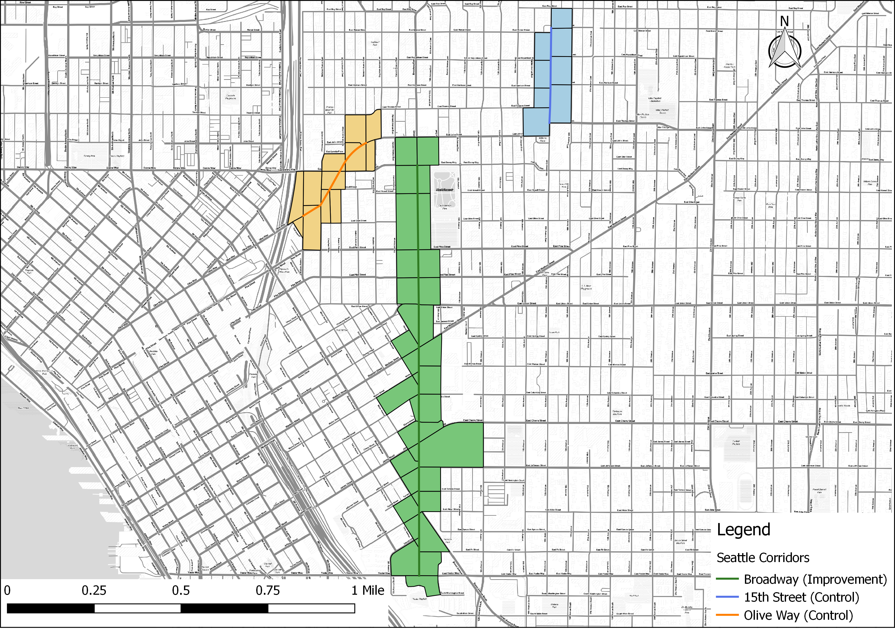
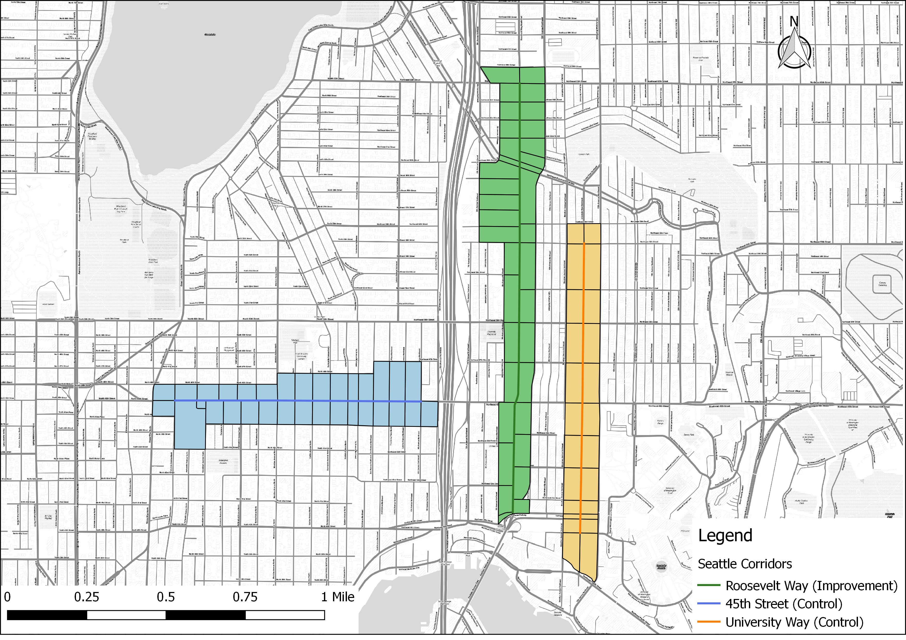

```{r setup,include=FALSE}

knitr::opts_chunk$set(cache = TRUE)

#knitr::opts_knit$set(root.dir = normalizePath(path = #"C:\\Users\\elmue\\Desktop\\Street-Improvement-Impact"))
```


#1. Introduction

In order to make their cities more livable, policymakers and planning departments are improving streets and upgrading transportation infrastructure  in order to improve access and mobility for pedestrians and bicyclists through the reduction of on-street parking or traffic lanes. While studies have shown how such upgrades improve safety the question remains whether such infrastructure improvements also improve the economic outcomes of improved corridors. This study will attempt to answer to what extent these types of corridor-level street improvements impact economic activity and business vitality.

DESCRIPTION OF CITY and CITY BIKE NETWORK and HISTORY HERE


#2. Data Sources/Methodology

## 2.1 Data Sources

For this study, we both used the Longitudinal Employment Household Dynamics Dataset (LEHD) and the retail sales tax data from the city. 

The LEHD dataset is utilized for our analysis in all cities because it is a publicly available data source that exists for most cities and states across the country. It integrates existing data from state-supplied administrative records on workers and employers with existing census, surveys, and other administrative records to create a longitudinal data system on U.S employment. This dataset tracks Workplace Area Characteristics (WAC), census blocks where people work as opposed to where workers live, for all the census blocks between 2002 and 2015 for most of the states in the US.  As such, LEHD provides geographically granular detail about American’s jobs, workers and local economies, allowing us to examine employment by broad industry sector, wage and educational attainment. 

DESCRIPTION of the sales tax data

## 2.2 Methodology

We have applied three methods in order to isolate the impact of street improvements while controlling for other economic and regional factors. The methods are an integrated trend analysis (following the NY DOT study), a difference-in-difference approach, and an interrupted time series analysis. 

### 2.2.1 Corridor Comparison Selection

In order to properly isolate the effect of the street improvements we must identify treatment corridors (corridors that actually were improved) and control corridors (corridors that are similar to the treatment corridors except they remain unimproved). Treatment corridors are corridors where new bike or pedestrian related improvements were installed. Ideally, these corridors are made up of a minimum of 10 adjacent, or intersecting, census blocks with a minimal number of retail and accommodations related jobs. Additionally, we will only use corridors where street improvements were installed between 2008 and 2013 in order to guarantee with have sufficient data to track pre and post-treatment employment trends. 

Once corridors are selected based on these criteria we require further testing in order to discern how similar the proposed treatment and control corridors. Finding corridors that are as similar as possible to each other except for the construction of new bicycle/pedestrian infrastructure allows us to approximate true experimental conditions. We will use a combination of descriptive statistics- comparing corridor employment figures to city employment quantiles- and statistical tests- t-tests in order to determine if the average employment, by block, for each corridor is similar to the other.

### 2.2.2 Aggregated Trend Comparison

This first method follows the previous NYCDOT study (NYCDOT, 2013), aiming to examine whether the treatment corridors tend to have better business performance than comparison corridors after street improvements. The approach compares the trends of treatment and control corridors in addition to city-wide trends over the full time period we have data for. If treatment corridors show greater increases in employment or sales tax receipts that would represent a positive impact of street improvement on business activities. This method is easy to follow and represents the aggregated trend of business activities. However, it lacks the rigor of econometric estimates and statistical tests that explicitly test whether or not the street improvement caused the change in trend.

### 2.2.3 Difference-in-Difference

The second method aims to estimate the difference in business vitality of pre- and post-improvement periods between improved and comparison corridors within the same time period. This is known as a difference-in-difference (DID) approach. It is a designed to answer the "but for" question of what a corridor's economic trajectory would look like had it streets not been improved.  It requires data from pre/post intervention such as panel data (individual level data overtime) or cross-sectional data (individual or group level). The approach looks at the change in the variable of interest in the treatment group before and after it is treated. In this case this means looking at some time period before and after a street improvement. Meanwhile, the control group has not been treated in either time period. The difference in growth trajectories between the two periods will give an unbiased estimate of the effect of the treatment. DID is a useful technique when randomization on the individual level is not possible. This approach removes biases in the second period comparisons between the treatment group and control group that could be result from permanent differences between those groups, as well as biases from comparisons over time in the treatment group that could be the result of trends. A key assumption of DID estimate is that the differences between control group and treatment group would have remained constant in the absence of treatment. 

DID is a linear modeling approach and its basic formula is expressed as:

$$ Y_{it} = \beta_0 + \beta_1T_{it} + \beta_2A_{it} + \beta_3T_{it}A_{it} +\varepsilon_{it} $$

$Y_{it}$ is the observed outcome in groups i and t (in this case change in employment or sales tax revenue)
$T_{it}$ is a dummy variable set to 1 if the observation is from the treatment group
$A_{it}$ is a dummy variable set to 1 if the observation is from the post treatment period i either groups
$\beta_3$ is the DID estimate of the treatment effect

If the DID estimate $\beta_3$  is significant and positive, then that indicates a positive effect of the street improvement. Conversely if the estimate is significant and negative that indicates a negative effect of the improvement. Finally, a non-significant result indicates the improvement had no statistically discernible effect. 

### 2.2.4 Interrupted Time Series

Interrupted time series is an econometric technique that estimates how street improvements impact corridor economic vitality from a longitudinal perspective. This approach tracks the treatment corridor over time and estimates the impact by the treatment by looking at the change of the corridor growth trend after the treatment. If the treatment has a causal impact, the post-intervention series will have a different level or slope than the pre-intervention series. In our research, interrupted-time series will be used to distinguish differences in growth before and after a specific time break point where an intervention, such as installation of new bicycled facility happens.  

One advantage of ITS is that it allows for the statistical investigation of potential biases in the estimate of the effect of the intervention. Given the longitudinal nature of the test ITS requires a significantly larger amount of data in order to accurately estimate a real effect on the growth trend. 

The interrupted time-series analysis equation can be expressed as: 

$$ Y_t = \beta_0 + \beta_1T_1 + \beta_2X_1 + \beta_3T_1X_1 +\varepsilon_{it} $$

$Y_t$ is the observed business outcome in time period t
$T_t$ indicates the number of quarters from start to finish of the series
$X_t$ is the treatment dummy variable taking values of 0 in the pre-intervention period and 1 in the post-intervention period
$\beta_0$ is the model intercept or baseline level at T = 0
$\beta_1$ represents the change in the outcome with a time unit increase (the pre-intervention trend)
$\beta_2$ is the level change following the intervention
$\beta_3$ indicates the slope change following the intervention 


```{r message=FALSE, warning=FALSE, include=FALSE}

if(!require(pacman)){install.packages("pacman"); library(pacman)}
p_load(here, sf, ggplot2, ggthemes, dplyr, stargazer)

source(here::here("Code/corridor_comparison_functions.R"))

seattle_corridor <- st_read(here::here("Data/Seattle/seattle_corridor_lehd_wgs84.geojson"))
seattle_corridor <- seattle_corridor %>% 
  mutate(CNS07=ifelse(Corr_Name=="E Olive Way" & GEOID10==530330084003000 & year==2006, 5, CNS07))%>%  # might be a data input error, replace it with average of the previous and next year
  rename(Name=Corr_Name,
         Type=Study_Cont) 
#add new colume of construct year as numeric

seattle_corridor$Type <- as.character(seattle_corridor$Type)
seattle_corridor[seattle_corridor$Name =="15th Ave E",]$Type <- "Control: 15th Ave E"
seattle_corridor[seattle_corridor$Name=="E Olive Way",]$Type <- "Control: E Olive Way"
seattle_corridor[seattle_corridor$Name=="University Way NE",]$Type <- "Control: University Way NE"
seattle_corridor[seattle_corridor$Name=="NE 45th St",]$Type <- "Control: NE 45th St"
seattle_corridor$Type <- as.factor(seattle_corridor$Type)

seattle_lehd <- st_read(here::here("Data/Seattle/seattle_lehd.geojson")) %>% as.data.frame()

seattle_emp_ratio <- employ_ratio_test(seattle_corridor)

seattle_growth <- growth_rate(seattle_corridor)

```


#3. Corridor Comparisons

Our first test in corridor comparability is comparing the count of the total number, retail, and accommodation jobs within the corridors compared to block figures for the city of Seattle as a whole. This is allows us to have a broad understanding of the relative job density of the corridors. This serves two purposes: first, it gives us a quick estimate of the range of jobs the corridors have; and second, it shows how similar the corridors are to each other in terms of the number of jobs in each. And then, we perform a t-test, a statistical test designed to measure if the means of two different groups are statistically similar. This final test offers us a more rigorous test of the comparability of the corridors. We compare the employment numbers a year before construction for each improvement corridor and its comparison corridor(s). Finally, we illustrate the growth trend of the comparable corridors, and perform a t-test and visual graph to justify the similarity of the corridors in terms of employment change over time. 

## 3.1 Second Avenue


Our first corridor group consists of the 2nd and 4th Ave corridors in downtown Seattle.

```{r message=FALSE, warning=FALSE, include=FALSE}

#comparisons-----

# prepare city level data & block level corridor data at the year before construction
conyear <- first(filter(seattle_corridor,Group==1, Type=="Study")$BuildStart)-1 
# find the year before construction

seattle_lehd_2013 <- seattle_lehd %>% filter(year == conyear, CNS07+CNS18 > 0)

secondave <- seattle_corridor %>% filter(Group==1, Type=="Study", year==conyear) %>% employ_ratio_test(.)
forthave <- seattle_corridor %>% filter(Group==1, Name=="4th Ave", year==conyear) %>% employ_ratio_test(.)

# find quantile dataframe 

p <- seq(0,1, by = .05)

quant_df <- data.frame(q_tot_emp = quantile(seattle_lehd_2013$C000, probs = p, na.rm = TRUE),
                       q_retail = quantile(seattle_lehd_2013$CNS07, probs = p, na.rm = TRUE),
                       q_food_accom = quantile(seattle_lehd_2013$CNS18, probs = p, na.rm = TRUE),
                       probs = p)

secondave %>% summarise(TotEmp = sum(C000)/nrow(secondave), RetailEmp = sum(CNS07)/nrow(secondave),
                                     AccomEmp = sum(CNS18)/nrow(secondave)) %>% as.data.frame
forthave %>% summarise(TotEmp = sum(C000)/nrow(forthave), RetailEmp = sum(CNS07)/nrow(forthave),
                                     AccomEmp = sum(CNS18)/nrow(forthave)) %>% as.data.frame
# get employment at block level, divided by nrow()
 

# t-test: compare retail, food_accom, business amount---
t.test(secondave$Business, forthave$Business)
t.test(secondave$Retail, forthave$Retail)
t.test(secondave$Food_Accom, forthave$Food_Accom)
t.test(secondave$ratio1, forthave$ratio1)
t.test(secondave$ratio2, forthave$ratio2)


# t-tests: growth rate----

secondave_growth <- seattle_growth %>%  
  mutate(year=as.numeric(as.character(year))) %>% 
  filter(Group==1, Type=="Study", year<=conyear) 
forthave_growth <- seattle_growth %>%  
  mutate(year=as.numeric(as.character(year))) %>% 
  filter(Group==1, Name=="4th Ave", year<=conyear) 

t.test(secondave_growth$biz_growth,forthave_growth$biz_growth)
t.test(secondave_growth$retail_growth,forthave_growth$retail_growth)
t.test(secondave_growth$food_accom_growth,forthave_growth$food_accom_growth)
```


### 3.1.1 Corridor employment amount
The following table shows total, retail, and accommodations employment for 2nd and 4th Ave. and the city based percentile rank of the corridors. Both corridors are in the top 5% of the city in terms of the number of total employment. In terms of retail, they also have similary employment numbers, and both in top 25%. There is slight difference in food and accomodation sector, the improvement corridor 2nd Ave. is in top 15%, while the comparison corridor is in top 10%.   


| Corridor       | Tot Emp | Retail Emp | Accom Emp | Tot (%) | Retail (%) | Accom (%) |
|----------------|---------|------------|-----------|---------|------------|-----------|
| 2nd Ave.       | 1135    | 14         | 42        | 95-100  | 75-80      | 85-90     |
| 4th Ave.       | 771     | 14         | 57        | 95-100  | 75-80      | 90-95     |

Table 1: 2nd and 4th Avenue Corridor Employment Percentiles

### 3.1.2 Employment number comparison
We performed t-tests on two types metrics of employment number at the census block level: employment number, for retail, food and accommodations, and sum of the two, named business; "business share" metric that is the share of employment in a census block of business employment over the sum of other services industries. Two definition of all service industies are applied: ones is the sum of professional/scientific services, public administration and educational services, and another is a smaller share of services employment including professional/scientific services, administrative/waste management services and arts/accommodation services (check appendix for variable definitions).

On all metrics the t-test returned non-significant results meaning that there is not a statistically significant difference in the mean employment levels between the two corridors. This means that the corridors are comparable and are appropriate for continued testing. 

### 3.1.3 Employment trend comparison

```{r, echo=FALSE, message=FALSE, warning=FALSE}
secondave_agg <- agg_trend_table(seattle_corridor, group = 1)
agg_trend_plot(secondave_agg, industry = "Retail", industry_code = "CNS07", corridor_name = "2nd Ave.", construct_year = 2014, end_year = 2015)
agg_trend_plot(secondave_agg, industry = "Food/Accommodataion",industry_code = "CNS18", corridor_name = "2nd Ave.", construct_year = 2014, end_year = 2015)
agg_trend_plot(secondave_agg, industry = "Business",industry_code = "business", corridor_name = "2nd Ave.", construct_year = 2014, end_year = 2015)
```

The total business employment for corridors both experienced continuing drop during economic recession period (2009-2012), and start to recover after that. Although the improvement corridor, 2nd Ave., experienced more significant fluctuation, the general trend of the two corridors are similar. The non-significance t-test result also verify this.


Retail employment trend of the two corridors varies among time. Before 2009, the improvement corridor experienced a rapid increase in retail employment, while the control corridor started with high level of employment and dropped significantly in 2009. After 2009, the growth trend for two corridors are very similar. The t-test also indicates slightly difference between the trend of two corridors at 0.1 level. While food and accommodation employment trend is similar to business trend presented above, and the t-test verify the similarity as well. 

## 3.2 Broadway Street



Our second improvement corridor is Broadway, and it has two control corridors: 15th Ave E, and E Olive Way. They locate in Pike/Pine or Capital Hill neighborhoods, close to Downtown core retail area.

```{r message=FALSE, warning=FALSE, include=FALSE}

#comparisons-----

# prepare city level data & block level corridor data at the year before construction
conyear <- first(filter(seattle_corridor,Group==2, Type=="Study")$BuildStart)-1 
# find the year before construction

seattle_lehd_2012 <- seattle_lehd %>% filter(year == conyear, CNS07+CNS18 > 0)

brwy <- seattle_corridor %>% filter(Group==2, Type=="Study", year==conyear) %>% employ_ratio_test(.)
fifteen <- seattle_corridor %>% filter(Group==2, Name=="15th Ave E", year==conyear) %>% employ_ratio_test(.)
olive <- seattle_corridor %>% filter(Group==2, Name=="E Olive Way", year==conyear) %>% employ_ratio_test(.)


# find quantile dataframe 

p <- seq(0,1, by = .05)

quant_df <- data.frame(q_tot_emp = quantile(seattle_lehd_2012$C000, probs = p, na.rm = TRUE),
                       q_retail = quantile(seattle_lehd_2012$CNS07, probs = p, na.rm = TRUE),
                       q_food_accom = quantile(seattle_lehd_2012$CNS18, probs = p, na.rm = TRUE),
                       probs = p)

brwy %>% summarise(TotEmp = sum(C000)/nrow(brwy), RetailEmp = sum(CNS07)/nrow(brwy),
                                     AccomEmp = sum(CNS18)/nrow(brwy)) %>% as.data.frame
fifteen %>% summarise(TotEmp = sum(C000)/nrow(fifteen), RetailEmp = sum(CNS07)/nrow(fifteen),
                                     AccomEmp = sum(CNS18)/nrow(fifteen)) %>% as.data.frame
olive %>% summarise(TotEmp = sum(C000)/nrow(olive), RetailEmp = sum(CNS07)/nrow(olive),
                                     AccomEmp = sum(CNS18)/nrow(olive)) %>% as.data.frame
# get employment at block level, divided by nrow()
 

# t-test: compare retail, food_accom, business amount---
t.test(brwy$Business, fifteen$Business)
t.test(brwy$Retail, fifteen$Retail)
t.test(brwy$Food_Accom, fifteen$Food_Accom)
t.test(brwy$ratio1, fifteen$ratio1)
t.test(brwy$ratio2, fifteen$ratio2)

t.test(brwy$Business, olive$Business)
t.test(brwy$Retail, olive$Retail)
t.test(brwy$Food_Accom, olive$Food_Accom)
t.test(brwy$ratio1, olive$ratio1)
t.test(brwy$ratio2, olive$ratio2)


# anova: growth rate----

brwy_growth <- seattle_growth %>% 
  mutate(year=as.numeric(as.character(year))) %>% 
  filter(Group==2, year<=conyear) 

TukeyHSD(aov(biz_growth~Type, data=brwy_growth))
TukeyHSD(aov(retail_growth~Type, data=brwy_growth))
TukeyHSD(aov(food_accom_growth~Type, data=brwy_growth))
```


### 3.2.1 Corridor employment amount
The following table shows total, retail, and accommodations employment for Broadway, 15th Ave, and E Olive Way corridors, and the city based percentile rank of the corridors. Broadway has much more employment than the other comparison corridors. However, with respect to our interested business employment, the corridors are at similar level. 15th Ave E has slight higher percentiles in both retail and food/accommodation sectors than the improvement corridor, while E Olive Way has slightly less food/accommodation employment with very small amount of retail employment.   


| Corridor       | Tot Emp | Retail Emp | Accom Emp | Tot (%) | Retail (%) | Accom (%) |
|----------------|---------|------------|-----------|---------|------------|-----------|
| Broadway       | 387     | 16         | 15        | 90-95   | 80-85      | 70-75     |
| 15th Ave E     | 88      | 31         | 27        | 65-70   | 85-90      | 80-85     |
| E Olive Way    | 30      | 2          | 11        | 40-45   | 45-50      | 60-65     |

Table 2: Broadway, 15th Ave, and E Olive Way Corridor Employment Percentiles

### 3.2.2 Employment number comparison
Control corridor 1: 15th Ave E 
With respect to employment number metrics, the t-test returned non-significant results meaning that there is not a statistically significant difference in the mean employment levels between the two corridors. However, the "business share" metrics indicate significant difference between improvement corridor and 15th Ave. The large share of other service jobs in improvement corridor might influence the impact of bike facility, since the might be confounding effect from other services to retail employment rather than bike lane installation. But given the similarity in business employment amount, the 15th Ave E corridors are still comparable and are appropriate for continued testing. 

Control corridor 2: E Olive Way
According to t-test result, although there is significant difference in retail employments between improvement corridor and E Olive Way, the general business vitalitiy are similar, after taking into account of food/accommodation sector. In terms of "business share" metrics, one of the metric (taking into smaller scale of service employment) shows no different in business share between two corridors. We conclude E Olive Way is comparable and appropriate for continued testing.

### 3.2.3 Employment trend comparison

```{r, echo=FALSE, message=FALSE, warning=FALSE}
brwy_agg <- agg_trend_table(seattle_corridor, group = 2)
agg_trend_plot(brwy_agg, industry = "Retail", industry_code = "CNS07",corridor_name = "Broadway", construct_year = 2014, end_year = 2015)
agg_trend_plot(brwy_agg, industry = "Food/Accomodation", industry_code = "CNS18", corridor_name = "Broadway", construct_year = 2014, end_year = 2015)
agg_trend_plot(brwy_agg, industry = "Business",industry_code = "business", corridor_name = "Broadway", construct_year = 2014, end_year = 2015)

```

The total business employment trend over this recent decade is similar for improvement corridor and 15th Ave. Although E Olive Way corridor experienced dramatic changes in 2007, 2011 and 2012, the overall trend before 2013, the bike lane installation year, is generally growing, which is similar to the improvement corridors. The non-significance t-test result also verify this.


Retail employment trend is very similar for improvement corridor and 15th Ave E corridor before the construction of bike lane. However, the second control corridor, E Olive Way, experienced much more fluctuation before 2013, which is unlike the improvement corridor. The growth trend of food/accommodation service sector are almost parallel across three corridors. The t-test verify this as well.


## 3.3 Roosevelt Way



Our third improvement corridor is Roosevelt Way, and it has two control corridors: University Way and N 45th St. They all locate in North Seattle, close to University District.

```{r message=FALSE, warning=FALSE, include=FALSE}

#comparisons-----

# prepare city level data & block level corridor data at the year before construction
conyear <- first(filter(seattle_corridor,Group==3, Type=="Study")$BuildStart)-1 
# find the year before construction

seattle_lehd_2015 <- seattle_lehd %>% filter(year == conyear, CNS07+CNS18 > 0)

rsvt <- seattle_corridor %>% filter(Group==3, Type=="Study", year==conyear) %>% employ_ratio_test(.)
unvst <- seattle_corridor %>% filter(Group==3, Name=="University Way NE", year==conyear) %>% employ_ratio_test(.)
fortyfif <- seattle_corridor %>% filter(Group==3, Name=="NE 45th St", year==conyear) %>% employ_ratio_test(.)


# find quantile dataframe 

p <- seq(0,1, by = .05)

quant_df <- data.frame(q_tot_emp = quantile(seattle_lehd_2015$C000, probs = p, na.rm = TRUE),
                       q_retail = quantile(seattle_lehd_2015$CNS07, probs = p, na.rm = TRUE),
                       q_food_accom = quantile(seattle_lehd_2015$CNS18, probs = p, na.rm = TRUE),
                       probs = p)

rsvt %>% summarise(TotEmp = sum(C000)/nrow(rsvt), RetailEmp = sum(CNS07)/nrow(rsvt),
                                     AccomEmp = sum(CNS18)/nrow(rsvt)) %>% as.data.frame
unvst %>% summarise(TotEmp = sum(C000)/nrow(unvst), RetailEmp = sum(CNS07)/nrow(unvst),
                                     AccomEmp = sum(CNS18)/nrow(unvst)) %>% as.data.frame
fortyfif %>% summarise(TotEmp = sum(C000)/nrow(fortyfif), RetailEmp = sum(CNS07)/nrow(fortyfif),
                                     AccomEmp = sum(CNS18)/nrow(fortyfif)) %>% as.data.frame
# get employment at block level, divided by nrow()
 

# t-test: compare retail, food_accom, business amount---
t.test(rsvt$Business, unvst$Business)
t.test(rsvt$Retail, unvst$Retail)
t.test(rsvt$Food_Accom, unvst$Food_Accom)
t.test(rsvt$ratio1, unvst$ratio1)
t.test(rsvt$ratio2, unvst$ratio2)

t.test(rsvt$Business, fortyfif$Business)
t.test(rsvt$Retail, fortyfif$Retail)
t.test(rsvt$Food_Accom, fortyfif$Food_Accom)
t.test(rsvt$ratio1, fortyfif$ratio1)
t.test(rsvt$ratio2, fortyfif$ratio2)


# anova: growth rate----

rsvt_growth <- seattle_growth %>% 
  mutate(year=as.numeric(as.character(year))) %>% 
  filter(Group==3, year<=conyear) 

TukeyHSD(aov(biz_growth~Type, data=rsvt_growth))
TukeyHSD(aov(retail_growth~Type, data=rsvt_growth))
TukeyHSD(aov(food_accom_growth~Type, data=rsvt_growth))
```

### 3.3.1 Corridor employment amount
The following table shows total, retail, and accommodations employment for Roosevelt Way, University Way, and 45th St corridors, and the city based percentile rank of the corridors. Compared with improvement corridor, Roosevelt Way, University Way corridor has similar amount of retail employment, while they are both between 85-90 percentiles. But University Way has more food & accomomdation service jobs than Roosevelt Way. Although 45th St has similar food and accommodation employment as Roosevelt Way, it has less retail jobs. In general, both the two control corridors are comparable with Roosevelt Way to some extent.  


| Corridor       | Tot Emp | Retail Emp | Accom Emp | Tot (%) | Retail (%) | Accom (%) |
|----------------|---------|------------|-----------|---------|------------|-----------|
| Roosevelt Way  | 74      | 30         | 10        | 60-65   | 85-90      | 60-65     |
| University Way | 120     | 39         | 37        | 70-75   | 85-90      | 85-90     |
| 45th St        | 50      | 11         | 15        | 50-55   | 70-75      | 65-70     |

Table 2: Roosvelt Way, University Way, and 45th St Corridor Employment Percentiles

### 3.3.2 Employment number comparison
Control corridor 1: University Way
With respect to employment number metrics, University Way has similar business and retail employment jobs, but it has significant more food/accommodation employment than the improvement corridor. It arise the caveat that the impact of bike lane on food/accommodation factor might be different between the two corridors. Both "business share" metrics t-tests indicate similarity between the two corridors. Although the food/accommodation employment test shows difference between the two corridors, they are still comparable in terms of all other metrics, and are appropriate for continued testing. 

Control corridor 2: 45th St
All the t-test return non-significant results, indicating 45th St are comparable with our improvement corridor with respect to employment number and business share.

### 3.3.3 Employment trend comparison

```{r, echo=FALSE, message=FALSE, warning=FALSE}
rsvt_agg <- agg_trend_table(seattle_corridor, group = 3)
agg_trend_plot(rsvt_agg, industry = "Business", industry_code = "business", corridor_name = "Roosevelt Way", construct_year = 2016, end_year = 2017)
agg_trend_plot(rsvt_agg, industry = "Retail",industry_code = "CNS07", corridor_name = "Rossevelt Way.", construct_year = 2016, end_year = 2017)
agg_trend_plot(rsvt_agg, industry = "Food/Acommodation",industry_code = "CNS18", corridor_name = "Roosevelt Way", construct_year = 2016, end_year = 2017)
```

The total business employment trend for three corridors over this recent decade are growing with some fluctuation. The business employment in improvement corridor generally increases beside during the economic recession period. NE 45th St also increase gentlly over time with slight decrease in 2005 and 2014. University Way has an increase spike in 2012 and 2013, but descreases after that. The t-test indicates the two control corridors are similar with improvement corridor. 

Retail employment trend is very similar for improvement corridor and 45th St corridor before, while University Way experience continuing growth in retail employment before 2012 and started to decrease after that. But in general, the two corridors are similar to improvement corridor based on t-test.

Food and accommodation employment trend is more fluctuated. Improvement corridor has an apparent recession between 2009-2011, while 45th St didn't change much besides the spike in 2010. University Way is the most fluctuated corridor. However, taking into account of the average trend over this decade, the two control corridors are similar to improvement corridor.

CORRIDOR COMPARISON SUMMARY TABLE

#4. Data Analysis
## 4.1 Second Avenue Corridor
### 4.1.1 Trend Analysis
#### LEHD Data
The bike facility installation has just taken place in 2014. The newest employment data for LEHD is in 2015. Therefore, although the business employment increases after bike lane installation, there is not much data to support the after-intervention trend. Although there is a great increase of retail after bike lane installation on 2nd Ave, more recent year data are needed to justify the trend of the impact. Again, the food/accommodation employment increase after bike lane installation needs more validation according to recent data.

```{r echo=FALSE, message=FALSE, warning=FALSE}

secondave_agg <- agg_index_trend_table(seattle_corridor, group = 1, construct_year = 2014)
secondave_agg_plot <- agg_index_trend_plot(secondave_agg, industry = "Business", corridor_name = "2nd Ave.",industry_code = "business_sd", construct_year = 2014, end_year = 2015)


```

```{r echo=FALSE, message=FALSE, warning=FALSE}

secondave_agg_plot <- agg_index_trend_plot(secondave_agg, industry = "Retail", corridor_name = "2nd Ave.",industry_code = "CNS07_sd", construct_year = 2014, end_year = 2015)


```

```{r echo=FALSE, message=FALSE, warning=FALSE}

secondave_agg_plot <- agg_index_trend_plot(secondave_agg, industry = "Food & Accommodations", corridor_name = "2nd Ave.",industry_code = "CNS18_sd", construct_year = 2014, end_year = 2015)


```

#### Sales Data

### 4.1.2 DID Analysis
As mentioned in the introduction, difference-in-difference (DID) is a linear modeling approach that infers casual relationship. The causal effect is estimated through the difference between change in the variable of interest in the treatment group before and after it is treated compared with the corresponding change in control group.

#### LEHD Data
Three models, using retail employment, food/accommodation employment and business employment (sum of the previous two) as dependent variable, are estimated. The key interest term in the table is Study:prepost variable. This DID estimators for retail employment models is statistically insignificant, which indicates the effect of treatment is not apparent. In terms of food/accommodation and total business employment, there is a significant negative impact. It indicates negative impact of bicycle infrastructure installation on food/accommodation and business in general. However, due to the limitation of data, there is only one year after installation time available, which brings about substantial caveats to infer long-term impact.

```{r echo=FALSE, message=FALSE, warning=FALSE}
secondave_did_agg <- did_agg_analysis(seattle_corridor,group = 1, 2014)
stargazer(secondave_did_agg[[1]],secondave_did_agg[[2]],secondave_did_agg[[3]],type = "text", title = "Second Avenue Corridor Difference-in-Difference Estimates", column.labels  = c("Retail Emp.", "Accomodations Emp.", "'Business' Emp."))

```

#### Sales Data

### 4.1.3 ITS Analysis
Interrupted time series is an econometric technique that estimates how street improvements impact corridor economic vitality from a longitudinal perspective. If the treatment has a causal impact, the post-intervention series will have a different level or slope than the pre-intervention series. In our research, interrupted-time series will be used to distinguish differences in growth before and after a specific time break point where the installation of new bicycled facility happens. The estimation of pre-post parameter indicates the impact of interruption on change of interested outcome variable, while the estimation of ts_year:prepost parameter indicates the impact of interruption on slope change.  

#### LEHD
```{r echo=FALSE, message=FALSE, warning=FALSE}
secondave_its_agg <- agg_its_analysis(seattle_corridor,group = 1, 2014)
stargazer(secondave_its_agg[[1]],secondave_its_agg[[2]],secondave_its_agg[[3]],type = "text", title = "Second Avenue Corridor Difference-in-Difference Estimates", column.labels  = c("Retail Emp.", "Accomodations Emp.", "'Business' Emp."))


```

As the construction year is 2014,  three models, using retail employment, food/accommodation employment and business employment (sum of the previous two) as dependent variable, are estimated. The key interest term in the table is Study:prepost variable. This DID estimators for all three models are statistically insignificant, which indicates the effect of treatment is not apparent. The 2nd Avenue treatment corridor does not exhibit a statistically significant effect of new bicycle infrastructure replacement.

#### Sales Data


## 4.2 Broadway Corridor
### 4.2.1 Trend Analysis
#### LEHD
The bike facility installation has taken place in 2013. The business employment continues to growth after two-year bike lane installation. However, it shows similar growth pattern with control corridors, if taking into the account of average of the two. There is a significant drop of retail employment after bike lane installation in Broadway corridor, but the control corridors continues to grow. Although it starts to recover after one year, there is still caveats that bike lane might negatively affect retail services. Food/accomnodation employment in improvement corridor jumps greatly after one-year bike lane installation. The two other corridor still maintains the similar trend as below. This indicates the potential positive effect of bike lane on food/accomnodation service.

```{r echo=FALSE, message=FALSE, warning=FALSE}

brwy_agg <- agg_index_trend_table(seattle_corridor, group = 2, construct_year = 2013)
brwy_agg_plot <- agg_index_trend_plot(brwy_agg, industry = "Business", corridor_name = "Broadway",industry_code = "business_sd", construct_year = 2013, end_year = 2014)


```

```{r echo=FALSE, message=FALSE, warning=FALSE}

brwy_agg_plot <- agg_index_trend_plot(brwy_agg, industry = "Retail", corridor_name = "Broadway",industry_code = "CNS07_sd", construct_year = 2013, end_year = 2014)


```

```{r echo=FALSE, message=FALSE, warning=FALSE}

brwy_agg_plot <- agg_index_trend_plot(brwy_agg, industry = "Food & Accommodations", corridor_name = "Broadway",industry_code = "CNS18_sd", construct_year = 2013, end_year = 2014)


```

#### Sales Data

### 4.2.2 DID Analysis
#### LEHD
```{r echo=FALSE, message=FALSE, warning=FALSE}
broadway_did_agg <- did_agg_analysis(seattle_corridor,group = 2, 2013)
stargazer(broadway_did_agg[[1]],broadway_did_agg[[2]],broadway_did_agg[[3]],type = "text", title = "Second Avenue Corridor Difference-in-Difference Estimates", column.labels  = c("Retail Emp.", "Accomodations Emp.", "'Business' Emp."))

```

Similarly, the DID estimators for all three models are statistically insignificant, which indicates the effect of treatment is not apparent. Although there is a big jump of food/accommodation employment in Broadway treatment corridor, the causal inference does not exhibit a statistically significant effect of new bicycle infrastructure replacement on employment.

#### Sales Data

### 4.2.3 ITS Analysis
#### LEHD
```{r echo=FALSE, message=FALSE, warning=FALSE}
broadway_its_agg <- agg_its_analysis(seattle_corridor,group = 2, 2013)
stargazer(broadway_its_agg[[1]],broadway_its_agg[[2]],broadway_its_agg[[3]],type = "text", title = "Second Avenue Corridor Difference-in-Difference Estimates", column.labels  = c("Retail Emp.", "Accomodations Emp.", "'Business' Emp."))


```

Similarly, the ITS estimators for all three models are statistically insignificant, which indicates the effect of treatment is not apparent. Although there is a big jump of food/accommodation employment in Broadway treatment corridor, the causal inference does not exhibit a statistically significant effect of new bicycle infrastructure replacement on employment.

#### Sales Data


## 4.3 Roosevelt Way Corridor
The installation of bike lane on Roosevelt Way is in 2016, where the most recent LEHD data is 2015. Therefore, we cannot analyze the impact of bike lane installation using LEHD data. The following analysis only apply retail sales data.

### 4.3.1 Trend Analysis

### 4.3.2 DID Analysis

### 4.3.2 ITS Analysis


## 4.4 Corridors Comparison
A TABLE COMPARE THE IMPACT OF THREE DIFFERENT CORRIDORS

#5. Conclcusion & Limitation
