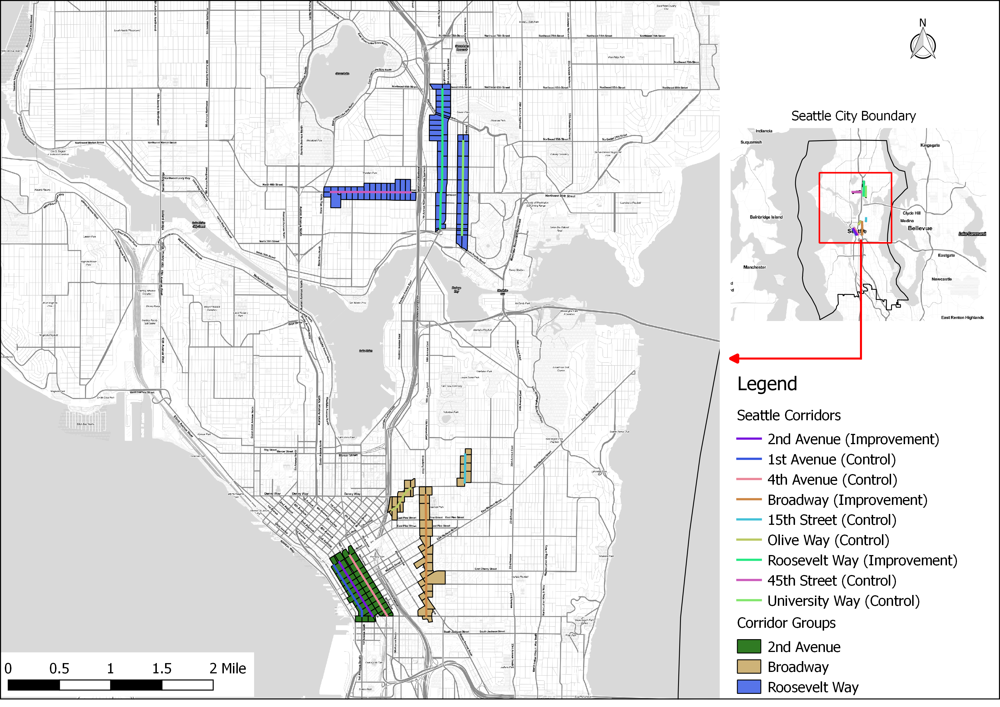

```{r setup,include=FALSE}

knitr::opts_chunk$set(cache = TRUE)

#knitr::opts_knit$set(root.dir = normalizePath(path = #"C:\\Users\\elmue\\Desktop\\Street-Improvement-Impact"))
```


#1. Introduction

In order to make their cities more livable, policymakers and planning departments are improving streets and upgrading transportation infrastructure  in order to improve access and mobility for pedestrians and bicyclists through the reduction of on-street parking or traffic lanes. While studies have shown how such upgrades improve safety the question remains whether such infrastructure improvements also improve the economic outcomes of improved corridors. This study will attempt to answer to what extent these types of corridor-level street improvements impact economic activity and business vitality.

DESCRIPTION OF CITY and CITY BIKE NETWORK and HISTORY HERE




#2. Data Sources/Methodology

## 2.1 Data Sources

For this study, we both used the Longitudinal Employment Household Dynamics Dataset (LEHD) and the retail sales tax data from the city. 

The LEHD dataset is utilized for our analysis in all cities because it is a publicly available data source that exists for most cities and states across the country. It integrates existing data from state-supplied administrative records on workers and employers with existing census, surveys, and other administrative records to create a longitudinal data system on U.S employment. This dataset tracks Workplace Area Characteristics (WAC), census blocks where people work as opposed to where workers live, for all the census blocks between 2002 and 2015 for most of the states in the US.  As such, LEHD provides geographically granular detail about American’s jobs, workers and local economies, allowing us to examine employment by broad industry sector, wage and educational attainment. 

DESCRIPTION of the sales tax data

## 2.2 Methodology

We have applied three methods in order to isolate the impact of street improvements while controlling for other economic and regional factors. The methods are an integrated trend analysis (following the NY DOT study), a difference-in-difference approach, and an interrupted time series analysis. 

### 2.2.1 Corridor Comparison Selection

In order to properly isolate the effect of the street improvements we must identify treatment corridors (corridors that actually were improved) and control corridors (corridors that are similar to the treatment corridors except they remain unimproved). Treatment corridors are corridors where new bike or pedestrian related improvements were installed. Ideally, these corridors are made up of a minimum of 10 adjacent, or intersecting, census blocks with a minimal number of retail and accommodations related jobs. Additionally, we will only use corridors where street improvements were installed between 2008 and 2013 in order to guarantee with have sufficient data to track pre and post-treatment employment trends. 

Once corridors are selected based on these criteria we require further testing in order to discern how similar the proposed treatment and control corridors. Finding corridors that are as similar as possible to each other except for the construction of new bicycle/pedestrian infrastructure allows us to approximate true experimental conditions. We will use a combination of descriptive statistics- comparing corridor employment figures to city employment quantiles- and statistical tests- t-tests in order to determine if the average employment, by block, for each corridor is similar to the other.

### 2.2.2 Aggregated Trend Comparison

This first method follows the previous NYCDOT study (NYCDOT, 2013), aiming to examine whether the treatment corridors tend to have better business performance than comparison corridors after street improvements. The approach compares the trends of treatment and control corridors in addition to city-wide trends over the full time period we have data for. If treatment corridors show greater increases in employment or sales tax receipts that would represent a positive impact of street improvement on business activities. This method is easy to follow and represents the aggregated trend of business activities. However, it lacks the rigor of econometric estimates and statistical tests that explicitly test whether or not the street improvement caused the change in trend.

### 2.2.3 Difference-in-Difference

The second method aims to estimate the difference in business vitality of pre- and post-improvement periods between improved and comparison corridors within the same time period. This is known as a difference-in-difference (DID) approach. It is a designed to answer the "but for" question of what a corridor's economic trajectory would look like had it streets not been improved.  It requires data from pre/post intervention such as panel data (individual level data overtime) or cross-sectional data (individual or group level). The approach looks at the change in the variable of interest in the treatment group before and after it is treated. In this case this means looking at some time period before and after a street improvement. Meanwhile, the control group has not been treated in either time period. The difference in growth trajectories between the two periods will give an unbiased estimate of the effect of the treatment. DID is a useful technique when randomization on the individual level is not possible. This approach removes biases in the second period comparisons between the treatment group and control group that could be result from permanent differences between those groups, as well as biases from comparisons over time in the treatment group that could be the result of trends. A key assumption of DID estimate is that the differences between control group and treatment group would have remained constant in the absence of treatment. 

DID is a linear modeling approach and its basic formula is expressed as:

$$ Y_{it} = \beta_0 + \beta_1T_{it} + \beta_2A_{it} + \beta_3T_{it}A_{it} +\varepsilon_{it} $$

$Y_{it}$ is the observed outcome in groups i and t (in this case change in employment or sales tax revenue)
$T_{it}$ is a dummy variable set to 1 if the observation is from the treatment group
$A_{it}$ is a dummy variable set to 1 if the observation is from the post treatment period i either groups
$\beta_3$ is the DID estimate of the treatment effect

If the DID estimate $\beta_3$  is significant and positive, then that indicates a positive effect of the street improvement. Conversely if the estimate is significant and negative that indicates a negative effect of the improvement. Finally, a non-significant result indicates the improvement had no statistically discernible effect. 

### 2.2.4 Interrupted Time Series

Interrupted time series is an econometric technique that estimates how street improvements impact corridor economic vitality from a longitudinal perspective. This approach tracks the treatment corridor over time and estimates the impact by the treatment by looking at the change of the corridor growth trend after the treatment. If the treatment has a causal impact, the post-intervention series will have a different level or slope than the pre-intervention series. In our research, interrupted-time series will be used to distinguish differences in growth before and after a specific time break point where an intervention, such as installation of new bicycled facility happens.  

One advantage of ITS is that it allows for the statistical investigation of potential biases in the estimate of the effect of the intervention. Given the longitudinal nature of the test ITS requires a significantly larger amount of data in order to accurately estimate a real effect on the growth trend. 

The interrupted time-series analysis equation can be expressed as: 

$$ Y_t = \beta_0 + \beta_1T_1 + \beta_2X_1 + \beta_3T_1X_1 +\varepsilon_{it} $$

$Y_t$ is the observed business outcome in time period t
$T_t$ indicates the number of quarters from start to finish of the series
$X_t$ is the treatment dummy variable taking values of 0 in the pre-intervention period and 1 in the post-intervention period
$\beta_0$ is the model intercept or baseline level at T = 0
$\beta_1$ represents the change in the outcome with a time unit increase (the pre-intervention trend)
$\beta_2$ is the level change following the intervention
$\beta_3$ indicates the slope change following the intervention 


```{r message=FALSE, warning=FALSE, include=FALSE}

if(!require(pacman)){install.packages("pacman"); library(pacman)}
p_load(here, sf, ggplot2, ggthemes, dplyr, stargazer,cowplot)

source(here::here("Code/corridor_comparison_functions.R"))

indy_corridor <- st_read(here::here("Data/Indianapolis/indy_corridor_lehd_NAD83.shp"))
indy_corridor <- indy_corridor %>% 
   rename(Type=GroupType) 
#add new colume of construct year as numeric

indy_corridor$Type <- as.character(indy_corridor$Type)
indy_corridor[indy_corridor$Name =="Virginia Ave Comp. Corridor 1\n",]$Type <- "Control: Meridian"
indy_corridor[indy_corridor$Name=="Virginia Ave Comp. Corridor 2\n",]$Type <- "Control: Prospect"
indy_corridor[indy_corridor$Name=="Virginia Ave Comp. Corridor 3\n",]$Type <- "Control: Shelby"
indy_corridor[indy_corridor$Name=="Mass Ave Comp. Corridor 1\n",]$Type <- "Control: Mass Ave"
indy_corridor$Type <- as.factor(indy_corridor$Type)

indy_lehd <- st_read(here::here("Data/Indianapolis/indy_lehd.geojson")) %>% as.data.frame()

indy_emp_ratio <- employ_ratio_test(indy_corridor)

indy_growth <- growth_rate(indy_corridor)

```


#3. Corridor Comparisons

Our first test in corridor comparability is comparing the count of the total number, retail, and accommodation jobs within the corridors compared to block figures for the city of Seattle as a whole. This is allows us to have a broad understanding of the relative job density of the corridors. This serves two purposes: first, it gives us a quick estimate of the range of jobs the corridors have; and second, it shows how similar the corridors are to each other in terms of the number of jobs in each. And then, we perform a t-test, a statistical test designed to measure if the means of two different groups are statistically similar. This final test offers us a more rigorous test of the comparability of the corridors. We compare the employment numbers a year before construction for each improvement corridor and its comparison corridor(s). Finally, we illustrate the growth trend of the comparable corridors, and perform a t-test and visual graph to justify the similarity of the corridors in terms of employment change over time. 

## 3.1 Virginia Avenue

![Virginia Avenue Corridor]

Our first treatment corridor is Virginia Avenue. The control corridors are Meridian Street, Prospect Street, and Shelby Street.

```{r message=FALSE, warning=FALSE, include=FALSE}

#comparisons-----

# prepare city level data & block level corridor data at the year before construction
conyear <- first(filter(indy_corridor,Group==1, Type=="Treatment")$BuildStart)-1 
# find the year before construction

indy_lehd_2010 <- indy_lehd %>% filter(year == conyear, CNS07+CNS18 > 0)

virginia <- indy_corridor %>% filter(Group==1, Type=="Treatment", year==conyear) %>% employ_ratio_test(.)
meridian <- indy_corridor %>% filter(Group==1, Type=="Control: Meridian", year==conyear) %>% employ_ratio_test(.)
prospect <- indy_corridor %>% filter(Group==1, Type=="Control: Prospect", year==conyear) %>% employ_ratio_test(.)
shelby <- indy_corridor %>% filter(Group==1, Type=="Control: Shelby", year==conyear) %>% employ_ratio_test(.)

# find quantile dataframe 

p <- seq(0,1, by = .05)

quant_df <- data.frame(q_tot_emp = quantile(indy_lehd_2010$C000, probs = p, na.rm = TRUE),
                       q_retail = quantile(indy_lehd_2010$CNS07, probs = p, na.rm = TRUE),
                       q_food_accom = quantile(indy_lehd_2010$CNS18, probs = p, na.rm = TRUE),
                       probs = p)

virginia %>% summarise(TotEmp = sum(C000)/nrow(virginia), RetailEmp = sum(CNS07)/nrow(virginia),
                                     AccomEmp = sum(CNS18)/nrow(virginia)) %>% as.data.frame
meridian %>% summarise(TotEmp = sum(C000)/nrow(meridian), RetailEmp = sum(CNS07)/nrow(meridian),
                                     AccomEmp = sum(CNS18)/nrow(meridian)) %>% as.data.frame
prospect %>% summarise(TotEmp = sum(C000)/nrow(prospect), RetailEmp = sum(CNS07)/nrow(prospect),
                                     AccomEmp = sum(CNS18)/nrow(prospect)) %>% as.data.frame
shelby %>% summarise(TotEmp = sum(C000)/nrow(shelby), RetailEmp = sum(CNS07)/nrow(shelby),
                                     AccomEmp = sum(CNS18)/nrow(shelby)) %>% as.data.frame
# get employment at block level, divided by nrow()
 

# t-test: compare retail, food_accom, business amount---
t.test(virginia$Business, meridian$Business)
t.test(virginia$Retail, meridian$Retail)
t.test(virginia$Food_Accom, meridian$Food_Accom)
t.test(virginia$ratio1, meridian$ratio1)
t.test(virginia$ratio2, meridian$ratio2)

t.test(virginia$Business, prospect$Business)
t.test(virginia$Retail, prospect$Retail)
t.test(virginia$Food_Accom, prospect$Food_Accom)
t.test(virginia$ratio1, prospect$ratio1)
t.test(virginia$ratio2, prospect$ratio2)

t.test(virginia$Business, shelby$Business)
t.test(virginia$Retail, shelby$Retail)
t.test(virginia$Food_Accom, shelby$Food_Accom)
t.test(virginia$ratio1, shelby$ratio1)
t.test(virginia$ratio2, shelby$ratio2)


# t-tests: growth rate----

virginia_growth <- indy_growth %>%  
  mutate(year=as.numeric(as.character(year))) %>% 
  filter(Group==1, Type=="Treatment", year<=conyear) 
meridian_growth <- indy_growth %>%  
  mutate(year=as.numeric(as.character(year))) %>% 
  filter(Group==1, Type=="Control: Meridian Ave", year<=conyear) 
prospect_growth <- indy_growth %>%  
  mutate(year=as.numeric(as.character(year))) %>% 
  filter(Group==1, Type=="Control: Prospect", year<=conyear) 
shelby_growth <- indy_growth %>%  
  mutate(year=as.numeric(as.character(year))) %>% 
  filter(Group==1, Type=="Control: Shelby", year<=conyear) 

t.test(virginia_growth$biz_growth,meridian_growth$biz_growth)
t.test(virginia_growth$retail_growth,meridian_growth$retail_growth)
t.test(virginia_growth$food_accom_growth,meridian_growth$food_accom_growth)

t.test(virginia_growth$biz_growth,prospect_growth$biz_growth)
t.test(virginia_growth$retail_growth,prospect_growth$retail_growth)
t.test(virginia_growth$food_accom_growth,prospect_growth$food_accom_growth)

t.test(virginia_growth$biz_growth,shelby_growth$biz_growth)
t.test(virginia_growth$retail_growth,shelby_growth$retail_growth)
t.test(virginia_growth$food_accom_growth,shelby_growth$food_accom_growth)
```


### 3.1.1 Corridor employment amount


| Corridor       | Tot Emp | Retail Emp | Accom Emp | Tot (%) | Retail (%) | Accom (%) |
|----------------|---------|------------|-----------|---------|------------|-----------|
| Virginia Ave.  | 18      | 1          | 4         | 35-40   | 40-45      | 60-65     |
| Meridian Ave.  | 538     | 32         | 75        | 90-95   | 85-90      | 95-100    |
| Prospect Ave.  | 32      | 6          | 4         | 45-50   | 65-70      | 60-65     |
| Shelby Ave.    | 26      | 6          | 4         | 45-50   | 65-70      | 60-65     |

Table 1: Virginia Avenue Corridor and Control Corridors Employment Percentiles

### 3.1.2 Employment number comparison


### 3.1.3 Employment trend comparison

```{r, echo=FALSE, message=FALSE, warning=FALSE, fig.width = 9.5, fig.asp=.5}

virginia_agg <- agg_trend_table(indy_corridor, group = 1)
agg_retail_trend_plot <- agg_trend_plot(virginia_agg, industry = "Retail", industry_code = "CNS07", corridor_name = "2nd Ave.", construct_year = 2011, end_year = 2013)
agg_food_trend_plot <- agg_trend_plot(virginia_agg, industry = "Food/Accommodataion",industry_code = "CNS18", corridor_name = "2nd Ave.", construct_year = 2011, end_year = 2013)
plot_grid(agg_retail_trend_plot, agg_food_trend_plot)
```


## 3.2 Mass Avenue

![Mass Avenue Corridor]

Intro of corridors

```{r message=FALSE, warning=FALSE, include=FALSE}

#comparisons-----

# prepare city level data & block level corridor data at the year before construction
conyear <- first(filter(indy_corridor,Group==2, Type=="Treatment")$BuildStart)-1 
# find the year before construction

indy_lehd_2007 <- indy_lehd %>% filter(year == conyear, CNS07+CNS18 > 0)

mass <- indy_corridor %>% filter(Group==2, Type=="Treatment", year==conyear) %>% employ_ratio_test(.)
mass_con <- indy_corridor %>% filter(Group==2, Type=="Control: Mass Ave", year==conyear) %>% employ_ratio_test(.)

# find quantile dataframe 

p <- seq(0,1, by = .05)

quant_df <- data.frame(q_tot_emp = quantile(indy_lehd_2007$C000, probs = p, na.rm = TRUE),
                       q_retail = quantile(indy_lehd_2007$CNS07, probs = p, na.rm = TRUE),
                       q_food_accom = quantile(indy_lehd_2007$CNS18, probs = p, na.rm = TRUE),
                       probs = p)

mass %>% summarise(TotEmp = sum(C000)/nrow(mass), RetailEmp = sum(CNS07)/nrow(mass),
                                     AccomEmp = sum(CNS18)/nrow(mass)) %>% as.data.frame
mass_con %>% summarise(TotEmp = sum(C000)/nrow(mass_con), RetailEmp = sum(CNS07)/nrow(mass_con),
                                     AccomEmp = sum(CNS18)/nrow(mass_con)) %>% as.data.frame

# get employment at block level, divided by nrow()
 

# t-test: compare retail, food_accom, business amount---
t.test(mass$Business, mass_con$Business)
t.test(mass$Retail, mass_con$Retail)
t.test(mass$Food_Accom, mass_con$Food_Accom)
t.test(mass$ratio1, mass_con$ratio1)
t.test(mass$ratio2, mass_con$ratio2)


# t-tests: growth rate----

mass_growth <- indy_growth %>%  
  mutate(year=as.numeric(as.character(year))) %>% 
  filter(Group==2, Type=="Treatment", year<=conyear)
mass_growth$retail_growth <- ifelse(is.infinite(mass_growth$retail_growth),1,mass_growth$retail_growth)
mass_con_growth <- indy_growth %>%  
  mutate(year=as.numeric(as.character(year))) %>% 
  filter(Group==2, Type=="Control: Mass Ave", year<=conyear) 


t.test(mass_growth$biz_growth,mass_con_growth$biz_growth,finite=T)
t.test(mass_growth$retail_growth,mass_con_growth$retail_growth, ,finite=T)
t.test(mass_growth$food_accom_growth,mass_con_growth$food_accom_growth)

```


### 3.1.1 Corridor employment amount

| Corridor          | Tot Emp | Retail Emp | Accom Emp | Tot (%) | Retail (%) | Accom (%) |
|-------------------|---------|------------|-----------|---------|------------|-----------|
| Mass Ave.         | 44      | 1          | 17        | 50-55   | 30-35      | 75-80     |
| Mass Ave.(Control)| 73      | 2          | 24        | 60-65   | 40-45      | 80-85     |

Table 2: Mass Avenue Corridor and Control Corridor Employment Percentiles

### 3.1.2 Employment number comparison


### 3.1.3 Employment trend comparison

```{r, echo=FALSE, message=FALSE, warning=FALSE, fig.width = 9.5, fig.asp=.5}

mass_agg <- agg_trend_table(indy_corridor, group = 2)
agg_retail_trend_plot <- agg_trend_plot(mass_agg, industry = "Retail", industry_code = "CNS07", corridor_name = "2nd Ave.", construct_year = 2009, end_year = 2010)
agg_food_trend_plot <- agg_trend_plot(mass_agg, industry = "Food/Accommodataion",industry_code = "CNS18", corridor_name = "2nd Ave.", construct_year = 2009, end_year = 2010)
plot_grid(agg_retail_trend_plot, agg_food_trend_plot)
```
