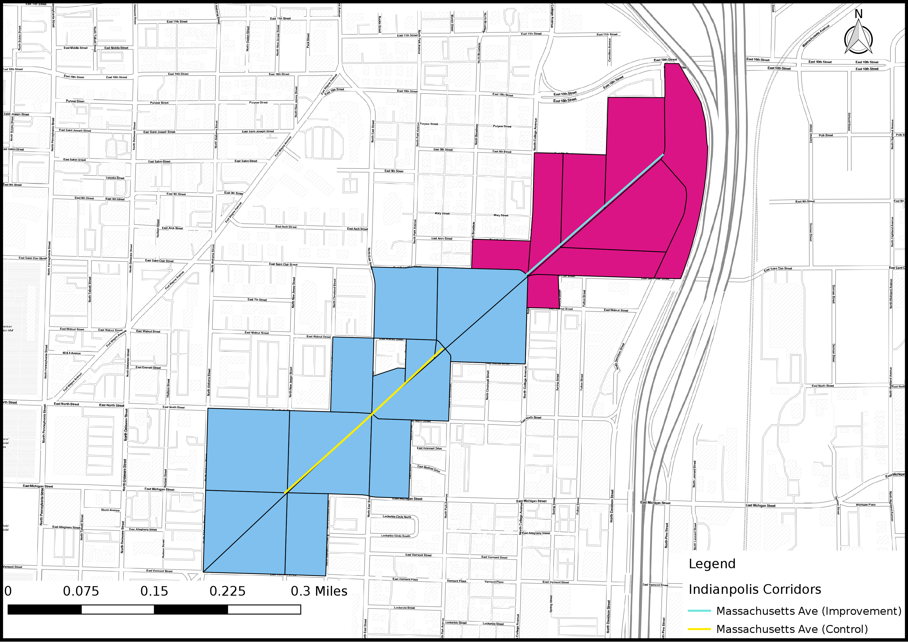

```{r setup,include=FALSE}

knitr::opts_chunk$set(cache = TRUE)


```


# 1. Introduction

In order to make their cities more livable, policymakers and planning departments are improving streets and upgrading transportation infrastructure  in order to improve access and mobility for pedestrians and bicyclists through the reduction of on-street parking or traffic lanes. While studies have shown how such upgrades improve safety the question remains whether such infrastructure improvements also improve the economic outcomes of improved corridors. This study will attempt to answer to what extent these types of corridor-level street improvements impact economic activity and business vitality.

DESCRIPTION OF CITY and CITY BIKE NETWORK and HISTORY HERE


# 2. Data Sources/Methodology

## 2.1 Data Sources

For this study we used multiple data sources to estimate the effect of new bike lane infrastructure investment. First, we used the Longitudinal Origin-Destination Employment Statistics (LODES) data set from the **Longitudinal Employer-Household Dynamics Dataset** (LEHD).  It integrates existing data from state-supplied administrative records on workers and employers with existing census, surveys, and other administrative records to create a longitudinal data system on U.S employment. This data set tracks Workplace Area Characteristics (WAC), census blocks where people work as opposed to where workers live, for all the census blocks between 2002 and 2015 for most of the states in the US.  As such, LEHD provides geographically granular detail about American’s jobs, workers and local economies, allowing us to examine employment by broad industry sector, wage and educational attainment. Some disadvantages of the LODES data set are that in order to guarantee confidentiality block level data is "fuzzed" so the numbers are not exactly the number of jobs, but they are accurate estimates. Additionally, though we get industrial data, it is only provided at the most general level (the equivalent of two digit NAICS codes) so we are unable to isolate specific retail or service employment such as restaurant workers. That being said, the LODES data set is comprehensive, offers unprecedented geographic detail, and longitudinal allowing for consistent comparisons over time.

This report also takes advantage of establishment level **Quarterly Census of Employment and Wages** (QCEW) data. Also referred to as ES-202 data, the QCEW is quarterly data submitted by firms to their respective state governments as part of the unemployment insurance system. Employers report their industry code, their number of employees at the site, and gross pay. The individual QCEW data is confidential and requires special permission from the state in order to use it and has additional data use restrictions. The QCEW gives us address level data on individual establishments as well as detailed employment information. Unfortunately, getting access to such data is difficult and differs for each state and has to be presented in a way to preserve confidentiality. As such, we cannot present ultra-detailed industrial information and have further presentation restrictions depending on the state.

Finally, we also collected **sales tax data**. Sales tax data allows us to estimate a more sensitive measure of economic activity than employment (as the decision to hire or fire for a firm is often an expensive one we expect employment to be a delayed response). Some drawbacks of sales tax data is that some states do not have a sales tax or, in states or cities that do have one, the sales tax data is not broken down by specific industry and it is difficult to accurately parse out accurate figures. But the benefits of sales tax data largely outweigh these issues and do offer a more sensitive metric than employment. 

Indiana has a general 7% sales tax for all businesses with a variety of additional taxes dependent upon use and the city/county a particular establishment is located. For example, Marion County, the home county of Indianapolis, has an additional 2% food and beverage tax as well as a 10% accommodations tax. This gives a range of 7-19% sales tax rates in the city. 

## 2.2 Methodology

We have applied three methods in order to isolate the impact of street improvements while controlling for other economic and regional factors. The methods are an integrated trend analysis (following the NY DOT study), a difference-in-difference approach, and an interrupted time series analysis. 

### 2.2.1 Corridor Comparison Selection

In order to properly isolate the effect of the street improvements we must identify treatment corridors (corridors that actually were improved) and control corridors (corridors that are similar to the treatment corridors except they remain unimproved). Treatment corridors are corridors where new bike or pedestrian related improvements were installed. Ideally, these corridors are made up of a minimum of 10 adjacent, or intersecting, census blocks with a minimal number of retail and accommodations related jobs. Additionally, we will only use corridors where street improvements were installed between 2008 and 2013 in order to guarantee with have sufficient data to track pre and post-treatment employment trends. 

Once corridors are selected based on these criteria we require further testing in order to discern how similar the proposed treatment and control corridors. Finding corridors that are as similar as possible to each other except for the construction of new bicycle/pedestrian infrastructure allows us to approximate true experimental conditions. We will use a combination of descriptive statistics- comparing corridor employment figures to city employment quantiles- and statistical tests- t-tests in order to determine if the average employment in the year before construction of our corridor of interest, by block, for each corridor is similar to the other.

### 2.2.2 Aggregated Trend Comparison

This first method follows the previous NYCDOT study (NYCDOT, 2013), aiming to examine whether the treatment corridors tend to have better business performance than comparison corridors after street improvements. The approach compares the trends of treatment and control corridors in addition to city-wide trends over the full time period we have data for. If treatment corridors show greater increases in employment or sales tax receipts that would represent a positive impact of street improvement on business activities. This method is easy to follow and represents the aggregated trend of business activities. However, it lacks the rigor of econometric estimates and statistical tests that explicitly test whether or not the street improvement caused the change in trend.

### 2.2.3 Difference-in-Difference

The second method aims to estimate the difference in business vitality of pre- and post-improvement periods between improved and comparison corridors within the same time period. This is known as a difference-in-difference (DID) approach. It is a designed to answer the "but for" question of what a corridor's economic trajectory would look like had it streets not been improved.  It requires data from pre/post intervention such as panel data (individual level data overtime) or cross-sectional data (individual or group level). The approach looks at the change in the variable of interest in the treatment group before and after it is treated. In this case this means looking at some time period before and after a street improvement. Meanwhile, the control group has not been treated in either time period. The difference in growth trajectories between the two periods will give an unbiased estimate of the effect of the treatment. DID is a useful technique when randomization on the individual level is not possible. This approach removes biases in the second period comparisons between the treatment group and control group that could be result from permanent differences between those groups, as well as biases from comparisons over time in the treatment group that could be the result of trends. A key assumption of DID estimate is that the differences between control group and treatment group would have remained constant in the absence of treatment. 

DID is a linear modeling approach and its basic formula is expressed as:

$$ Y_{it} = \beta_0 + \beta_1T_{it} + \beta_2A_{it} + \beta_3T_{it}A_{it} +\varepsilon_{it} $$

$Y_{it}$ is the observed outcome in groups i and t (in this case change in employment or sales tax revenue)
$T_{it}$ is a dummy variable set to 1 if the observation is from the treatment group
$A_{it}$ is a dummy variable set to 1 if the observation is from the post treatment period i either groups
$\beta_3$ is the DID estimate of the treatment effect

If the DID estimate $\beta_3$  is significant and positive, then that indicates a positive effect of the street improvement. Conversely if the estimate is significant and negative that indicates a negative effect of the improvement. Finally, a non-significant result indicates the improvement had no statistically discernible effect. 

### 2.2.4 Interrupted Time Series

Interrupted time series is an econometric technique that estimates how street improvements impact corridor economic vitality from a longitudinal perspective. This approach tracks the treatment corridor over time and estimates the impact by the treatment by looking at the change of the corridor growth trend after the treatment. If the treatment has a causal impact, the post-intervention series will have a different level or slope than the pre-intervention series. In our research, interrupted-time series will be used to distinguish differences in growth before and after a specific time break point where an intervention, such as installation of new bicycled facility happens.  

One advantage of ITS is that it allows for the statistical investigation of potential biases in the estimate of the effect of the intervention. Given the longitudinal nature of the test ITS requires a significantly larger amount of data in order to accurately estimate a real effect on the growth trend. 

The interrupted time-series analysis equation can be expressed as: 

$$ Y_t = \beta_0 + \beta_1T_1 + \beta_2X_1 + \beta_3T_1X_1 +\varepsilon_{it} $$

$Y_t$ is the observed business outcome in time period t
$T_t$ indicates the number of quarters from start to finish of the series
$X_t$ is the treatment dummy variable taking values of 0 in the pre-intervention period and 1 in the post-intervention period
$\beta_0$ is the model intercept or baseline level at T = 0
$\beta_1$ represents the change in the outcome with a time unit increase (the pre-intervention trend)
$\beta_2$ is the level change following the intervention
$\beta_3$ indicates the slope change following the intervention 


```{r message=FALSE, warning=FALSE, include=FALSE}

if(!require(pacman)){install.packages("pacman"); library(pacman)}
p_load(here, RPostgreSQL, sf, ggplot2, directlabels,ggthemes, lubridate, dplyr, dbplyr, stargazer,cowplot, zoo)

#query the corridors from bike_lanes
user <- "jamgreen"
host <- "pgsql102.rc.pdx.edu"
pw <- scan(here::here("batteries.pgpss"), what = "")
dbname <- "bike_lanes"

con <- dbConnect("PostgreSQL", host = host, user = user, dbname = dbname, 
                 password = pw, port = 5433)

source(here::here("Code/corridor_comparison_functions.R"))

indy_corridor <- st_read(dsn = con, query = "select a.geoid10 as geoid, a.c000 as c000,
a.cns07 as cns07, a.cns12 as cns12, a.cns14 as cns14, a.cns15 as cns15, 
a.cns16 as cns16, a.cns17 as cns17, a.cns18 as cns18, a.cns19 as cns19, b.name as Name, 
b.buildstart as buildstart, b.buildend as buildend, b.group as corridor_group, 
b.grouptype as grouptype,  a.year as year, a.geom
FROM indy_lehd a, indy_corridors b
WHERE ST_Intersects(ST_Buffer(b.geom, 20), a.geom);")


#indy_corridor <- st_read(here::here("Data/Indianapolis/indy_corridor_lehd_NAD83.shp"))
indy_corridor <- indy_corridor %>% 
   rename(Type = grouptype) 
#add new colume of construct year as numeric

indy_corridor$Type <- as.character(indy_corridor$Type)
indy_corridor[indy_corridor$name =="Virginia Ave Comp. Corridor 1\n",]$Type <- "Control: Meridian"
indy_corridor[indy_corridor$name=="Virginia Ave Comp. Corridor 2\n",]$Type <- "Control: Prospect"
indy_corridor[indy_corridor$name=="Virginia Ave Comp. Corridor 3\n",]$Type <- "Control: Shelby"
indy_corridor[indy_corridor$name=="Mass Ave Comp. Corridor 1\n",]$Type <- "Control: Mass Ave"
indy_corridor$Type <- as.factor(indy_corridor$Type)

indy_corridor <- indy_corridor %>%
  rename(C000 = c000, CNS07 = cns07, CNS18 = cns18, CNS12 = cns12, CNS14 = cns14, CNS15 = cns15,
         CNS16 = cns16, CNS17 = cns17, CNS18 = cns18, CNS19 = cns19, Group = corridor_group,
         BuildStart = buildstart, BuildEnd = buildend, Name = name)

indy_lehd <- st_read(dsn = con, query = "SELECT * FROM indy_lehd") %>% as.data.frame() %>% 
  rename(C000 = c000, CNS07 = cns07, CNS18 = cns18, CNS12 = cns12, CNS14 = cns14, CNS15 = cns15,
         CNS16 = cns16, CNS17 = cns17, CNS18 = cns18, CNS19 = cns19)

indy_emp_ratio <- employ_ratio_test(indy_corridor)

indy_growth <- growth_rate(indy_corridor)


```


# 3. Corridor Comparisons

Our first test in corridor comparability is comparing the count of the total number, retail, and accommodation jobs within the corridors compared to block figures for the city of Indianapolis as a whole for the year before construction. This is allows us to have a broad understanding of the relative job density of the corridors. This serves two purposes: first, it gives us a quick estimate of the range of jobs the corridors have; and second, it shows how similar the corridors are to each other in terms of the number of jobs in each. And then, we perform a t-test, a statistical test designed to measure if the means of two different groups are statistically similar. This final test offers us a more rigorous test of the comparability of the corridors. Finally, we illustrate the growth trend of the comparable corridors, and perform a t-test and visual graph to justify the similarity of the corridors in terms of employment change over time. 

## 3.1 Virginia Avenue


Our first treatment corridor is Virginia Avenue, which installed separate bike lane in 2011. The control corridors are Meridian Street, Prospect Street, and Shelby Street. Prospect Street and Shelby Street are close to the treatment corridor in southeast downtown Indianapolis while Meridian Street is located in central downtown area.

```{r message=FALSE, warning=FALSE, include=FALSE}

#comparisons-----

# prepare city level data & block level corridor data at the year before construction
conyear <- first(filter(indy_corridor, Group== 1, Type== "Treatment")$BuildStart)-1 
# find the year before construction


indy_lehd_2010 <- indy_lehd %>% filter(year == conyear, CNS07+ CNS18 > 0)


virginia <- indy_corridor %>% filter(Group ==1, Type =="Treatment", year==conyear) %>% 
employ_ratio_test(.)

meridian <- indy_corridor %>% filter(Group ==1, Type =="Control: Meridian", year ==conyear) %>% employ_ratio_test(.)

prospect <- indy_corridor %>% filter(Group ==1, Type =="Control: Prospect", year ==conyear) %>% employ_ratio_test(.)

shelby <- indy_corridor %>% filter(Group ==1, Type =="Control: Shelby", year ==conyear) %>% 
employ_ratio_test(.)

# find quantile dataframe 

p <- seq(0,1, by = .05)

quant_df <- data.frame(q_tot_emp = quantile(indy_lehd_2010$C000, probs = p, na.rm = TRUE),
                       q_retail = quantile(indy_lehd_2010$CNS07, probs = p, na.rm = TRUE),
                       q_food_accom = quantile(indy_lehd_2010$CNS18, probs = p, na.rm = TRUE),
                       probs = p)

virginia %>% summarise(TotEmp = sum(C000)/nrow(virginia), RetailEmp = sum(CNS07)/nrow(virginia),
                                     AccomEmp = sum(CNS18)/nrow(virginia)) %>% as.data.frame()
meridian %>% summarise(TotEmp = sum(C000)/nrow(meridian), RetailEmp = sum(CNS07)/nrow(meridian),
                                     AccomEmp = sum(CNS18)/nrow(meridian)) %>% as.data.frame
prospect %>% summarise(TotEmp = sum(C000)/nrow(prospect), RetailEmp = sum(CNS07)/nrow(prospect),
                                     AccomEmp = sum(CNS18)/nrow(prospect)) %>% as.data.frame
shelby %>% summarise(TotEmp = sum(C000)/nrow(shelby), RetailEmp = sum(CNS07)/nrow(shelby),
                                     AccomEmp = sum(CNS18)/nrow(shelby)) %>% as.data.frame
# get employment at block level, divided by nrow()
 

# t-test: compare retail, food_accom, business amount---
t.test(virginia$Business, meridian$Business)
t.test(virginia$Retail, meridian$Retail)
t.test(virginia$Food_Accom, meridian$Food_Accom)
t.test(virginia$ratio1, meridian$ratio1)
t.test(virginia$ratio2, meridian$ratio2)

t.test(virginia$Business, prospect$Business)
t.test(virginia$Retail, prospect$Retail)
t.test(virginia$Food_Accom, prospect$Food_Accom)
t.test(virginia$ratio1, prospect$ratio1)
t.test(virginia$ratio2, prospect$ratio2)

t.test(virginia$Business, shelby$Business)
t.test(virginia$Retail, shelby$Retail)
t.test(virginia$Food_Accom, shelby$Food_Accom)
t.test(virginia$ratio1, shelby$ratio1)
t.test(virginia$ratio2, shelby$ratio2)


# t-tests: growth rate----

virginia_growth <- indy_growth %>%  
  mutate(year=as.numeric(as.character(year))) %>% 
  filter(Group==1, Type=="Treatment", year<=conyear) 
meridian_growth <- indy_growth %>%  
  mutate(year=as.numeric(as.character(year))) %>% 
  filter(Group==1, Type=="Control: Meridian", year<=conyear) 
prospect_growth <- indy_growth %>%  
  mutate(year=as.numeric(as.character(year))) %>% 
  filter(Group==1, Type=="Control: Prospect", year<=conyear) 
shelby_growth <- indy_growth %>%  
  mutate(year=as.numeric(as.character(year))) %>% 
  filter(Group==1, Type=="Control: Shelby", year<=conyear) 

t.test(virginia_growth$biz_growth,meridian_growth$biz_growth)
t.test(virginia_growth$retail_growth,meridian_growth$retail_growth)
t.test(virginia_growth$food_accom_growth,meridian_growth$food_accom_growth)

t.test(virginia_growth$biz_growth,prospect_growth$biz_growth)
t.test(virginia_growth$retail_growth,prospect_growth$retail_growth)
t.test(virginia_growth$food_accom_growth,prospect_growth$food_accom_growth)

t.test(virginia_growth$biz_growth,shelby_growth$biz_growth)
t.test(virginia_growth$retail_growth,shelby_growth$retail_growth)
t.test(virginia_growth$food_accom_growth,shelby_growth$food_accom_growth)
```


### 3.1.1 Corridor employment amount

Comparing 'business' related employment, we find the Meridian St Corridor has much more 'business' employment than the Virginia Ave corridor. The other two comparison corridors have similar levels of business employment amount, though, the Virginia Ave corridor has relatively less retail employment. 

| Corridor       | Tot Emp | Retail Emp | Accom Emp | Tot (%) | Retail (%) | Accom (%) |
|----------------|---------|------------|-----------|---------|------------|-----------|
| Virginia Ave.  | 18      | 1          | 4         | 35-40   | 40-45      | 60-65     |
| Meridian St.   | 538     | 32         | 75        | 90-95   | 85-90      | 90-95    |
| Prospect St.   | 30      | 5          | 4         | 45-50   | 60-65      | 60-65     |
| Shelby St.     | 26      | 6          | 4         | 40-45   | 65-70      | 60-65     |

Table 1: Virginia Avenue Corridor and Control Corridors Employment Percentiles

### 3.1.2 Employment number comparison

We also performed a series of t-tests in order to determine whether the average employment levels per block between the treatment and control corridors are statistically significantly different. A statistically significant results here would suggest that the corridors are not necessarily comparable. The Meridian corridor mean 'business' and food employment per block is significantly different than the Virginia corridor blocks, according to our t-tests. Additionally, we performed a second set of t-tests on the business/service employment ratios between the two corridors. In this case, all of the comparison corridors t-tests came back non-significant indicating the corridors have a similar structure of 'business' versus service jobs.


## 3.2 Mass Avenue



The Massachusetts Avenue corridor had a  separated bike lane installed in 2009. The installation included removing one travel lane. The control corridor is another section on Mass Ave without any improvement.

```{r message=FALSE, warning=FALSE, include=FALSE}

#comparisons-----

# prepare city level data & block level corridor data at the year before construction
conyear <- first(filter(indy_corridor,Group==2, Type=="Treatment")$BuildStart)-1 
# find the year before construction

indy_lehd_2007 <- indy_lehd %>% filter(year == conyear, CNS07+CNS18 > 0)

mass <- indy_corridor %>% filter(Group==2, Type=="Treatment", year==conyear) %>% employ_ratio_test(.)
mass_con <- indy_corridor %>% filter(Group==2, Type=="Control: Mass Ave", year==conyear) %>% employ_ratio_test(.)

# find quantile dataframe 

p <- seq(0,1, by = .05)

quant_df <- data.frame(q_tot_emp = quantile(indy_lehd_2007$C000, probs = p, na.rm = TRUE),
                       q_retail = quantile(indy_lehd_2007$CNS07, probs = p, na.rm = TRUE),
                       q_food_accom = quantile(indy_lehd_2007$CNS18, probs = p, na.rm = TRUE),
                       probs = p)

mass %>% summarise(TotEmp = sum(C000)/nrow(mass), RetailEmp = sum(CNS07)/nrow(mass),
                                     AccomEmp = sum(CNS18)/nrow(mass)) %>% as.data.frame
mass_con %>% summarise(TotEmp = sum(C000)/nrow(mass_con), RetailEmp = sum(CNS07)/nrow(mass_con),
                                     AccomEmp = sum(CNS18)/nrow(mass_con)) %>% as.data.frame

# get employment at block level, divided by nrow()
 

# t-test: compare retail, food_accom, business amount---
t.test(mass$Business, mass_con$Business)
t.test(mass$Retail, mass_con$Retail)
t.test(mass$Food_Accom, mass_con$Food_Accom)
t.test(mass$ratio1, mass_con$ratio1)
t.test(mass$ratio2, mass_con$ratio2)


# t-tests: growth rate----

mass_growth <- indy_growth %>%  
  mutate(year=as.numeric(as.character(year))) %>% 
  filter(Group==2, Type=="Treatment", year<=conyear)
mass_growth$retail_growth <- ifelse(is.infinite(mass_growth$retail_growth),1,mass_growth$retail_growth)
mass_con_growth <- indy_growth %>%  
  mutate(year=as.numeric(as.character(year))) %>% 
  filter(Group==2, Type=="Control: Mass Ave", year<=conyear) 


# t.test(mass_growth$biz_growth,mass_con_growth$biz_growth,finite=T)
# t.test(mass_growth$retail_growth,mass_con_growth$retail_growth, finite=T)
# t.test(mass_growth$food_accom_growth,mass_con_growth$food_accom_growth)

```


### 3.2.1 Corridor employment amount

The treatment and control corridors have a relatively similar amount of employment before the street improvement. The total employment is around 50-55 percentile for treatment corridor, and 60-65 percentile for control corridor. They both have smaller amounts of retail employment along the corridors, but have a lot of food/accommodation stores along the corridors.

| Corridor          | Tot Emp | Retail Emp | Accom Emp | Tot (%) | Retail (%) | Accom (%) |
|-------------------|---------|------------|-----------|---------|------------|-----------|
| Mass Ave.         | 44      | 1          | 17        | 50-55   | 40-45      | 75-80     |
| Mass Ave.(Control)| 73      | 2          | 24        | 60-65   | 45-50      | 80-85     |

Table 2: Mass Avenue Corridor and Control Corridor Employment Percentiles

### 3.2.2 Employment number comparison
According to t-test, the two corridors are comparable in terms of business activity level and business/service structure. The t-tests are all non-significant.

## 3.3 Corridor Comparison Summary

The Prospect and Shelby corridors seem appropriate comparators for Virginia Avenue in terms of trends comparisons and t-test scores. While the Mass Ave corridors are technically comparable because they are two legs of the same length of street they will not be suitable for all follow up tests, particularly, difference-in-difference. 

[Comparison table to be added]


# 4. Analysis

This section presents the results of the econometric models for the appropriate corridors. We will run two different models, a difference-in-difference and interrupted time series. The difference-in-difference (DiD) approach aims to estimate the difference between the control and treatment corridors at two points in time (pre and post-treatment). The "difference" term is the interaction between the pre/post and treatment/control indicator variables. The interrupted time series (ITS) model tracks the change in our outcome of interest only for the treatment corridor. The main variables in the model are a time series variable that gives an estimate of the general trend of our outcome variable, a pre/post-treatment indicator variable that signals the change in the *level* of our outcome variable attributable to the treatment, and the interaction term between the time series and pre/post-treatment term that gives an estimate of the *slope*, or rate of change, of our outcome after treatment. 

## 4.1 Virginia Avenue

### 4.1.1 Employment trend comparison

In terms of retail performance, the treatment corridor's retail employment remains relatively flat over the study period and tracks the other comparison corridors fairly closely. The exception is the Meridian corridor that shows a large drop with a slow rebound that is likely due to the Great Recession starting in 2008. In terms of the food/accommodation sector, the treatment corridor has a similar growth trend to the Prospect and Shelby corridors while the Meridian corridor shows much more volatility over the study period.

```{r, echo=FALSE, message=FALSE, warning=FALSE, fig.width = 9.5, fig.asp=.5}

virginia_agg <- agg_trend_table(indy_corridor, group = 1)

agg_retail_trend_plot <- agg_trend_plot(virginia_agg, industry = "Retail", industry_code = "CNS07", corridor_name = "Virginia Ave.", construct_year = 2011, end_year = 2013)

agg_food_trend_plot <- agg_trend_plot(virginia_agg, industry = "Food/Accommodataion",industry_code = "CNS18", corridor_name = "Virginia Ave.", construct_year = 2011, end_year = 2013)

plot_grid(agg_retail_trend_plot, agg_food_trend_plot)
```

#### 4.1.1.1 Sales Tax Comparisons

In terms of sales tax revenue and growth patterns, all three corridors are appropriately comparable. Meridian has a much higher absolute amount of tax receipts, but its trajectory, though more unstable, is still generally positive and matches those of the other corridors in the set. Virginia Ave itself sees steady and increasing tax revenue over time with anomalous spike in 2014 but it quickly returns to normal. Shelby and Prospect mirror Virginia Avenue in terms of total tax receipts and also generally follow growth trends, though both have more modest growth over time than Virginia. The t-test comparison of corridor growth rates came back non-significant for all three corridors giving us qualified confidence that these are appropriate comparators.  

```{r, echo=FALSE, message=FALSE, warning=FALSE, fig.width = 9.5, fig.asp=.5}

#query the sales tax from bike_lanes
user <- "jamgreen"
host <- "pgsql102.rc.pdx.edu"
pw <- scan(here::here("batteries.pgpss"), what = "")
dbname <- "bike_lanes"

con <- dbConnect("PostgreSQL", host = host, user = user, dbname = dbname, 
                 password = pw, port = 5433)

indy_sales <- dbReadTable(conn = con, name = "indy_sales_tax")


va_sales <- indy_sales %>% filter(group == 2)


va_sales$type <- as.character(va_sales$type)
va_sales[va_sales$corridor =="Meridian",]$type <- "Control: Meridian"
va_sales[va_sales$corridor=="Prospect",]$type <- "Control: Prospect"
va_sales[va_sales$corridor=="Shelby",]$type <- "Control: Shelby"
va_sales[va_sales$corridor=="Virginia Ave",]$type <- "Treatment"


va_sales$type <- factor(va_sales$type,
                           levels = c("Treatment", "Control: Meridian",
                                      "Control: Prospect", "Control: Shelby"))

va_p1 <- ggplot(va_sales, aes(x = quarter, y = tax_revenue, shape = type,
                              group = type, colour = type)) +
                  geom_rect(aes(xmin = as.Date("2011-01-01", "%Y-%m-%d"), 
                  xmax = as.Date("2013-01-01","%Y-%m-%d"), 
                  ymin = -Inf, ymax = Inf),
                  fill = "#adff2f",linetype=0,alpha = 0.03) +
                  geom_line() +
                  geom_point(size = 3) +
                 scale_shape_manual(values=c(22,21,21,23))+
                 scale_x_date(date_breaks = "3 years", date_labels = "%Y") +
                 theme_minimal()  +
    labs(title = "Sales Tax Comparison:\n Virginia Ave.", x="Year",y="Sales Tax",
         caption = glue("Shaded Area is Construction Period")) +
    guides(shape = guide_legend(title = "Street Type"), colour = guide_legend(title = "Street Type")) +
  scale_y_continuous(labels = scales::dollar)


va_sales_t <- va_sales[grepl("Virginia", va_sales$corridor), ]
va_sales_t <- va_sales_t %>% 
  mutate(tax_growth = tax_revenue/lag(tax_revenue))

meridian_sales_t <- va_sales[grepl("Meridian", va_sales$corridor), ]
meridian_sales_t <- meridian_sales_t %>% 
  mutate(tax_growth = tax_revenue/lag(tax_revenue))

prospect_sales_t <- va_sales[grepl("Prospect", va_sales$corridor), ]
prospect_sales_t <- prospect_sales_t %>% 
  mutate(tax_growth = tax_revenue/lag(tax_revenue))

shelby_sales_t <- va_sales[grepl("Shelby", va_sales$corridor), ]
shelby_sales_t <- shelby_sales_t %>% 
  mutate(tax_growth = tax_revenue/lag(tax_revenue))


# t.test(va_sales_t$tax_growth, meridian_sales_t$tax_growth)
# t.test(va_sales_t$tax_growth, shelby_sales_t$tax_growth)
# t.test(va_sales_t$tax_growth,prospect_sales_t$tax_growth)

plot(va_p1)

```

#### 4.1.1.2 QCEW Comparisons

As mentioned earlier, the advantage of using QCEW data is the ability to get greater industrial detail in addition to establishment counts and total wages. In the case of Virginia Avenue, the ability to isolate slightly more detailed industries, in this case food and drinking places (NAICS code 722) gives us a clearer idea of the growth in our industries of interest. Note, for example, that the growth in food and drinking places employment is more dramatic for Virginia Avenue but the overall pattern remains similar to the LEHD estimates. 

```{r echo=FALSE, message=FALSE, warning=FALSE, fig.width= 9.5, fig.asp=1}

user <- "jamgreen"
host <- "pgsql102.rc.pdx.edu"
pw <- scan(here::here("batteries.pgpss"), what = "")
dbname <- "bike_lanes"

con <- dbConnect("PostgreSQL", host = host, user = user, dbname = dbname, 
                 password = pw, port = 5433)

indy_qcew <- tbl(con, "indy_qcew_modified")
indy_qcew <- collect(indy_qcew)

indy_qcew$corridor_name <- stringr::str_trim(indy_qcew$corridor_name, "both")

indy_qcew$corridor_type <- factor(indy_qcew$corridor_type, levels = c("treatment", "control"))

indy_qcew <- indy_qcew %>% 
  mutate(year_quarter = paste0(year,"-",qtr), 
          year_quarter = as.yearqtr(year_quarter)) %>% 
  filter(naics_code != "suppressed") %>% 
  mutate(naics_label = case_when(naics_code == "722" ~ "Food/Drinking Places",
                                 naics_code == "448" ~ "Clothing Stores",
                                 naics_code == "721" ~ "Accommodation"))


va_qcew <- indy_qcew %>% filter(corridor_group == 1)
va_qcew <- va_qcew %>% 
  mutate(corridor_name = case_when(corridor_name == "shelby" ~ "Control: Shelby",
                                   corridor_name == "virginia ave" ~ "Treatment: Virginia",
                                   corridor_name == "prospect" ~ "Control: Prospect",
                                   corridor_name == "meridian" ~ "Control: Meridian"))

va_qcew$corridor_name <- factor(va_qcew$corridor_name,
                                levels = c("Treatment: Virginia",
                                           "Control: Shelby",
                                           "Control: Prospect",
                                           "Control: Meridian"))

#plot check 1 for virginia

qc1 <- ggplot(va_qcew %>%  filter(naics_code == "722"), 
              aes(x = year_quarter, y = employment, group = corridor_name, 
                           colour = corridor_name, shape = corridor_name)) +
  geom_rect(aes(xmin = 2011, 
                  xmax = 2013, 
                  ymin = -Inf, ymax = Inf),
                  fill = "#adff2f",linetype=0,alpha = 0.03) +
  geom_line() + 
  geom_point(size = 3) +
  scale_x_yearqtr() +
  theme(axis.text.x = element_text(angle=45, vjust = 0.5)) +
  theme_minimal() +
  labs(x = "Quarter", y = "", title = "Virginia Ave Food and Drinking Places\n Employment",
       caption = "Data Source: QCEW data provided by the state of Indiana\n and Indiana Business Research Center") +
  guides(shape = guide_legend("Corridor"), colour = guide_legend("Corridor")) +
      theme(axis.text.x = element_text(angle=45, vjust = 0.5)) 


qc2 <- ggplot(va_qcew %>%  filter(naics_code == "722"), 
              aes(x = year_quarter, y = qtr_wages, group = corridor_name, 
                           colour = corridor_name, shape = corridor_name)) +
  geom_rect(aes(xmin = 2011, 
                  xmax = 2013, 
                  ymin = -Inf, ymax = Inf),
                  fill = "#adff2f",linetype=0,alpha = 0.03) +
  geom_line() + 
  geom_point(size = 3, fill = "white") +
  scale_x_yearqtr() +
  theme_minimal() +
  labs(x = "Quarter", y = "", title = "Virginia Ave Food and Drinking Places\n Total Wages",
       caption = "Data Source: QCEW data provided by the state of Indiana\n and Indiana Business Research Center; Wage data are indexed at 2011 Q1") +
  guides(shape = guide_legend("Corridor"), colour = guide_legend("Corridor")) +
  scale_y_continuous(labels = scales::dollar) +
    theme(axis.text.x = element_text(angle=45, vjust = 0.5)) 


plot_grid(qc1, qc2, ncol = 1)

```

While the basic trend graphs give us an idea of the pattern of growth over time, in this case, consistent employment on Virginia compared to its comparison corridors, an indexed plot can give us a better idea of changes in growth with every corridor on the same scale. 

The indexed values for employment and wages better display the dramatic growth of the Virginia Avenue corridor. Compared to its 2011 base line, the beginning of construction of the corridor, the corridor has seen nearly 600% growth in employment. But do note that the growth starts before the construction, carries on through construction and after. Interestingly, the Shelby and Prospect corridor growth trends also mirror Virginia Avenue well before construction, signaling these may be appropriate corridors for the difference-in-difference models. 

In terms of wages, we find similar patterns, which is to be expected assuming that wages and employment track closely together. Virginia displays dramatic growth again with over 800% rise in total wages reported with steady growth starting in the mid-to-late 2000s, and carrying through the construction period and beyond. 

```{r echo=FALSE, message=FALSE, warning=FALSE, fig.width=9.5, fig.asp=1}

va_qc_base <- va_qcew %>% filter(year_quarter == "2011 Q1", naics_code == "722") %>% 
  select(corridor_name, base_yr_qtr = year_quarter, naics_code ,base_employment = employment, base_wages = qtr_wages)

va_qcew <- va_qcew %>% left_join(va_qc_base, by = c("corridor_name", "naics_code")) %>% 
  filter(naics_code == 722)

va_qcew <- va_qcew %>% mutate(emp_index = employment/base_employment,
                              wages_index = qtr_wages/base_wages)

qc_idx1 <- ggplot(va_qcew, 
              aes(x = year_quarter, y = emp_index, group = corridor_name, 
                           colour = corridor_name, shape = corridor_name)) +
  geom_rect(aes(xmin = 2011, 
                  xmax = 2013, 
                  ymin = -Inf, ymax = Inf),
                  fill = "#adff2f",linetype=0,alpha = 0.03) +
  geom_line() + 
  geom_point(size = 3, fill = "white") +
  scale_x_yearqtr() +
  theme_minimal() +
  labs(x = "Quarter", y = "", title = "Virginia Ave Food and Drinking Places\n Employment Change",
       caption = "Data Source: QCEW data provided by the state of Indiana\n and Indiana Business Research Center, data are indexed to 2011") +
  guides(shape = guide_legend("Corridor"), colour = guide_legend("Corridor")) +
  scale_y_continuous(labels = scales::percent) +
    theme(axis.text.x = element_text(angle=45, vjust = 0.5)) 


qc_idx2 <- ggplot(va_qcew, 
              aes(x = year_quarter, y = wages_index, group = corridor_name, 
                           colour = corridor_name, shape = corridor_name)) +
  geom_rect(aes(xmin = 2011, 
                  xmax = 2013, 
                  ymin = -Inf, ymax = Inf),
                  fill = "#adff2f",linetype=0,alpha = 0.03) +
  geom_line() + 
  geom_point(size = 3) +
  scale_x_yearqtr() +
  theme_minimal() +
  labs(x = "Quarter", y = "", title = "Virginia Ave Food and Drinking Places\n Growth in Wages",
       caption = "Data Source: QCEW data provided by the state of Indiana\n and Indiana Business Research Center")  +
  guides(shape = guide_legend("Corridor"), colour = guide_legend("Corridor")) +
  scale_y_continuous(labels = scales::percent) +
    theme(axis.text.x = element_text(angle=45, vjust = 0.5)) 


plot_grid(qc_idx1, qc_idx2, ncol = 1)

```


### 4.1.2 Difference-in-Difference Models

#### 4.1.2.1 Difference-in-Difference (LEHD)

The difference terms for the Virginia Ave corridors are all non-significant, except for the Shelby corridor accommodations employment that is borderline significant but does not meet our preferred significance level. The lack of statistically significant terms here leads us to believe there is not a causal relationship between the installation of the new bike lane and change in retail or accommodations employment for Virginia Ave. 

#### 4.1.2.2 Difference-in-Difference (Sales Tax)

The difference terms for the the Shelby and Prospect corridors are all large, negative and significant. While the difference term is negative, this actual signals a *positive* causal relationship between the infrastructure and sales tax receipts as Virginia Ave is the reference group in this model specification. This means that when compared to Virginia Prospect lost approxiately \$210k compared to Virginia.  

#### 4.1.2.3 Difference-in-Difference QCEW

The difference terms for Prospect and Shelby are large, negative and significant, signaling a positive effect of bike lane installation on both employment and quarterly wages. Again, Virginia Ave is the reference term for the difference variable meaning that the coefficient estimates what would happen if one were to move from Virginia to Prospect or Shelby. In this case, holding all other things equal, Prospect grew by nearly 200 jobs less with a loss of nearly a million dollars in quarterly wages.   

### 4.1.3 Interrupted Time Series

#### 4.1.3.1 ITS (LEHD)

Across all three models both the pre_post term (the term that signals a potential level change in your unit of interest) and the time series-pre_post term (the term that signals a potential slope change in your unit of interest) are non-significant. The time series alone term for accommodations and the combined 'business' variable are significant and positive signaling a general positive growth trend over time that is not related to the installation of the new cycling infrastructure. 


#### 4.1.3.2 ITS (Sales Tax)

The sales tax ITS model was also non-significant given our specification with a marginally significant time series term signalling the effect of a general positive growth trend above and beyond the placement of new infrastructure. 

### 4.1.3.3 ITS (QCEW)

Our ITS model shows both a positive and significant effect of bike lane installation on Virginia Ave for both jobs and quarterly wages. This is primarily due to the overall positive time series term as the construction term is negative and significant. Recall that the pre_post term signals a potential level change in our unit of interest while the interaction time series and pre_post term estimates the change in slope, or rate of change, of our unit of interest over time. This result more cleanly follows our descriptive data that shows a clear positive growth of employment and wages over time before, during and after the construction period with accelerated growth post-construction.

## 4.2 Massachusetts Avenue

### 4.2.1 Employment trend comparison

The employment trend graphs of two corridors are presented below. In terms of retail employment, the two corridors  experienced a significant employment drop around 2007 due to recession and are in the midst of a recovery but with the treatment corridor lagging in terms of new employment growth. In terms of food/accommodation sector, both show pre-constructions drops in employment with rebounds in employment in the years after. Given the proximity of the corridors, this is to be expected and is reflected by the non-significant t-test results. 

```{r, echo=FALSE, message=FALSE, warning=FALSE, fig.width = 9.5, fig.asp=.5}

mass_agg <- agg_trend_table(indy_corridor, group = 2)
agg_retail_trend_plot <- agg_trend_plot(mass_agg, industry = "Retail", industry_code = "CNS07", corridor_name = "2nd Ave.", construct_year = 2008, end_year = 2009)
agg_food_trend_plot <- agg_trend_plot(mass_agg, industry = "Food/Accommodataion",industry_code = "CNS18", corridor_name = "2nd Ave.", construct_year = 2008, end_year = 2009)
plot_grid(agg_retail_trend_plot, agg_food_trend_plot)
```


#### 4.2.1.1 Sales tax comparison

Given their proximal nature the sales tax between the Massachusetts corridors their similarity is to be expected. They both run parallel with each other until separation occurring approximately around 2013. Both ends of the corridor see a spike in sales tax receipts but the Massachusetts control section sees a much larger growth spike and maintains the lead over the rest of the corridor moving forward. Beyond that, the two halves of the corridor continue to mirror each other.

```{r echo=FALSE, message=FALSE, warning=FALSE, fig.width = 9.5, fig.asp=.5}

ma_sales <- indy_sales %>% filter(group == 1)

ma_sales <- ma_sales %>% 
  mutate(type = case_when(type == "treatment" ~ "Treatment",
                          type == "control" ~ "Control: Massachusetts"))

ma_sales$type <- factor(ma_sales$type,
                        levels = c("Treatment", "Control: Massachusetts"))

ma_p1 <- ggplot(ma_sales, aes(x = quarter, y = tax_revenue, shape = type,
                              group = corridor, colour = type, label = corridor)) +
                  geom_rect(aes(xmin = as.Date("2009-01-01", "%Y-%m-%d"), 
                  xmax = as.Date("2010-01-01","%Y-%m-%d"), 
                  ymin = -Inf, ymax = Inf),
                  fill = "#adff2f",linetype=0,alpha = 0.03) +
                  geom_line() +
                  geom_point(size = 3, fill="white") +
                 scale_shape_manual(values=c(22,21,21,23))+
                 scale_x_date(date_breaks = "3 years", date_labels = "%Y") +
                 theme_minimal() +
    labs(title = "Sales Tax Comparison:\n Massachusetts Ave.", x="Year",y="Sales Tax",
         caption = glue("Shaded Area is Construction Period")) +
    guides(shape = guide_legend(title = "Street Type"), colour = guide_legend(title = "Street Type")) +
  scale_y_continuous(labels = scales::dollar)


ma_sales_t <- ma_sales[grepl("control", ma_sales$corridor), ]
ma_sales_t <- ma_sales_t %>% 
  mutate(tax_growth = tax_revenue/lag(tax_revenue))

ma_sales_treat <- ma_sales[!grepl("control", ma_sales$corridor), ]
ma_sales_treat <- ma_sales_treat %>% 
  mutate(tax_growth = tax_revenue/lag(tax_revenue))


#t.test(ma_sales_t$tax_growth, ma_sales_treat$tax_growth)


plot(ma_p1)

```

#### 4.2.1.2 QCEW Comparisons

According to the QCEW data the treatment section of Massachusetts Avenue did not have any food and drinking establishments during the construction period. This does not mean there was no retail oriented employment, the LEHD data shows there was some kind of retail on Massachusetts, but that there was no food and drinking specific employment. While we do not have data covering the construction period it is still valuable to note the the robust growth in employment and wages for the treatment corridor over such a short period of time. While it is not possible using this particular data source to determine whether or not the cycling infrastructure played a causal role in this growth, it is still heartening to see robust employment and wage growth on a commercial corridor with cycling infrastructure. 

Due to the lack of data during the construction period, no index values were calculated for this corridor.

```{r echo=FALSE, message=FALSE, warning=FALSE, fig.width=9.5, fig.asp=.5}


mass_qcew <- indy_qcew %>% filter(corridor_group == 2)
mass_qcew <- mass_qcew %>% 
  mutate(corridor_name = case_when(corridor_name == "mass ave (control)" ~ "Control: Massachusetts",
                                   corridor_name == "mass ave" ~ "Treatment: Massachusetts"))

mass_qcew$corridor_name <- factor(mass_qcew$corridor_name, 
                                  levels = c("Treatment: Massachusetts",
                                             "Control: Massachusetts"))

qc3 <- ggplot(mass_qcew, 
              aes(x = year_quarter, y = employment, group = corridor_name, 
                           colour = corridor_name, shape = corridor_name)) +
  geom_rect(aes(xmin = 2008, 
                  xmax = 2009, 
                  ymin = -Inf, ymax = Inf),
                  fill = "#adff2f",linetype=0,alpha = 0.03) +
  geom_line() + 
  geom_point(size = 3, fill = "white") +
  scale_x_yearqtr() +
  theme_minimal() +
  labs(x = "Quarter", y = "", title = "Massachusetts Ave Food and Drinking Places\n Employment",
       caption = "Data Source: QCEW data provided by the state of Indiana\n and Indiana Business Research Center") +
  scale_color_discrete(breaks = c("Control: Massachusetts", "Treatment: Massachusetts")) +
  scale_shape_discrete(breaks = c("Control: Massachusetts", "Treatment: Massachusetts")) +
  guides(shape = guide_legend("Corridor"), colour = guide_legend("Corridor")) +
    theme(axis.text.x = element_text(angle=45, vjust = 0.5)) 


qc4 <- ggplot(mass_qcew, 
              aes(x = year_quarter, y = qtr_wages, group = corridor_name, 
                           colour = corridor_name, shape = corridor_name)) +
  geom_rect(aes(xmin = 2008, 
                  xmax = 2009, 
                  ymin = -Inf, ymax = Inf),
                  fill = "#adff2f",linetype=0,alpha = 0.03) +
  geom_line() + 
  geom_point(size = 3, fill = "white") +
  scale_x_yearqtr() +
  theme_minimal() +
  labs(x = "Quarter", y = "", title = "Massachusetts Ave Food and Drinking Places\n Quarterly Wages",
       caption = "Data Source: QCEW data provided by the state of Indiana\n and Indiana Business Research Center") +
  scale_color_discrete(breaks = c("Control: Massachusetts", "Treatment: Massachusetts")) +
  scale_shape_discrete(breaks = c("Control: Massachusetts", "Treatment: Massachusetts")) +
  guides(shape = guide_legend("Corridor"), colour = guide_legend("Corridor"))+
  scale_y_continuous(labels = scales::dollar) +
   theme(axis.text.x = element_text(angle=45, vjust = 0.5)) 

plot_grid(qc3, qc4)


```


### 4.2.2 Difference in Difference

We did not run a DiD model for the Massachusetts Ave corridor because it violated too many assumptions of the model and its results would therefore be meaningless.

### 4.2.3 ITS 

#### 4.2.3.1 (LEHD)

The Massachusetts Ave corridor shows mixed results in its ITS specification. The pre_post term (the term that estimates the change in the level of your unit of interest) is significant and negative for accommodations and the combined 'business' employment variables. This means there was a sharp loss in jobs at the construction point in time. But the time series-pre_post term (the term that estimates the change in the slope of the level of interest) is positive and significant for all employment sectors. This means that the growth in employment in our sectors of interest is greater post-construction than it was before. This means that while construction may have temporarily resulted in employment loss (due to establishments closing during construction or releasing workers due to lower sales during construction) the corridors are now growing at a healthier rate than before. 

This is a mixed result, but considering the construction of the corridor was still during the Great Recession, the fact that there was still robust growth five years after suggests that overall economic conditions have improved and that the construction of the lane may have had a positive effect on this new growth trajectory.

#### 4.2.3.2 ITS (Sales Tax)

In terms of the sales tax model, the pre_post term is negative and significant signaling a change in level of sales tax receipts due to the intervention but the pre_post and time series interaction term is non-significant. The lack of a significant interaction term means that we cannot attribute change in the growth of sales tax on Massachusetts to the placement of new cycling infrastructure. It should be noted, though, that this sales tax data starts in 2008 so we do not necessarily have enough pre-intervention data points to make a strong statement either way using this technique. That being said, given our model specification, the ITS model does not signal a causal relationship between the change in sales tax receipts and new cycling infrastructure. 

# 5. Summary and Conclusion

Overall, the results show a rather mixed set of conclusions regarding the effect of new bike lane infrastructure placement on employment, wages and sales tax in Indianapolis. Descriptive data for both corridors, but particularly the Virginia Ave corridor shows a generally positive growth trend in all metrics over time. When modeling these effects using the DiD and ITS models we have mixed, though largely positive, results. The DiD specifications are generally positive for both corridors while the ITS specifications are non-significant or positive. Overall, this signals a positive causal effect of bike lane infrastructure placement in the city, at least for Virginia Ave. 

While this is an overall positive result, we should warn that the results are still mixed and our models are not perfect. First, while the results are a mix of positive and non-significant, no corridor shows a primarily *negative* result of new cycling infrastructure on employment, sales tax receipts or wages. This offers supportive evidence that such infrastructure is, at minimum, not harmful to local business, and in the case of Virginia Ave, we have evidence that the new bike lane has a positive causal effect on commercial growth. With these corridors and specifications, at least, there is simply not the evidence that cycling infrastructure harms local business. Second, while we have evidence of a positive causal relationship, our models are still relatively simple and do not account for all potential determinants of growth. Virginia Ave, in particular, has robust employment and wage growth starting before and during the construction period, though its growth accelerates afterwards. Further investigation into the corridors is warranted to account for any additional variables not covered in our model. Greater transportation data, for example, would help us determine whether corridors saw increased traffic, both auto and non-auto, and to see whether or not such flows had a noticeable effect on business. 

## 5.1 Key Takeaways

* New Cycling infrastructure on Virginia Ave. has a positive, causal relationship to business and sales tax growth
* Cycling infrastructure DOES NOT have a negative, causal effect on business dynamics for either of the corridors
* Combining multiple data sources gives us more explanatory power but requires extensive local partnering and longer turn around times when working state agencies

```{r message=FALSE, warning=FALSE, include=FALSE}
dbDisconnect(con)


```


# Technical Appendix